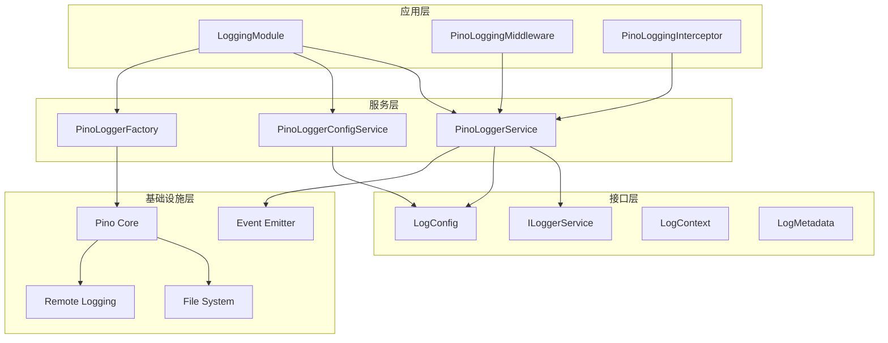

# @aiofix/logging 模块技术设计方案

## 1. 概述

### 1.1 模块定位

`@aiofix/logging` 是 Aiofix-AI-SaaS 平台的核心日志记录库，基于 Pino 提供高性能的结构化日志功能。该模块遵循领域驱动设计（DDD）和清洁架构（Clean Architecture）原则，为整个平台提供统一、高效、可观测的日志记录能力。

### 1.2 设计目标

- **高性能**: 基于 Pino 的高性能日志库，支持异步日志记录
- **结构化**: 支持结构化 JSON 日志输出，便于日志分析和处理
- **多租户**: 支持多租户上下文和用户上下文追踪
- **安全**: 自动脱敏敏感信息，保护数据安全
- **可观测**: 内置性能监控和统计功能
- **灵活性**: 支持多种配置选项和动态更新
- **集成性**: 与 NestJS 深度集成，支持中间件和拦截器

### 1.3 技术栈

- **核心库**: Pino (高性能 JSON 日志库)
- **框架**: NestJS (依赖注入、模块化)
- **上下文**: nestjs-cls (请求上下文管理)
- **事件**: @nestjs/event-emitter (事件驱动)
- **传输**: Fastify (HTTP 请求处理)
- **工具**: UUID (唯一标识符生成)

## 2. 架构设计

### 2.1 整体架构



### 2.2 核心组件

#### 2.2.1 LoggingModule

- **职责**: 模块注册和依赖注入配置
- **功能**:
  - 动态模块配置
  - 服务注册和导出
  - 中间件和拦截器注册
  - 全局配置管理

#### 2.2.2 PinoLoggerService

- **职责**: 核心日志服务实现
- **功能**:
  - 多级别日志记录
  - 结构化日志输出
  - 性能监控和统计
  - 子日志器创建

#### 2.2.3 PinoLoggerConfigService

- **职责**: 日志配置管理
- **功能**:
  - 配置初始化和验证
  - 环境变量处理
  - 动态配置更新
  - 配置持久化

#### 2.2.4 PinoLoggerFactory

- **职责**: Pino 实例创建和配置
- **功能**:
  - Pino 实例创建
  - 传输器配置
  - 格式化器配置
  - 环境适配

#### 2.2.5 PinoLoggingMiddleware

- **职责**: HTTP 请求日志记录
- **功能**:
  - 请求 ID 生成
  - 请求详情记录
  - 响应详情记录
  - 性能监控

#### 2.2.6 PinoLoggingInterceptor

- **职责**: 方法调用日志记录
- **功能**:
  - 方法调用追踪
  - 参数和返回值记录
  - 执行时间计算
  - 异常记录

## 3. 接口设计

### 3.1 核心接口

#### 3.1.1 ILoggerService

```typescript
interface ILoggerService {
  // 基础日志方法
  debug(message: string, context?: LogContext, metadata?: LogMetadata, error?: Error): void;
  info(message: string, context?: LogContext, metadata?: LogMetadata, error?: Error): void;
  warn(message: string, context?: LogContext, metadata?: LogMetadata, error?: Error): void;
  error(message: string, context?: LogContext, metadata?: LogMetadata, error?: Error): void;
  fatal(message: string, context?: LogContext, metadata?: LogMetadata, error?: Error): void;
  trace(message: string, context?: LogContext, metadata?: LogMetadata, error?: Error): void;
  
  // 专用日志方法
  performance(operation: string, duration: number, context?: LogContext, metadata?: LogMetadata): void;
  business(message: string, metadata?: LogMetadata): void;
  security(message: string, metadata?: LogMetadata): void;
  
  // 日志器管理
  child(context: LogContext, metadata?: LogMetadata): ILoggerService;
  
  // 配置管理
  setLevel(level: LogLevel): void;
  getLevel(): LogLevel;
  updateConfig(config: Partial<LogConfig>): void;
  getConfig(): LogConfig;
  
  // 生命周期管理
  flush(): Promise<void>;
  close(): Promise<void>;
  
  // 统计信息
  getStats(): LogStats;
  resetStats(): void;
}
```

### 3.2 数据结构

#### 3.2.1 LogContext 枚举

```typescript
enum LogContext {
  HTTP_REQUEST = 'http_request',
  DATABASE = 'database',
  BUSINESS = 'business',
  AUTH = 'auth',
  CONFIG = 'config',
  CACHE = 'cache',
  EVENT = 'event',
  SYSTEM = 'system',
  EXTERNAL = 'external',
  PERFORMANCE = 'performance',
}
```

#### 3.2.2 LogMetadata 接口

```typescript
interface LogMetadata {
  requestId?: string;
  tenantId?: string;
  userId?: string;
  sessionId?: string;
  operation?: string;
  resource?: string;
  resourceId?: string;
  duration?: number;
  errorCode?: string;
  errorType?: string;
  stack?: string;
  [key: string]: any;
}
```

#### 3.2.3 LogConfig 接口

```typescript
interface LogConfig {
  level: LogLevel;
  format: LogFormat;
  colorize: boolean;
  timestamp: boolean;
  requestId: boolean;
  tenantId: boolean;
  userId: boolean;
  performance: boolean;
  stackTrace: boolean;
  filePath?: string;
  rotation?: {
    maxSize: string;
    maxFiles: number;
    interval: string;
  };
  remote?: {
    url: string;
    token?: string;
    timeout: number;
    retries: number;
  };
  custom?: Record<string, any>;
}
```

## 4. 实现细节

### 4.1 日志级别管理

#### 4.1.1 级别定义

```typescript
type LogLevel = 'fatal' | 'error' | 'warn' | 'info' | 'debug' | 'trace';
```

#### 4.1.2 级别优先级

- `fatal` (60): 致命错误，系统无法继续运行
- `error` (50): 错误，功能异常但系统可继续运行
- `warn` (40): 警告，潜在问题或异常情况
- `info` (30): 信息，一般性信息记录
- `debug` (20): 调试，开发调试信息
- `trace` (10): 跟踪，最详细的执行信息

### 4.2 结构化日志

#### 4.2.1 日志格式

```json
{
  "level": 30,
  "time": "2024-01-01T00:00:00.000Z",
  "msg": "User created successfully",
  "context": "business",
  "requestId": "req-123",
  "tenantId": "tenant-456",
  "userId": "user-789",
  "operation": "createUser",
  "duration": 150,
  "metadata": {
    "userEmail": "user@example.com",
    "userRole": "admin"
  }
}
```

#### 4.2.2 上下文信息

- **请求上下文**: requestId, tenantId, userId, sessionId
- **业务上下文**: operation, resource, resourceId
- **性能上下文**: duration, startTime, endTime
- **错误上下文**: errorCode, errorType, stack

### 4.3 性能优化

#### 4.3.1 异步日志记录

- 使用 Pino 的异步传输机制
- 非阻塞日志写入
- 批量日志处理

#### 4.3.2 内存管理

- 日志缓冲区管理
- 内存使用监控
- 自动垃圾回收

#### 4.3.3 性能监控

- 日志记录性能统计
- 传输延迟监控
- 错误率统计

### 4.4 安全机制

#### 4.4.1 敏感信息脱敏

```typescript
const sensitiveFields = [
  'password', 'token', 'secret', 'apiKey', 
  'authorization', 'cookie', 'session'
];

function sanitizeMetadata(metadata: LogMetadata): LogMetadata {
  const sanitized = { ...metadata };
  sensitiveFields.forEach(field => {
    if (sanitized[field]) {
      sanitized[field] = '[REDACTED]';
    }
  });
  return sanitized;
}
```

#### 4.4.2 访问控制

- 基于角色的日志访问控制
- 租户数据隔离
- 审计日志记录

## 5. 配置管理

### 5.1 配置源优先级

1. **环境变量**: 最高优先级
2. **模块配置**: 中等优先级
3. **默认配置**: 最低优先级

### 5.2 环境变量配置

```bash
# 基础配置
LOG_LEVEL=info
LOG_FORMAT=json
LOG_COLORIZE=false

# 文件配置
LOG_FILE_PATH=./logs/app.log
LOG_ROTATION_MAX_SIZE=10MB
LOG_ROTATION_MAX_FILES=5

# 远程配置
LOG_REMOTE_URL=https://logs.example.com/api/logs
LOG_REMOTE_TOKEN=your-token
LOG_REMOTE_TIMEOUT=5000
LOG_REMOTE_RETRIES=3

# 功能开关
LOG_REQUEST_ID=true
LOG_TENANT_ID=true
LOG_USER_ID=true
LOG_PERFORMANCE=true
LOG_STACK_TRACE=true
```

### 5.3 动态配置更新

```typescript
// 运行时更新配置
logger.updateConfig({
  level: 'debug',
  format: LogFormat.STRUCTURED,
  performance: true
});
```

## 6. 使用模式

### 6.1 基础使用

```typescript
import { LoggingModule } from '@aiofix/logging';

@Module({
  imports: [
    LoggingModule.forRoot({
      config: {
        level: 'info',
        format: 'json',
        colorize: false
      }
    })
  ]
})
export class AppModule {}
```

### 6.2 服务中使用

```typescript
import { Injectable } from '@nestjs/common';
import { PinoLoggerService, LogContext } from '@aiofix/logging';

@Injectable()
export class UserService {
  constructor(private readonly logger: PinoLoggerService) {}

  async createUser(userData: any) {
    this.logger.info('Creating new user', LogContext.BUSINESS, {
      operation: 'createUser',
      userId: userData.id
    });

    try {
      const user = await this.userRepository.save(userData);
      
      this.logger.info('User created successfully', LogContext.BUSINESS, {
        operation: 'createUser',
        userId: user.id,
        duration: Date.now() - startTime
      });

      return user;
    } catch (error) {
      this.logger.error('Failed to create user', LogContext.BUSINESS, {
        operation: 'createUser',
        error: error.message
      }, error);
      
      throw error;
    }
  }
}
```

### 6.3 子日志器使用

```typescript
// 创建子日志器
const userLogger = this.logger.child(LogContext.BUSINESS, {
  userId: user.id,
  tenantId: tenant.id
});

userLogger.info('User profile updated', {
  fields: ['name', 'email']
});
```

### 6.4 中间件和拦截器

```typescript
// 自动注册
@Module({
  imports: [
    LoggingModule.forRoot({
      middleware: true,  // 启用中间件
      interceptor: true  // 启用拦截器
    })
  ]
})
export class AppModule {}

// 手动使用
@Controller('users')
@UseInterceptors(PinoLoggingInterceptor)
export class UserController {
  // 控制器方法
}
```

## 7. 监控和统计

### 7.1 统计信息

```typescript
interface LogStats {
  totalLogs: number;
  logsByLevel: Record<LogLevel, number>;
  logsByContext: Record<LogContext, number>;
  averageLogSize: number;
  lastLogTime?: Date;
}
```

### 7.2 性能监控

- **日志记录延迟**: 记录每条日志的处理时间
- **传输延迟**: 记录日志传输到目标的时间
- **错误率**: 统计日志记录失败的比例
- **内存使用**: 监控日志缓冲区内存使用

### 7.3 健康检查

```typescript
interface LoggingHealth {
  status: 'healthy' | 'degraded' | 'unhealthy';
  lastLogTime: Date;
  errorRate: number;
  memoryUsage: number;
  queueSize: number;
}
```

## 8. 扩展性设计

### 8.1 传输器扩展

```typescript
interface LogTransport {
  name: string;
  send(logEntry: LogEntry): Promise<void>;
  flush(): Promise<void>;
  close(): Promise<void>;
}
```

### 8.2 格式化器扩展

```typescript
interface LogFormatter {
  name: string;
  format(logEntry: LogEntry): string;
}
```

### 8.3 过滤器扩展

```typescript
interface LogFilter {
  name: string;
  filter(logEntry: LogEntry): boolean;
}
```

## 9. 测试策略

### 9.1 单元测试

- **服务测试**: 测试日志服务的核心功能
- **配置测试**: 测试配置管理的各种场景
- **工厂测试**: 测试日志器创建和配置
- **中间件测试**: 测试 HTTP 请求日志记录
- **拦截器测试**: 测试方法调用日志记录

### 9.2 集成测试

- **模块集成**: 测试模块的整体功能
- **配置集成**: 测试不同配置组合的效果
- **传输集成**: 测试日志传输功能
- **性能集成**: 测试高并发场景下的性能

### 9.3 性能测试

- **基准测试**: 与标准日志库的性能对比
- **压力测试**: 高并发场景下的稳定性测试
- **内存测试**: 长时间运行的内存使用测试

## 10. 部署和运维

### 10.1 部署配置

#### 10.1.1 开发环境

```typescript
const devConfig: LogConfig = {
  level: 'debug',
  format: LogFormat.TEXT,
  colorize: true,
  timestamp: true,
  requestId: true,
  tenantId: false,
  userId: false,
  performance: false,
  stackTrace: true
};
```

#### 10.1.2 生产环境

```typescript
const prodConfig: LogConfig = {
  level: 'info',
  format: LogFormat.JSON,
  colorize: false,
  timestamp: true,
  requestId: true,
  tenantId: true,
  userId: true,
  performance: true,
  stackTrace: false,
  filePath: '/var/log/app/app.log',
  rotation: {
    maxSize: '100MB',
    maxFiles: 10,
    interval: '1d'
  },
  remote: {
    url: process.env.LOG_REMOTE_URL,
    token: process.env.LOG_REMOTE_TOKEN,
    timeout: 5000,
    retries: 3
  }
};
```

### 10.2 日志轮转

#### 10.2.1 文件轮转策略

- **按大小轮转**: 文件达到指定大小时轮转
- **按时间轮转**: 按天/小时轮转日志文件
- **保留策略**: 保留指定数量的历史文件

#### 10.2.2 压缩策略

- **自动压缩**: 轮转后的文件自动压缩
- **压缩格式**: 支持 gzip 压缩
- **压缩比例**: 监控压缩效果

### 10.3 监控告警

#### 10.3.1 关键指标

- **日志记录延迟**: 超过阈值时告警
- **错误率**: 错误日志比例过高时告警
- **磁盘空间**: 日志文件占用空间过大时告警
- **传输失败**: 远程日志传输失败时告警

#### 10.3.2 告警策略

- **实时告警**: 关键错误立即告警
- **阈值告警**: 性能指标超过阈值时告警
- **趋势告警**: 基于历史数据的趋势分析告警

## 11. 最佳实践

### 11.1 日志级别使用

```typescript
// ✅ 正确的级别使用
logger.debug('Processing user data', LogContext.BUSINESS, { userId });
logger.info('User created successfully', LogContext.BUSINESS, { userId });
logger.warn('Rate limit exceeded', LogContext.AUTH, { userId, ip });
logger.error('Database connection failed', LogContext.DATABASE, {}, error);

// ❌ 避免的做法
logger.info('Processing user data'); // 应该用debug
logger.error('User created successfully'); // 应该用info
```

### 11.2 结构化日志

```typescript
// ✅ 好的做法
logger.info('Order processed', LogContext.BUSINESS, {
  orderId: order.id,
  customerId: order.customerId,
  amount: order.total,
  currency: order.currency,
  paymentMethod: order.paymentMethod,
  duration: processingTime
});

// ❌ 避免的做法
logger.info(`Order ${order.id} processed for customer ${order.customerId}`);
```

### 11.3 错误处理

```typescript
// ✅ 完整的错误日志
logger.error('Failed to process payment', LogContext.BUSINESS, {
  orderId: order.id,
  customerId: order.customerId,
  paymentMethod: order.paymentMethod,
  amount: order.total,
  errorCode: error.code
}, error);

// ❌ 不完整的错误日志
logger.error('Payment failed', LogContext.BUSINESS, {}, error);
```

### 11.4 性能考虑

```typescript
// ✅ 延迟日志创建
if (logger.isLevelEnabled('debug')) {
  logger.debug('Complex data processing', LogContext.BUSINESS, {
    data: expensiveDataProcessing()
  });
}

// ❌ 总是执行昂贵的操作
logger.debug('Complex data processing', LogContext.BUSINESS, {
  data: expensiveDataProcessing() // 即使debug级别关闭也会执行
});
```

## 12. 故障排查

### 12.1 常见问题

#### 12.1.1 日志丢失

- **原因**: 缓冲区溢出、传输失败
- **排查**: 检查统计信息、监控传输状态
- **解决**: 调整缓冲区大小、增加重试机制

#### 12.1.2 性能问题

- **原因**: 同步日志写入、频繁磁盘IO
- **排查**: 监控日志记录延迟、CPU使用率
- **解决**: 启用异步写入、优化传输器配置

#### 12.1.3 配置问题

- **原因**: 配置格式错误、环境变量缺失
- **排查**: 检查配置验证日志、环境变量设置
- **解决**: 修正配置格式、设置正确的环境变量

### 12.2 调试技巧

#### 12.2.1 启用调试模式

```typescript
logger.updateConfig({ level: 'debug' });
```

#### 12.2.2 查看统计信息

```typescript
const stats = logger.getStats();
console.log('Log statistics:', stats);
```

#### 12.2.3 监控健康状态

```typescript
const health = logger.getHealth();
console.log('Logging health:', health);
```

## 13. 版本兼容性

### 13.1 向后兼容

- **接口兼容**: 保持核心接口的向后兼容性
- **配置兼容**: 支持旧版本配置格式
- **行为兼容**: 保持日志行为的一致性

### 13.2 升级指南

#### 13.2.1 从 1.0.x 升级到 1.1.x

- 新增配置选项为可选，不影响现有配置
- 新增接口方法有默认实现
- 保持现有API的兼容性

#### 13.2.2 破坏性变更

- 重大版本升级会明确标注破坏性变更
- 提供迁移指南和工具
- 保持合理的升级周期

## 14. 总结

`@aiofix/logging` 模块是一个高性能、功能完整的日志记录解决方案，具有以下特点：

### 14.1 技术优势

1. **高性能**: 基于 Pino 的高性能日志库
2. **结构化**: 支持结构化 JSON 日志输出
3. **可观测**: 内置性能监控和统计功能
4. **安全性**: 自动脱敏敏感信息
5. **灵活性**: 支持多种配置选项和动态更新
6. **集成性**: 与 NestJS 深度集成

### 14.2 架构优势

1. **清洁架构**: 遵循 DDD 和 Clean Architecture 原则
2. **模块化**: 清晰的模块边界和职责分离
3. **可扩展**: 支持传输器、格式化器、过滤器扩展
4. **可测试**: 良好的测试覆盖率和测试策略
5. **可维护**: 清晰的代码结构和完整的文档

### 14.3 运维优势

1. **监控友好**: 提供丰富的监控指标
2. **故障排查**: 完善的故障排查机制
3. **配置灵活**: 支持环境变量和动态配置
4. **部署简单**: 支持多种部署模式
5. **升级平滑**: 良好的版本兼容性

该模块为 Aiofix-AI-SaaS 平台提供了可靠、高效的日志记录能力，是平台可观测性的重要组成部分。
