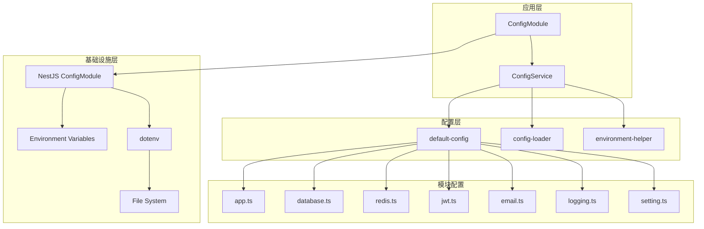

# @aiofix/config 模块技术设计方案

## 1. 概述

### 1.1 模块定位

`@aiofix/config` 是 Aiofix-AI-SaaS 平台的核心配置管理库，基于 NestJS ConfigModule 提供统一、类型安全、多环境的配置管理能力。该模块遵循领域驱动设计（DDD）和清洁架构（Clean Architecture）原则，为整个平台提供可靠、灵活的配置管理服务。

### 1.2 设计目标

- **类型安全**: 提供完整的 TypeScript 类型定义和类型检查
- **多环境支持**: 支持开发、测试、生产等多环境配置
- **模块化**: 按功能模块组织配置，支持独立管理和扩展
- **动态配置**: 支持运行时配置更新和热重载
- **环境变量集成**: 与环境变量深度集成，支持 12-factor 应用原则
- **配置验证**: 内置配置验证和错误处理机制
- **性能优化**: 配置缓存和延迟加载机制
- **安全性**: 敏感配置加密和安全存储

### 1.3 技术栈

- **核心框架**: NestJS ConfigModule
- **类型系统**: TypeScript (严格模式)
- **环境管理**: dotenv
- **配置注册**: registerAs (NestJS)
- **日志集成**: @aiofix/logging
- **ORM 集成**: MikroORM, KnexJS
- **缓存集成**: Redis

## 2. 架构设计

### 2.1 整体架构



### 2.2 核心组件

#### 2.2.1 ConfigModule

- **职责**: 配置模块注册和全局服务提供
- **功能**:
  - 全局配置模块注册
  - NestJS ConfigModule 集成
  - 配置缓存启用
  - 模块化配置加载

#### 2.2.2 ConfigService

- **职责**: 核心配置服务实现
- **功能**:
  - 配置加载和初始化
  - 类型安全的配置访问
  - 环境变量管理
  - 配置验证和错误处理
  - 结构化日志记录

#### 2.2.3 default-config

- **职责**: 默认配置定义
- **功能**:
  - 完整默认配置提供
  - 环境变量集成
  - 多环境配置支持
  - 安全最佳实践

#### 2.2.4 config-loader

- **职责**: 配置加载和合并
- **功能**:
  - 配置动态加载
  - 深度合并算法
  - 配置验证
  - 配置重置功能

#### 2.2.5 environment-helper

- **职责**: 环境工具函数
- **功能**:
  - 特性开关检查
  - 环境变量解析
  - 配置条件判断

## 3. 接口设计

### 3.1 核心接口

#### 3.1.1 IamConfig 接口

```typescript
interface IamConfig {
  /** 应用基础配置 */
  app: Record<string, unknown>;
  /** 数据库配置 */
  database: Record<string, unknown>;
  /** Redis缓存配置 */
  redis: Record<string, unknown>;
  /** JWT认证配置 */
  jwt: Record<string, unknown>;
  /** 邮件服务配置 */
  email: Record<string, unknown>;
  /** 日志系统配置 */
  logging: Record<string, unknown>;
  /** 系统设置配置 */
  setting: Record<string, unknown>;
  /** Keycloak集成配置 */
  keycloak: Record<string, unknown>;
}
```

#### 3.1.2 ConfigService 核心方法

```typescript
class ConfigService {
  // 配置访问方法
  getConfig(): Readonly<Partial<IamConfig>>;
  getConfigValue<K extends keyof IamConfig>(key: K): Readonly<IamConfig[K]>;
  getAppConfig(): Readonly<IamConfig['app']>;
  getDatabaseConfig(): Readonly<IamConfig['database']>;
  getRedisConfig(): Readonly<IamConfig['redis']>;
  getJwtConfig(): Readonly<IamConfig['jwt']>;
  getEmailConfig(): Readonly<IamConfig['email']>;
  getLoggingConfig(): Readonly<IamConfig['logging']>;
  getSettingConfig(): Readonly<IamConfig['setting']>;
  getKeycloakConfig(): Readonly<IamConfig['keycloak']>;
  
  // 环境管理方法
  isProduction(): boolean;
  isDevelopment(): boolean;
  isTest(): boolean;
  getEnvironment(): string;
  
  // 配置验证方法
  validateConfig(): boolean;
  getAvailableEnvVars(): string[];
}
```

### 3.2 配置模块接口

#### 3.2.1 应用配置 (app.ts)

```typescript
interface AppConfig {
  app_name: string;
  app_version: string;
  app_description: string;
  app_logo: string;
  environment: string;
  debug: boolean;
  demo: boolean;
  client_base_url: string;
  api_base_url: string;
  docs_url: string;
}
```

#### 3.2.2 数据库配置 (database.ts)

```typescript
interface DatabaseConfig {
  type: string;
  postgresql: {
    host: string;
    port: number;
    username: string;
    password: string;
    database: string;
    schema: string;
    ssl: boolean;
    sslMode: string;
  };
  mongodb: {
    uri: string;
    database: string;
    options: {
      useNewUrlParser: boolean;
      useUnifiedTopology: boolean;
    };
  };
  pool: {
    min: number;
    max: number;
    acquireTimeoutMillis: number;
    createTimeoutMillis: number;
    destroyTimeoutMillis: number;
    idleTimeoutMillis: number;
    reapIntervalMillis: number;
    createRetryIntervalMillis: number;
  };
  mikroOrm: {
    debug: boolean;
    logger: any;
    migrations: {
      path: string;
      tableName: string;
    };
    entities: string[];
  };
  logging: {
    enabled: boolean;
    level: string;
    slowQueryThreshold: number;
  };
}
```

#### 3.2.3 Redis 配置 (redis.ts)

```typescript
interface RedisConfig {
  connection: {
    host: string;
    port: number;
    password?: string;
    db: number;
    retryDelayOnFailover: number;
    enableReadyCheck: boolean;
    maxRetriesPerRequest: number;
    lazyConnect: boolean;
    keepAlive: number;
    connectTimeout: number;
    commandTimeout: number;
    family: number;
  };
  pool: {
    min: number;
    max: number;
    acquireTimeoutMillis: number;
    createTimeoutMillis: number;
    destroyTimeoutMillis: number;
    idleTimeoutMillis: number;
    reapIntervalMillis: number;
    createRetryIntervalMillis: number;
  };
  cache: {
    defaultTtl: number;
    maxMemoryPolicy: string;
    keyPrefix: string;
  };
  distributedLock: {
    retryDelay: number;
    retryTimes: number;
    expireTime: number;
  };
  cluster: {
    enable: boolean;
    nodes: string[];
    options: any;
  };
  sentinel: {
    enable: boolean;
    masterName: string;
    sentinels: string[];
    options: any;
  };
  healthCheck: {
    enabled: boolean;
    interval: number;
    timeout: number;
  };
}
```

#### 3.2.4 JWT 配置 (jwt.ts)

```typescript
interface JwtConfig {
  secret: {
    accessToken: string;
    refreshToken: string;
    resetPassword: string;
    emailVerification: string;
    phoneVerification: string;
  };
  accessToken: {
    algorithm: string;
    expiresIn: string;
    issuer: string;
    audience: string;
  };
  refreshToken: {
    algorithm: string;
    expiresIn: string;
    issuer: string;
    audience: string;
  };
  multiTenant: {
    enabled: boolean;
    tenantSpecificSecrets: boolean;
    defaultTenantSecret: string;
  };
  security: {
    requireHttps: boolean;
    sameSite: string;
    secure: boolean;
    httpOnly: boolean;
    domain?: string;
    path: string;
  };
  cache: {
    enabled: boolean;
    ttl: number;
    keyPrefix: string;
  };
}
```

#### 3.2.5 邮件配置 (email.ts)

```typescript
interface EmailConfig {
  provider: {
    type: string;
    sendgrid?: {
      apiKey: string;
      fromEmail: string;
      fromName: string;
    };
    awsSes?: {
      region: string;
      accessKeyId: string;
      secretAccessKey: string;
      fromEmail: string;
      fromName: string;
    };
    smtp: {
      host: string;
      port: number;
      secure: boolean;
      auth: {
        user: string;
        pass: string;
      };
      fromEmail: string;
      fromName: string;
      replyTo: string;
    };
  };
  templates: {
    welcome: {
      subject: string;
      template: string;
      variables: string[];
    };
    resetPassword: {
      subject: string;
      template: string;
      variables: string[];
    };
    emailVerification: {
      subject: string;
      template: string;
      variables: string[];
    };
  };
  queue: {
    enabled: boolean;
    concurrency: number;
    retryAttempts: number;
    retryDelay: number;
  };
  rateLimit: {
    enabled: boolean;
    maxEmailsPerHour: number;
    maxEmailsPerDay: number;
  };
}
```

#### 3.2.6 日志配置 (logging.ts)

```typescript
interface LoggingConfig {
  level: string;
  format: string;
  colorize: boolean;
  timestamp: boolean;
  requestId: boolean;
  tenantId: boolean;
  userId: boolean;
  performance: boolean;
  stackTrace: boolean;
  filePath?: string;
  rotation?: {
    maxSize: string;
    maxFiles: number;
    interval: string;
  };
  remote?: {
    url: string;
    token?: string;
    timeout: number;
    retries: number;
  };
  filter: {
    sensitiveFields: string[];
    ignorePaths: string[];
    ignoreMethods: string[];
  };
  monitoring: {
    enabled: boolean;
    metrics: boolean;
    alerts: boolean;
  };
  retention: {
    enabled: boolean;
    maxAge: string;
    maxSize: string;
  };
}
```

## 4. 实现细节

### 4.1 配置加载机制

#### 4.1.1 配置优先级

1. **环境变量**: 最高优先级，直接覆盖默认值
2. **自定义配置**: 通过 defineConfig 动态设置
3. **默认配置**: 最低优先级，作为后备值

#### 4.1.2 深度合并算法

```typescript
function deepMerge(
  target: Record<string, unknown>,
  source: Record<string, unknown>,
): Record<string, unknown> {
  const result = { ...target };

  for (const key in source) {
    if (
      source[key] &&
      typeof source[key] === 'object' &&
      !Array.isArray(source[key])
    ) {
      result[key] = deepMerge(
        (result[key] as Record<string, unknown>) || {},
        source[key] as Record<string, unknown>,
      );
    } else {
      result[key] = source[key];
    }
  }

  return result;
}
```

#### 4.1.3 配置验证

```typescript
export async function defineConfig(
  providedConfig: Partial<IamConfig>,
): Promise<void> {
  if (!providedConfig || typeof providedConfig !== 'object') {
    throw new Error(
      'Invalid configuration provided. Expected a non-empty object.',
    );
  }

  currentAppConfig = await deepMerge(currentAppConfig, providedConfig);
}
```

### 4.2 环境变量管理

#### 4.2.1 环境变量加载

```typescript
// 自动加载 .env 文件
import * as dotenv from 'dotenv';
dotenv.config();
```

#### 4.2.2 特性开关

```typescript
export const isFeatureEnabled = (featureKey: string): boolean => {
  return process.env[featureKey] === 'false' ? false : true;
};
```

#### 4.2.3 环境检测

```typescript
private readonly environment = {
  production: process.env.NODE_ENV === 'production',
  env: {} as Record<string, string>,
};
```

### 4.3 类型安全

#### 4.3.1 泛型约束

```typescript
public getConfigValue<K extends keyof IamConfig>(
  key: K,
): Readonly<IamConfig[K]> {
  return this.config[key] as Readonly<IamConfig[K]>;
}
```

#### 4.3.2 只读配置

```typescript
export function getConfig(): Readonly<Partial<IamConfig>> {
  return Object.freeze({ ...currentAppConfig });
}
```

#### 4.3.3 配置接口定义

```typescript
export interface IamConfig {
  app: Record<string, unknown>;
  database: Record<string, unknown>;
  redis: Record<string, unknown>;
  jwt: Record<string, unknown>;
  email: Record<string, unknown>;
  logging: Record<string, unknown>;
  setting: Record<string, unknown>;
  keycloak: Record<string, unknown>;
}
```

### 4.4 性能优化

#### 4.4.1 配置缓存

```typescript
@Module({
  imports: [
    NestConfigModule.forRoot({
      isGlobal: true,
      cache: true, // 启用配置缓存
      load: [...configs],
    }),
  ],
})
```

#### 4.4.2 延迟初始化

```typescript
constructor(logger: PinoLoggerService) {
  this.logger = logger;
  void this.initConfig(); // 异步初始化
}
```

#### 4.4.3 只读配置对象

```typescript
private config: Partial<IamConfig> = {};

public getConfig(): Readonly<Partial<IamConfig>> {
  return Object.freeze({ ...this.config });
}
```

## 5. 配置管理

### 5.1 模块化配置

#### 5.1.1 配置模块结构

```
src/config/
├── index.ts          # 配置模块导出
├── app.ts            # 应用配置
├── database.ts       # 数据库配置
├── redis.ts          # Redis配置
├── jwt.ts            # JWT配置
├── email.ts          # 邮件配置
├── logging.ts        # 日志配置
└── setting.ts        # 系统设置
```

#### 5.1.2 配置注册

```typescript
export default registerAs('app', () => ({
  app_name: process.env.APP_NAME || 'Aiofix IAM',
  app_version: process.env.APP_VERSION || '1.0.0',
  // ... 其他配置
}));
```

#### 5.1.3 配置聚合

```typescript
export default [app, database, redis, jwt, email, logging, setting];
```

### 5.2 环境配置

#### 5.2.1 环境变量配置

```bash
# 应用配置
APP_NAME=Aiofix IAM
APP_VERSION=1.0.0
APP_DESCRIPTION=基于DDD和Clean Architecture的多租户SaaS平台
NODE_ENV=production
APP_DEBUG=false
APP_DEMO=false

# 数据库配置
DB_TYPE=postgresql
DB_HOST=localhost
DB_PORT=5432
DB_USERNAME=postgres
DB_PASSWORD=password
DB_NAME=aiofix_iam
DB_SCHEMA=public
DB_SSL=true
DB_SSL_MODE=prefer

# Redis配置
REDIS_HOST=localhost
REDIS_PORT=6379
REDIS_PASSWORD=
REDIS_DB=0

# JWT配置
JWT_ACCESS_TOKEN_SECRET=your-access-token-secret
JWT_REFRESH_TOKEN_SECRET=your-refresh-token-secret
JWT_ACCESS_TOKEN_EXPIRES_IN=15m
JWT_REFRESH_TOKEN_EXPIRES_IN=7d

# 邮件配置
EMAIL_PROVIDER=smtp
SMTP_HOST=smtp.gmail.com
SMTP_PORT=587
SMTP_USER=your-email@gmail.com
SMTP_PASS=your-password

# 日志配置
LOG_LEVEL=info
LOG_FORMAT=json
LOG_COLORIZE=false
```

#### 5.2.2 多环境支持

```typescript
// 开发环境
const devConfig: Partial<IamConfig> = {
  app: {
    debug: true,
    environment: 'development'
  },
  database: {
    mikroOrm: {
      debug: true
    }
  }
};

// 生产环境
const prodConfig: Partial<IamConfig> = {
  app: {
    debug: false,
    environment: 'production'
  },
  database: {
    mikroOrm: {
      debug: false
    }
  }
};
```

### 5.3 动态配置更新

#### 5.3.1 配置更新

```typescript
// 动态更新配置
await defineConfig({
  app: {
    debug: true,
    environment: 'development'
  }
});
```

#### 5.3.2 配置重置

```typescript
export function resetConfig(): void {
  currentAppConfig = { ...defaultConfiguration };
  console.log('Aiofix IAM Config Reset to Defaults');
}
```

#### 5.3.3 配置验证

```typescript
public validateConfig(): boolean {
  try {
    // 验证必需配置项
    const requiredKeys = ['app', 'database', 'redis', 'jwt'];
    for (const key of requiredKeys) {
      if (!this.config[key]) {
        throw new Error(`Missing required configuration: ${key}`);
      }
    }
    return true;
  } catch (error) {
    this.logger.error('Configuration validation failed', LogContext.CONFIG, {
      error: error.message
    }, error);
    return false;
  }
}
```

## 6. 使用模式

### 6.1 基础使用

```typescript
import { ConfigModule } from '@aiofix/config';

@Module({
  imports: [ConfigModule],
  // ...
})
export class AppModule {}
```

### 6.2 服务中使用

```typescript
import { Injectable } from '@nestjs/common';
import { ConfigService } from '@aiofix/config';

@Injectable()
export class DatabaseService {
  constructor(private readonly configService: ConfigService) {}

  getDatabaseConfig() {
    return this.configService.getDatabaseConfig();
  }

  getConnectionString() {
    const dbConfig = this.configService.getDatabaseConfig();
    return `postgresql://${dbConfig.postgresql.username}:${dbConfig.postgresql.password}@${dbConfig.postgresql.host}:${dbConfig.postgresql.port}/${dbConfig.postgresql.database}`;
  }
}
```

### 6.3 配置访问

```typescript
// 获取完整配置
const config = this.configService.getConfig();

// 获取特定模块配置
const appConfig = this.configService.getAppConfig();
const dbConfig = this.configService.getDatabaseConfig();

// 获取特定配置值
const dbHost = this.configService.getConfigValue('database').postgresql.host;

// 环境检查
if (this.configService.isProduction()) {
  // 生产环境逻辑
}
```

### 6.4 动态配置

```typescript
import { defineConfig, getConfig } from '@aiofix/config';

// 动态设置配置
await defineConfig({
  app: {
    debug: true,
    environment: 'development'
  },
  database: {
    mikroOrm: {
      debug: true
    }
  }
});

// 获取更新后的配置
const updatedConfig = getConfig();
```

## 7. 集成和扩展

### 7.1 NestJS 集成

#### 7.1.1 全局模块

```typescript
@Global()
@Module({
  imports: [
    NestConfigModule.forRoot({
      isGlobal: true,
      cache: true,
      load: [...configs],
    }),
  ],
  providers: [ConfigService],
  exports: [ConfigService],
})
export class ConfigModule {}
```

#### 7.1.2 依赖注入

```typescript
@Injectable()
export class SomeService {
  constructor(private readonly configService: ConfigService) {}
}
```

### 7.2 日志集成

#### 7.2.1 结构化日志

```typescript
this.logger.info(
  '配置服务初始化完成',
  LogContext.CONFIG,
  {
    isProduction: this.environment.production,
    nodeEnv: process.env.NODE_ENV,
    configKeys: Object.keys(this.config),
  },
);
```

#### 7.2.2 错误日志

```typescript
this.logger.error(
  'Configuration validation failed',
  LogContext.CONFIG,
  {
    error: error.message,
    configKeys: Object.keys(this.config)
  },
  error
);
```

### 7.3 ORM 集成

#### 7.3.1 MikroORM 配置

```typescript
// database.ts
export default registerAs('database', () => ({
  mikroOrm: {
    debug: process.env.DB_LOGGING === 'true',
    logger: undefined,
    migrations: {
      path: 'src/migrations/*.migration{.ts,.js}',
      tableName: 'mikro_orm_migrations',
    },
    entities: ['src/**/*.entity{.ts,.js}'],
  },
}));
```

#### 7.3.2 KnexJS 配置

```typescript
// database.ts
export default registerAs('database', () => ({
  knex: {
    client: 'postgresql',
    connection: {
      host: process.env.DB_HOST || 'localhost',
      port: parseInt(process.env.DB_PORT || '5432', 10),
      user: process.env.DB_USERNAME || 'postgres',
      password: process.env.DB_PASSWORD || 'password',
      database: process.env.DB_NAME || 'aiofix_iam',
    },
  },
}));
```

## 8. 安全考虑

### 8.1 敏感信息保护

#### 8.1.1 环境变量加密

```typescript
// 敏感配置项使用环境变量
secret: {
  accessToken: process.env.JWT_ACCESS_TOKEN_SECRET || 'default-secret',
  refreshToken: process.env.JWT_REFRESH_TOKEN_SECRET || 'default-secret',
}
```

#### 8.1.2 配置脱敏

```typescript
// 日志记录时脱敏敏感信息
this.logger.info('Database configuration loaded', LogContext.CONFIG, {
  host: dbConfig.postgresql.host,
  port: dbConfig.postgresql.port,
  database: dbConfig.postgresql.database,
  // 不记录密码等敏感信息
});
```

### 8.2 配置验证

#### 8.2.1 必需配置检查

```typescript
public validateConfig(): boolean {
  const requiredKeys = ['app', 'database', 'redis', 'jwt'];
  for (const key of requiredKeys) {
    if (!this.config[key]) {
      throw new Error(`Missing required configuration: ${key}`);
    }
  }
  return true;
}
```

#### 8.2.2 配置格式验证

```typescript
private validateDatabaseConfig(config: any): boolean {
  if (!config.postgresql) {
    throw new Error('PostgreSQL configuration is required');
  }
  
  const { host, port, username, password, database } = config.postgresql;
  if (!host || !port || !username || !password || !database) {
    throw new Error('Invalid PostgreSQL configuration');
  }
  
  return true;
}
```

## 9. 测试策略

### 9.1 单元测试

#### 9.1.1 配置服务测试

```typescript
describe('ConfigService', () => {
  let service: ConfigService;
  let logger: PinoLoggerService;

  beforeEach(async () => {
    const module: TestingModule = await Test.createTestingModule({
      providers: [
        ConfigService,
        {
          provide: PinoLoggerService,
          useValue: mockLogger,
        },
      ],
    }).compile();

    service = module.get<ConfigService>(ConfigService);
  });

  it('should be defined', () => {
    expect(service).toBeDefined();
  });

  it('should return app config', () => {
    const appConfig = service.getAppConfig();
    expect(appConfig).toBeDefined();
    expect(appConfig.app_name).toBe('Aiofix IAM');
  });
});
```

#### 9.1.2 配置加载器测试

```typescript
describe('ConfigLoader', () => {
  beforeEach(() => {
    resetConfig();
  });

  it('should return default config', () => {
    const config = getConfig();
    expect(config).toBeDefined();
    expect(config.app?.app_name).toBe('Aiofix IAM');
  });

  it('should merge provided config', async () => {
    await defineConfig({
      app: {
        debug: true,
        environment: 'test'
      }
    });

    const config = getConfig();
    expect(config.app?.debug).toBe(true);
    expect(config.app?.environment).toBe('test');
  });
});
```

### 9.2 集成测试

#### 9.2.1 模块集成测试

```typescript
describe('ConfigModule Integration', () => {
  let app: INestApplication;
  let configService: ConfigService;

  beforeEach(async () => {
    const moduleFixture: TestingModule = await Test.createTestingModule({
      imports: [ConfigModule],
    }).compile();

    app = moduleFixture.createNestApplication();
    configService = app.get<ConfigService>(ConfigService);
    await app.init();
  });

  it('should load all configurations', () => {
    expect(configService.getAppConfig()).toBeDefined();
    expect(configService.getDatabaseConfig()).toBeDefined();
    expect(configService.getRedisConfig()).toBeDefined();
    expect(configService.getJwtConfig()).toBeDefined();
  });
});
```

### 9.3 环境测试

#### 9.3.1 环境变量测试

```typescript
describe('Environment Variables', () => {
  beforeEach(() => {
    process.env.APP_NAME = 'Test App';
    process.env.DB_HOST = 'test-host';
    process.env.REDIS_PORT = '6380';
  });

  afterEach(() => {
    delete process.env.APP_NAME;
    delete process.env.DB_HOST;
    delete process.env.REDIS_PORT;
  });

  it('should use environment variables', () => {
    const config = getConfig();
    expect(config.app?.app_name).toBe('Test App');
    expect(config.database?.postgresql?.host).toBe('test-host');
    expect(config.redis?.connection?.port).toBe(6380);
  });
});
```

## 10. 部署和运维

### 10.1 部署配置

#### 10.1.1 Docker 配置

```dockerfile
# Dockerfile
FROM node:18-alpine

WORKDIR /app

COPY package*.json ./
RUN npm install

COPY . .

# 设置环境变量
ENV NODE_ENV=production
ENV APP_NAME=Aiofix IAM
ENV DB_HOST=postgres
ENV REDIS_HOST=redis

EXPOSE 3000

CMD ["npm", "start"]
```

#### 10.1.2 Docker Compose

```yaml
# docker-compose.yml
version: '3.8'

services:
  app:
    build: .
    ports:
      - "3000:3000"
    environment:
      - NODE_ENV=production
      - DB_HOST=postgres
      - DB_PASSWORD=password
      - REDIS_HOST=redis
      - JWT_ACCESS_TOKEN_SECRET=your-secret
    depends_on:
      - postgres
      - redis

  postgres:
    image: postgres:13
    environment:
      - POSTGRES_DB=aiofix_iam
      - POSTGRES_USER=postgres
      - POSTGRES_PASSWORD=password
    volumes:
      - postgres_data:/var/lib/postgresql/data

  redis:
    image: redis:6-alpine
    volumes:
      - redis_data:/data

volumes:
  postgres_data:
  redis_data:
```

### 10.2 环境管理

#### 10.2.1 开发环境

```bash
# .env.development
NODE_ENV=development
APP_DEBUG=true
DB_HOST=localhost
DB_PORT=5432
REDIS_HOST=localhost
REDIS_PORT=6379
LOG_LEVEL=debug
```

#### 10.2.2 生产环境

```bash
# .env.production
NODE_ENV=production
APP_DEBUG=false
DB_HOST=prod-postgres.internal
DB_PORT=5432
REDIS_HOST=prod-redis.internal
REDIS_PORT=6379
LOG_LEVEL=info
```

### 10.3 配置管理

#### 10.3.1 配置热重载

```typescript
// 支持配置热重载
export class ConfigService {
  private configWatcher?: any;

  enableHotReload(): void {
    if (process.env.NODE_ENV === 'development') {
      this.configWatcher = chokidar.watch('.env*', {
        ignoreInitial: true,
      });

      this.configWatcher.on('change', () => {
        this.reloadConfig();
      });
    }
  }

  private async reloadConfig(): Promise<void> {
    // 重新加载配置
    await this.initConfig();
    this.logger.info('Configuration reloaded', LogContext.CONFIG);
  }
}
```

#### 10.3.2 配置监控

```typescript
// 配置健康检查
export class ConfigService {
  getHealthStatus(): {
    status: 'healthy' | 'unhealthy';
    configLoaded: boolean;
    environment: string;
    missingConfigs: string[];
  } {
    const missingConfigs: string[] = [];
    const requiredKeys = ['app', 'database', 'redis', 'jwt'];

    for (const key of requiredKeys) {
      if (!this.config[key]) {
        missingConfigs.push(key);
      }
    }

    return {
      status: missingConfigs.length === 0 ? 'healthy' : 'unhealthy',
      configLoaded: Object.keys(this.config).length > 0,
      environment: this.getEnvironment(),
      missingConfigs,
    };
  }
}
```

## 11. 最佳实践

### 11.1 配置组织

#### 11.1.1 模块化配置

```typescript
// ✅ 好的做法：按功能模块组织配置
export default registerAs('database', () => ({
  postgresql: { /* ... */ },
  mongodb: { /* ... */ },
  pool: { /* ... */ },
  mikroOrm: { /* ... */ },
}));

// ❌ 避免的做法：将所有配置放在一个文件中
export default registerAs('all', () => ({
  app: { /* ... */ },
  database: { /* ... */ },
  redis: { /* ... */ },
  jwt: { /* ... */ },
  // ... 所有配置
}));
```

#### 11.1.2 配置验证

```typescript
// ✅ 好的做法：验证必需配置
export default registerAs('database', () => {
  const config = {
    postgresql: {
      host: process.env.DB_HOST || 'localhost',
      port: parseInt(process.env.DB_PORT || '5432', 10),
      // ...
    },
  };

  // 验证必需配置
  if (!config.postgresql.host) {
    throw new Error('DB_HOST is required');
  }

  return config;
});

// ❌ 避免的做法：不验证配置
export default registerAs('database', () => ({
  postgresql: {
    host: process.env.DB_HOST, // 可能是 undefined
  },
}));
```

### 11.2 环境变量管理

#### 11.2.1 默认值处理

```typescript
// ✅ 好的做法：提供合理的默认值
export default registerAs('app', () => ({
  app_name: process.env.APP_NAME || 'Aiofix IAM',
  debug: process.env.APP_DEBUG === 'true',
  port: parseInt(process.env.PORT || '3000', 10),
}));

// ❌ 避免的做法：不提供默认值
export default registerAs('app', () => ({
  app_name: process.env.APP_NAME, // 可能是 undefined
  debug: process.env.APP_DEBUG, // 字符串，不是布尔值
}));
```

#### 11.2.2 类型转换

```typescript
// ✅ 好的做法：正确的类型转换
export default registerAs('database', () => ({
  postgresql: {
    port: parseInt(process.env.DB_PORT || '5432', 10),
    ssl: process.env.DB_SSL === 'true',
    pool: {
      min: parseInt(process.env.DB_POOL_MIN || '2', 10),
      max: parseInt(process.env.DB_POOL_MAX || '20', 10),
    },
  },
}));

// ❌ 避免的做法：不进行类型转换
export default registerAs('database', () => ({
  postgresql: {
    port: process.env.DB_PORT, // 字符串，不是数字
    ssl: process.env.DB_SSL, // 字符串，不是布尔值
  },
}));
```

### 11.3 安全性

#### 11.3.1 敏感信息保护

```typescript
// ✅ 好的做法：敏感信息使用环境变量
export default registerAs('jwt', () => ({
  secret: {
    accessToken: process.env.JWT_ACCESS_TOKEN_SECRET || 'default-secret',
    refreshToken: process.env.JWT_REFRESH_TOKEN_SECRET || 'default-secret',
  },
}));

// ❌ 避免的做法：硬编码敏感信息
export default registerAs('jwt', () => ({
  secret: {
    accessToken: 'hardcoded-secret', // 不安全
    refreshToken: 'hardcoded-secret',
  },
}));
```

#### 11.3.2 配置脱敏

```typescript
// ✅ 好的做法：日志记录时脱敏
this.logger.info('Database configuration loaded', LogContext.CONFIG, {
  host: dbConfig.postgresql.host,
  port: dbConfig.postgresql.port,
  database: dbConfig.postgresql.database,
  // 不记录密码
});

// ❌ 避免的做法：记录敏感信息
this.logger.info('Database configuration loaded', LogContext.CONFIG, {
  host: dbConfig.postgresql.host,
  password: dbConfig.postgresql.password, // 不安全
});
```

## 12. 故障排查

### 12.1 常见问题

#### 12.1.1 配置未加载

**症状**: 配置值为 undefined 或默认值
**原因**: 环境变量未设置或配置文件未加载
**解决**: 检查环境变量设置和 .env 文件

```typescript
// 检查配置加载状态
const config = this.configService.getConfig();
console.log('Loaded config keys:', Object.keys(config));
```

#### 12.1.2 类型错误

**症状**: TypeScript 类型错误
**原因**: 配置接口定义不匹配
**解决**: 更新配置接口定义

```typescript
// 确保接口定义正确
interface DatabaseConfig {
  postgresql: {
    host: string;
    port: number;
    // ... 其他字段
  };
}
```

#### 12.1.3 环境变量问题

**症状**: 环境变量未生效
**原因**: .env 文件未加载或变量名错误
**解决**: 检查 .env 文件和变量名

```typescript
// 检查环境变量
console.log('Environment variables:', {
  NODE_ENV: process.env.NODE_ENV,
  APP_NAME: process.env.APP_NAME,
  DB_HOST: process.env.DB_HOST,
});
```

### 12.2 调试技巧

#### 12.2.1 配置调试

```typescript
// 启用配置调试
if (process.env.CONFIG_DEBUG === 'true') {
  console.log('Configuration loaded:', JSON.stringify(config, null, 2));
}
```

#### 12.2.2 环境检查

```typescript
// 检查环境状态
const healthStatus = this.configService.getHealthStatus();
console.log('Config health status:', healthStatus);
```

#### 12.2.3 配置验证

```typescript
// 验证配置完整性
const isValid = this.configService.validateConfig();
if (!isValid) {
  console.error('Configuration validation failed');
}
```

## 13. 版本兼容性

### 13.1 向后兼容

#### 13.1.1 接口兼容

- **配置接口**: 保持配置接口的向后兼容性
- **方法签名**: 保持现有方法签名不变
- **默认值**: 保持默认值的一致性

#### 13.1.2 配置迁移

```typescript
// 配置迁移工具
export function migrateConfig(oldConfig: any, version: string): any {
  switch (version) {
    case '1.0.0':
      return migrateFromV1(oldConfig);
    case '1.1.0':
      return migrateFromV1_1(oldConfig);
    default:
      return oldConfig;
  }
}
```

### 13.2 升级指南

#### 13.2.1 从 1.0.x 升级到 1.1.x

```typescript
// 新增配置项为可选，不影响现有配置
interface IamConfig {
  app: Record<string, unknown>;
  database: Record<string, unknown>;
  // 新增配置项
  monitoring?: Record<string, unknown>; // 可选
}
```

#### 13.2.2 破坏性变更

- 重大版本升级会明确标注破坏性变更
- 提供迁移指南和工具
- 保持合理的升级周期

## 14. 总结

`@aiofix/config` 模块是一个功能完整、类型安全的配置管理解决方案，具有以下特点：

### 14.1 技术优势

1. **类型安全**: 完整的 TypeScript 类型定义和类型检查
2. **模块化**: 按功能模块组织配置，支持独立管理
3. **多环境支持**: 支持开发、测试、生产等多环境配置
4. **动态配置**: 支持运行时配置更新和热重载
5. **环境变量集成**: 与环境变量深度集成，支持 12-factor 应用原则
6. **性能优化**: 配置缓存和延迟加载机制

### 14.2 架构优势

1. **清洁架构**: 遵循 DDD 和 Clean Architecture 原则
2. **模块化设计**: 清晰的模块边界和职责分离
3. **可扩展性**: 支持新配置模块的轻松添加
4. **可测试性**: 良好的测试覆盖率和测试策略
5. **可维护性**: 清晰的代码结构和完整的文档

### 14.3 运维优势

1. **配置管理**: 统一的配置管理和验证机制
2. **环境适配**: 支持多环境配置和部署
3. **监控友好**: 提供配置健康检查和监控
4. **故障排查**: 完善的故障排查机制
5. **安全性**: 敏感信息保护和配置脱敏

该模块为 Aiofix-AI-SaaS 平台提供了可靠、灵活的配置管理能力，是平台基础设施的重要组成部分。通过类型安全的配置访问、模块化的配置组织和多环境支持，为整个平台的配置管理提供了坚实的基础。
