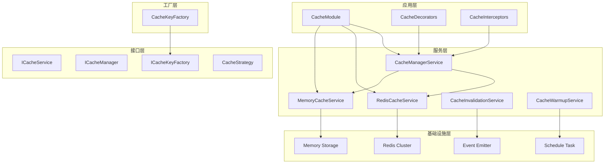

# @aiofix/cache 模块技术设计方案

## 1. 概述

### 1.1 模块定位

`@aiofix/cache` 是 Aiofix-AI-SaaS 平台的高性能缓存管理库，提供多级缓存、分布式缓存、缓存策略管理等功能。该模块遵循领域驱动设计（DDD）和清洁架构（Clean Architecture）原则，为整个平台提供统一、高效、可扩展的缓存管理服务。

### 1.2 设计目标

- **高性能**: 多级缓存架构，L1内存缓存 + L2 Redis缓存
- **多策略**: 支持LRU、LFU、FIFO、TTL等多种缓存策略
- **分布式**: Redis集群、哨兵模式支持，高可用性
- **多租户**: 租户隔离的缓存键管理，数据安全
- **监控统计**: 详细的命中率、响应时间等统计信息
- **并发安全**: 线程安全的并发访问控制
- **AOP支持**: 装饰器和拦截器支持，简化使用
- **可扩展**: 支持自定义缓存层和策略

### 1.3 技术栈

- **核心框架**: NestJS (依赖注入、模块化)
- **缓存引擎**: ioredis (Redis客户端)、内存Map
- **上下文管理**: nestjs-cls (请求上下文)
- **事件系统**: @nestjs/event-emitter (事件驱动)
- **任务调度**: @nestjs/schedule (定时任务)
- **配置管理**: @aiofix/config (统一配置)
- **日志系统**: @aiofix/logging (结构化日志)
- **工具库**: minimatch (模式匹配)、uuid (唯一标识)

## 2. 架构设计

### 2.1 整体架构



### 2.2 核心组件

#### 2.2.1 CacheModule

- **职责**: 缓存模块注册和依赖注入配置
- **功能**:
  - 动态模块配置
  - 服务注册和导出
  - 配置管理集成
  - 全局和特性模块支持

#### 2.2.2 CacheManagerService

- **职责**: 缓存管理器，统一管理多级缓存
- **功能**:
  - 多级缓存协调
  - 缓存策略管理
  - 性能监控和统计
  - 缓存层管理

#### 2.2.3 RedisCacheService

- **职责**: Redis分布式缓存服务
- **功能**:
  - Redis连接管理
  - 集群和哨兵支持
  - 序列化/反序列化
  - 健康检查和统计

#### 2.2.4 MemoryCacheService

- **职责**: 内存缓存服务
- **功能**:
  - 多种缓存策略实现
  - 内存管理和清理
  - 并发安全控制
  - 性能优化

#### 2.2.5 CacheKeyFactory

- **职责**: 缓存键工厂
- **功能**:
  - 缓存键创建和解析
  - 命名空间管理
  - 租户和用户隔离
  - 标签和版本控制

#### 2.2.6 CacheInvalidationService

- **职责**: 缓存失效服务
- **功能**:
  - 按模式失效
  - 按标签失效
  - 延迟失效
  - 批量失效

#### 2.2.7 CacheWarmupService

- **职责**: 缓存预热服务
- **功能**:
  - 启动预热
  - 定时预热
  - 预热策略管理
  - 预热统计

## 3. 接口设计

### 3.1 核心接口

#### 3.1.1 ICacheService

```typescript
interface ICacheService {
  // 基础操作
  get<T>(key: CacheKey): Promise<T | null>;
  set<T>(key: CacheKey, value: T, options?: CacheOptions): Promise<boolean>;
  delete(key: CacheKey): Promise<boolean>;
  clear(): Promise<boolean>;
  
  // 批量操作
  mget<T>(keys: CacheKey[]): Promise<Map<string, T | null>>;
  mset<T>(entries: Array<{ key: CacheKey; value: T; options?: CacheOptions }>): Promise<boolean[]>;
  mdelete(keys: CacheKey[]): Promise<boolean[]>;
  
  // 高级操作
  exists(key: CacheKey): Promise<boolean>;
  expire(key: CacheKey, ttl: number): Promise<boolean>;
  ttl(key: CacheKey): Promise<number>;
  
  // 统计和监控
  getStats(): Promise<CacheStats>;
  getHealth(): Promise<CacheHealth>;
  resetStats(): Promise<void>;
  
  // 生命周期
  connect(): Promise<void>;
  disconnect(): Promise<void>;
}
```

#### 3.1.2 ICacheManager

```typescript
interface ICacheManager {
  // 缓存操作
  get<T>(key: CacheKey): Promise<T | null>;
  set<T>(key: CacheKey, value: T, options?: CacheOptions): Promise<boolean>;
  delete(key: CacheKey): Promise<boolean>;
  
  // 缓存层管理
  addLayer(layer: CacheLayer): void;
  removeLayer(name: string): void;
  getLayers(): CacheLayer[];
  
  // 策略管理
  setStrategy(strategy: CacheStrategy): void;
  getStrategy(): CacheStrategy;
  
  // 监控统计
  getStats(): Promise<CacheStats>;
  getLayerStats(): Promise<Map<string, CacheStats>>;
}
```

#### 3.1.3 ICacheKeyFactory

```typescript
interface ICacheKeyFactory {
  // 基础键创建
  create(key: string, options?: Partial<CacheKey>): CacheKey;
  createNamespace(namespace: string, key: string, options?: Partial<CacheKey>): CacheKey;
  createTenant(tenantId: string, key: string, options?: Partial<CacheKey>): CacheKey;
  createUser(userId: string, key: string, options?: Partial<CacheKey>): CacheKey;
  createTagged(key: string, tags: string[], options?: Partial<CacheKey>): CacheKey;
  
  // 键操作
  toString(cacheKey: CacheKey): string;
  parse(keyString: string): CacheKey;
  
  // 模式匹配
  createPattern(pattern: string): string;
  matchPattern(pattern: string, key: string): boolean;
  
  // 信息提取
  extractNamespace(cacheKey: CacheKey): string | undefined;
  extractTenantId(cacheKey: CacheKey): string | undefined;
  extractUserId(cacheKey: CacheKey): string | undefined;
  extractTags(cacheKey: CacheKey): string[];
}
```

### 3.2 数据结构

#### 3.2.1 CacheKey 接口

```typescript
interface CacheKey {
  key: string;
  namespace?: string;
  version?: string;
  tenantId?: string;
  userId?: string;
  tags?: string[];
}
```

#### 3.2.2 CacheValue 接口

```typescript
interface CacheValue<T = unknown> {
  value: T;
  createdAt: number;
  expiresAt?: number;
  accessCount: number;
  lastAccessed: number;
  version?: string;
  tags?: string[];
  metadata?: Record<string, unknown>;
}
```

#### 3.2.3 CacheOptions 接口

```typescript
interface CacheOptions {
  type: CacheType;
  strategy: CacheStrategy;
  ttl?: number;
  maxSize?: number;
  compress?: boolean;
  encrypt?: boolean;
  retries?: number;
  retryDelay?: number;
  timeout?: number;
}
```

#### 3.2.4 CacheStats 接口

```typescript
interface CacheStats {
  totalEntries: number;
  hits: number;
  misses: number;
  hitRate: number;
  totalSize: number;
  averageSize: number;
  expiredEntries: number;
  evictedEntries: number;
  lastReset: number;
}
```

## 4. 实现细节

### 4.1 多级缓存架构

#### 4.1.1 缓存层次

```
Application Layer
       ↓
Cache Manager Service
       ↓
┌─────────────────────┐
│  L1: Memory Cache   │ ← 高速访问，容量有限
│  L2: Redis Cache    │ ← 持久化，容量大
└─────────────────────┘
```

#### 4.1.2 缓存策略

1. **Write-Through**: 写入时同时更新所有缓存层
2. **Write-Behind**: 异步写入，提高性能
3. **Cache-Aside**: 应用控制缓存逻辑
4. **Read-Through**: 缓存未命中时自动加载

#### 4.1.3 缓存失效策略

1. **TTL失效**: 基于时间过期
2. **LRU失效**: 最近最少使用
3. **LFU失效**: 最少使用频率
4. **FIFO失效**: 先进先出

### 4.2 内存缓存实现

#### 4.2.1 LRU策略

```typescript
class LRUCache {
  private cache = new Map<string, CacheEntry>();
  private accessOrder: string[] = [];

  get(key: string): T | null {
    if (this.cache.has(key)) {
      // 移动到末尾
      this.moveToEnd(key);
      return this.cache.get(key)!.value;
    }
    return null;
  }

  set(key: string, value: T): void {
    if (this.cache.has(key)) {
      this.moveToEnd(key);
    } else {
      this.accessOrder.push(key);
    }
    this.cache.set(key, { value, lastAccessed: Date.now() });
    this.evictIfNeeded();
  }

  private moveToEnd(key: string): void {
    const index = this.accessOrder.indexOf(key);
    this.accessOrder.splice(index, 1);
    this.accessOrder.push(key);
  }
}
```

#### 4.2.2 LFU策略

```typescript
class LFUCache {
  private cache = new Map<string, CacheEntry>();
  private frequency = new Map<string, number>();

  get(key: string): T | null {
    if (this.cache.has(key)) {
      // 增加访问频率
      this.frequency.set(key, (this.frequency.get(key) || 0) + 1);
      return this.cache.get(key)!.value;
    }
    return null;
  }

  set(key: string, value: T): void {
    this.cache.set(key, { value, lastAccessed: Date.now() });
    this.frequency.set(key, 1);
    this.evictIfNeeded();
  }

  private evictIfNeeded(): void {
    if (this.cache.size > this.maxSize) {
      // 找到频率最低的键
      let minFreq = Infinity;
      let minKey = '';
      
      for (const [key, freq] of this.frequency) {
        if (freq < minFreq) {
          minFreq = freq;
          minKey = key;
        }
      }
      
      this.delete(minKey);
    }
  }
}
```

### 4.3 Redis缓存实现

#### 4.3.1 连接管理

```typescript
class RedisCacheService {
  private redis: Redis | Cluster;
  private isConnected = false;

  async connect(): Promise<void> {
    if (this.config.cluster) {
      this.redis = new Cluster(this.config.nodes, {
        redisOptions: {
          password: this.config.password,
          connectTimeout: this.config.connectTimeout,
        },
      });
    } else if (this.config.sentinel) {
      this.redis = new Redis({
        sentinels: this.config.sentinels,
        name: this.config.name,
        password: this.config.password,
      });
    } else {
      this.redis = new Redis({
        host: this.config.host,
        port: this.config.port,
        password: this.config.password,
        db: this.config.db,
        connectTimeout: this.config.connectTimeout,
      });
    }

    this.redis.on('connect', () => {
      this.isConnected = true;
      this.logger.info('Redis connected successfully');
    });

    this.redis.on('error', (error) => {
      this.isConnected = false;
      this.logger.error('Redis connection error', LogContext.CACHE, {}, error);
    });
  }
}
```

#### 4.3.2 序列化处理

```typescript
class RedisCacheService {
  private serialize<T>(value: T): string {
    try {
      return JSON.stringify({
        value,
        createdAt: Date.now(),
        version: '1.0',
      });
    } catch (error) {
      this.logger.error('Serialization failed', LogContext.CACHE, {}, error);
      throw new Error('Failed to serialize cache value');
    }
  }

  private deserialize<T>(data: string): CacheValue<T> | null {
    try {
      return JSON.parse(data) as CacheValue<T>;
    } catch (error) {
      this.logger.error('Deserialization failed', LogContext.CACHE, {}, error);
      return null;
    }
  }
}
```

### 4.4 缓存键管理

#### 4.4.1 键生成策略

```typescript
class CacheKeyFactory {
  create(key: string, options?: Partial<CacheKey>): CacheKey {
    return {
      key: this.sanitizeKey(key),
      namespace: options?.namespace,
      version: options?.version || this.DEFAULT_VERSION,
      tenantId: options?.tenantId,
      userId: options?.userId,
      tags: options?.tags ?? [],
    };
  }

  toString(cacheKey: CacheKey): string {
    const parts: string[] = [];
    
    if (cacheKey.namespace) {
      parts.push(cacheKey.namespace);
    }
    
    if (cacheKey.tenantId) {
      parts.push(`tenant:${cacheKey.tenantId}`);
    }
    
    if (cacheKey.userId) {
      parts.push(`user:${cacheKey.userId}`);
    }
    
    parts.push(cacheKey.key);
    
    if (cacheKey.version) {
      parts.push(`v:${cacheKey.version}`);
    }
    
    if (cacheKey.tags && cacheKey.tags.length > 0) {
      parts.push(`tags:${cacheKey.tags.join(',')}`);
    }
    
    return parts.join(this.DEFAULT_SEPARATOR);
  }
}
```

#### 4.4.2 模式匹配

```typescript
class CacheKeyFactory {
  createPattern(pattern: string): string {
    return pattern.replace(/\*/g, '**').replace(/\?/g, '*');
  }

  matchPattern(pattern: string, key: string): boolean {
    const normalizedPattern = this.createPattern(pattern);
    return minimatch(key, normalizedPattern);
  }
}
```

## 5. 配置管理

### 5.1 缓存配置

#### 5.1.1 Redis配置

```typescript
interface RedisConfig {
  host: string;
  port: number;
  password?: string;
  db: number;
  connectTimeout: number;
  commandTimeout: number;
  retries: number;
  retryDelay: number;
  cluster: boolean;
  sentinel: boolean;
  sentinels?: Array<{ host: string; port: number }>;
  name?: string;
}
```

#### 5.1.2 内存缓存配置

```typescript
interface MemoryCacheConfig {
  defaultTtl: number;
  maxSize: number;
  cleanupInterval: number;
  enableCompression: boolean;
  enableEncryption: boolean;
}
```

#### 5.1.3 缓存管理器配置

```typescript
interface CacheManagerConfig {
  enabled: boolean;
  defaultStrategy: CacheStrategy;
  monitoringInterval: number;
  cleanupInterval: number;
  maxSize: number;
  enableStats: boolean;
  enableEvents: boolean;
}
```

### 5.2 环境变量配置

```bash
# Redis配置
REDIS_HOST=localhost
REDIS_PORT=6379
REDIS_PASSWORD=your-password
REDIS_DB=0
REDIS_CONNECT_TIMEOUT=10000
REDIS_COMMAND_TIMEOUT=5000
REDIS_RETRIES=3
REDIS_RETRY_DELAY=1000

# 缓存配置
MEMORY_CACHE_TTL=300000
MEMORY_CACHE_MAX_SIZE=1000
MEMORY_CACHE_CLEANUP_INTERVAL=60000
MEMORY_CACHE_COMPRESSION=false
MEMORY_CACHE_ENCRYPTION=false

# 缓存管理器配置
CACHE_MANAGER_ENABLED=true
CACHE_MANAGER_STRATEGY=LRU
CACHE_MANAGER_MONITORING_INTERVAL=30000
CACHE_MANAGER_CLEANUP_INTERVAL=60000
CACHE_MANAGER_MAX_SIZE=10000
CACHE_MANAGER_STATS=true
CACHE_MANAGER_EVENTS=true

# 缓存失效配置
CACHE_INVALIDATION_ENABLED=true
CACHE_INVALIDATION_STRATEGY=exact
CACHE_INVALIDATION_BATCH_SIZE=100
CACHE_INVALIDATION_CONCURRENCY=5
CACHE_INVALIDATION_TIMEOUT=30000
CACHE_INVALIDATION_RETRIES=3
CACHE_INVALIDATION_RETRY_DELAY=1000
CACHE_INVALIDATION_STATS=true
CACHE_INVALIDATION_EVENTS=true
CACHE_INVALIDATION_MONITORING_INTERVAL=60000

# 缓存键配置
CACHE_KEY_NAMESPACE=cache
CACHE_KEY_SEPARATOR=:
CACHE_KEY_COMPRESSION=false
CACHE_KEY_MAX_LENGTH=250
CACHE_KEY_VALIDATION=true

# TTL配置
CACHE_TTL_USER_PERMISSIONS=3600000
CACHE_TTL_USER_PROFILE=1800000
CACHE_TTL_USER_SESSIONS=7200000
CACHE_TTL_ORG_TREE=1800000
CACHE_TTL_ORG_INFO=3600000
CACHE_TTL_TENANT_INFO=7200000
CACHE_TTL_TENANT_CONFIG=3600000
CACHE_TTL_ROLE_PERMISSIONS=3600000
CACHE_TTL_ROLE_TEMPLATES=86400000
CACHE_TTL_SYSTEM_CONFIG=86400000
CACHE_TTL_API_RATE_LIMIT=60000

# 前缀配置
CACHE_PREFIX_USER=user
CACHE_PREFIX_ORG=org
CACHE_PREFIX_TENANT=tenant
CACHE_PREFIX_ROLE=role
CACHE_PREFIX_SYSTEM=system
CACHE_PREFIX_SESSION=session
CACHE_PREFIX_LOCK=lock
```

## 6. 使用模式

### 6.1 基础使用

```typescript
import { CacheModule } from '@aiofix/cache';

@Module({
  imports: [CacheModule.forRoot()],
  providers: [MyService],
})
export class AppModule {}
```

### 6.2 服务中使用

```typescript
import { Injectable } from '@nestjs/common';
import { RedisCacheService, CacheKeyFactory } from '@aiofix/cache';

@Injectable()
export class UserService {
  constructor(
    private readonly cache: RedisCacheService,
    private readonly keyFactory: CacheKeyFactory,
  ) {}

  async getUserProfile(userId: string) {
    const key = this.keyFactory.createUser(userId, 'profile');
    let profile = await this.cache.get(key);
    
    if (!profile) {
      profile = await this.fetchUserProfile(userId);
      await this.cache.set(key, profile, { ttl: 3600000 });
    }
    
    return profile;
  }
}
```

### 6.3 AOP缓存支持

#### 6.3.1 装饰器使用

```typescript
import { Cacheable, CacheEvict, CacheKey } from '@aiofix/cache';

@Injectable()
export class UserService {
  @Cacheable('user:profile', 3600000)
  async getUserProfile(@CacheKey() userId: string) {
    return this.userRepository.findById(userId);
  }

  @CacheEvict('user:profile')
  async updateUserProfile(@CacheKey() userId: string, profile: UserProfile) {
    return this.userRepository.update(userId, profile);
  }
}
```

#### 6.3.2 拦截器使用

```typescript
import { CacheInterceptor } from '@aiofix/cache';

@Controller('users')
@UseInterceptors(CacheInterceptor)
export class UserController {
  @Get(':id')
  async getUser(@Param('id') id: string) {
    return this.userService.findById(id);
  }
}
```

### 6.4 缓存管理

#### 6.4.1 缓存管理器

```typescript
import { CacheManagerService } from '@aiofix/cache';

@Injectable()
export class CacheService {
  constructor(private readonly cacheManager: CacheManagerService) {}

  async getFromCache<T>(key: CacheKey): Promise<T | null> {
    return this.cacheManager.get<T>(key);
  }

  async setToCache<T>(key: CacheKey, value: T, options?: CacheOptions): Promise<boolean> {
    return this.cacheManager.set(key, value, options);
  }
}
```

#### 6.4.2 缓存失效

```typescript
import { CacheInvalidationService } from '@aiofix/cache';

@Injectable()
export class CacheInvalidationService {
  constructor(private readonly invalidationService: CacheInvalidationService) {}

  async invalidateUserCache(userId: string) {
    await this.invalidationService.invalidateByUser(userId);
    await this.invalidationService.invalidateByPattern(`user:${userId}:*`);
    await this.invalidationService.invalidateByTags(['user', 'profile']);
  }
}
```

## 7. 监控和统计

### 7.1 缓存统计

```typescript
interface CacheStats {
  totalEntries: number;        // 总条目数
  hits: number;               // 命中次数
  misses: number;             // 未命中次数
  hitRate: number;            // 命中率
  totalSize: number;          // 总大小（字节）
  averageSize: number;        // 平均大小（字节）
  expiredEntries: number;     // 过期条目数
  evictedEntries: number;     // 驱逐条目数
  lastReset: number;          // 最后重置时间
}
```

### 7.2 健康检查

```typescript
interface CacheHealth {
  healthy: boolean;           // 健康状态
  responseTime: number;       // 响应时间（毫秒）
  error?: string;            // 错误信息
  lastCheck: number;         // 最后检查时间
  connected: boolean;        // 连接状态
}
```

### 7.3 性能监控

```typescript
@Injectable()
export class CacheMonitoringService {
  constructor(private readonly cache: RedisCacheService) {}

  async getPerformanceMetrics() {
    const stats = await this.cache.getStats();
    const health = await this.cache.getHealth();
    
    return {
      hitRate: stats.hitRate,
      responseTime: health.responseTime,
      totalEntries: stats.totalEntries,
      memoryUsage: stats.totalSize,
      healthStatus: health.healthy,
    };
  }
}
```

## 8. 最佳实践

### 8.1 键命名规范

```typescript
// ✅ 好的做法：使用有意义的命名空间
const userKey = this.keyFactory.createNamespace('user', 'profile');
const productKey = this.keyFactory.createNamespace('product', 'detail');

// ✅ 使用租户隔离
const tenantKey = this.keyFactory.createTenant(tenantId, 'settings');

// ✅ 使用标签便于批量操作
const taggedKey = this.keyFactory.createTagged('data', ['user', 'profile', 'public']);

// ❌ 避免的做法：键名过于简单
const badKey = this.keyFactory.create('data');
```

### 8.2 缓存策略选择

```typescript
// ✅ 用户配置 - 使用LRU，经常访问的配置保留
await cache.set(userConfigKey, config, { 
  strategy: CacheStrategy.LRU,
  ttl: 3600000 
});

// ✅ 临时数据 - 使用TTL，自动过期
await cache.set(tempDataKey, data, { 
  strategy: CacheStrategy.TTL,
  ttl: 300000 
});

// ✅ 热点数据 - 使用LFU，频繁访问的数据优先
await cache.set(hotDataKey, data, { 
  strategy: CacheStrategy.LFU 
});
```

### 8.3 错误处理

```typescript
@Injectable()
export class ResilientCacheService {
  constructor(private readonly cache: RedisCacheService) {}

  async getWithFallback<T>(key: CacheKey, fallback: () => Promise<T>): Promise<T> {
    try {
      const cached = await this.cache.get<T>(key);
      if (cached !== null) {
        return cached;
      }
    } catch (error) {
      this.logger.warn('缓存读取失败，使用后备方案', LogContext.CACHE, {}, error);
    }
    
    const result = await fallback();
    
    try {
      await this.cache.set(key, result, { ttl: 1800000 });
    } catch (error) {
      this.logger.warn('缓存写入失败', LogContext.CACHE, {}, error);
    }
    
    return result;
  }
}
```

### 8.4 性能优化

```typescript
@Injectable()
export class OptimizedCacheService {
  constructor(private readonly cacheManager: CacheManagerService) {}

  async batchGet<T>(keys: CacheKey[]): Promise<Map<string, T | null>> {
    const results = new Map<string, T | null>();
    
    const promises = keys.map(async (key) => {
      const keyString = this.keyFactory.toString(key);
      const value = await this.cacheManager.get<T>(key);
      return { keyString, value };
    });
    
    const resolved = await Promise.all(promises);
    
    for (const { keyString, value } of resolved) {
      results.set(keyString, value);
    }
    
    return results;
  }
}
```

## 9. 测试策略

### 9.1 单元测试

```typescript
describe('RedisCacheService', () => {
  let service: RedisCacheService;
  let mockRedis: jest.Mocked<Redis>;

  beforeEach(async () => {
    mockRedis = {
      get: jest.fn(),
      set: jest.fn(),
      del: jest.fn(),
      exists: jest.fn(),
      expire: jest.fn(),
      ttl: jest.fn(),
    } as any;

    const module: TestingModule = await Test.createTestingModule({
      providers: [
        RedisCacheService,
        {
          provide: 'REDIS_CONFIG',
          useValue: mockRedisConfig,
        },
        {
          provide: 'ICacheKeyFactory',
          useValue: mockKeyFactory,
        },
        {
          provide: 'PinoLoggerService',
          useValue: mockLogger,
        },
      ],
    }).compile();

    service = module.get<RedisCacheService>(RedisCacheService);
  });

  it('should get value from cache', async () => {
    const key = { key: 'test-key' };
    const value = 'test-value';
    
    mockRedis.get.mockResolvedValue(JSON.stringify({ value, createdAt: Date.now() }));
    
    const result = await service.get(key);
    
    expect(result).toBe(value);
    expect(mockRedis.get).toHaveBeenCalledWith('test-key');
  });
});
```

### 9.2 集成测试

```typescript
describe('Cache Integration', () => {
  let module: TestingModule;
  let cacheService: RedisCacheService;

  beforeAll(async () => {
    module = await Test.createTestingModule({
      imports: [
        CacheModule.forRoot({
          config: {
            redis: {
              host: 'localhost',
              port: 6379,
              db: 1,
            },
          },
        }),
      ],
    }).compile();

    cacheService = module.get<RedisCacheService>(RedisCacheService);
  });

  afterAll(async () => {
    await cacheService.clear();
    await module.close();
  });

  it('should store and retrieve data', async () => {
    const key = { key: 'test-key' };
    const value = { message: 'Hello World' };
    
    await cacheService.set(key, value);
    const retrieved = await cacheService.get(key);
    
    expect(retrieved).toEqual(value);
  });
});
```

## 10. 部署和运维

### 10.1 Redis部署配置

#### 10.1.1 单机部署

```yaml
# docker-compose.yml
version: '3.8'

services:
  redis:
    image: redis:7-alpine
    ports:
      - "6379:6379"
    command: redis-server --appendonly yes --requirepass your-password
    volumes:
      - redis_data:/data

volumes:
  redis_data:
```

#### 10.1.2 集群部署

```yaml
version: '3.8'

services:
  redis-node-1:
    image: redis:7-alpine
    command: redis-server --port 7000 --cluster-enabled yes --cluster-config-file nodes.conf --cluster-node-timeout 5000 --appendonly yes
    ports:
      - "7000:7000"
    volumes:
      - redis_data_1:/data

  redis-node-2:
    image: redis:7-alpine
    command: redis-server --port 7001 --cluster-enabled yes --cluster-config-file nodes.conf --cluster-node-timeout 5000 --appendonly yes
    ports:
      - "7001:7001"
    volumes:
      - redis_data_2:/data

  redis-node-3:
    image: redis:7-alpine
    command: redis-server --port 7002 --cluster-enabled yes --cluster-config-file nodes.conf --cluster-node-timeout 5000 --appendonly yes
    ports:
      - "7002:7002"
    volumes:
      - redis_data_3:/data
```

### 10.2 监控配置

#### 10.2.1 Prometheus监控

```yaml
# prometheus.yml
global:
  scrape_interval: 15s

scrape_configs:
  - job_name: 'redis'
    static_configs:
      - targets: ['localhost:6379']
    metrics_path: /metrics
```

#### 10.2.2 Grafana仪表板

```json
{
  "dashboard": {
    "title": "Cache Performance",
    "panels": [
      {
        "title": "Cache Hit Rate",
        "type": "stat",
        "targets": [
          {
            "expr": "cache_hit_rate",
            "legendFormat": "Hit Rate %"
          }
        ]
      },
      {
        "title": "Cache Response Time",
        "type": "graph",
        "targets": [
          {
            "expr": "cache_response_time_ms",
            "legendFormat": "Response Time (ms)"
          }
        ]
      }
    ]
  }
}
```

## 11. 故障排查

### 11.1 常见问题

#### 11.1.1 连接问题

**症状**: Redis连接失败
**原因**: 网络问题、配置错误、Redis服务未启动
**解决**: 检查网络连接、验证配置、确认Redis服务状态

```typescript
// 检查连接状态
const health = await cacheService.getHealth();
if (!health.healthy) {
  console.error(`Redis连接失败: ${health.error}`);
}
```

#### 11.1.2 内存问题

**症状**: 内存使用过高
**原因**: 缓存项过多、TTL设置不当、内存泄漏
**解决**: 调整maxSize、优化TTL、检查内存泄漏

```typescript
// 监控内存使用
const stats = await cacheService.getStats();
console.log(`内存使用: ${(stats.totalSize / 1024 / 1024).toFixed(2)} MB`);
console.log(`条目数量: ${stats.totalEntries}`);
```

#### 11.1.3 性能问题

**症状**: 缓存响应慢
**原因**: 网络延迟、Redis性能问题、序列化开销
**解决**: 优化网络、升级Redis、优化数据结构

```typescript
// 监控响应时间
const health = await cacheService.getHealth();
console.log(`响应时间: ${health.responseTime}ms`);
```

### 11.2 调试技巧

#### 11.2.1 启用调试日志

```typescript
// 配置调试模式
const config = {
  redis: {
    // ... 其他配置
    debug: true,
  },
  logging: {
    level: 'debug',
  },
};
```

#### 11.2.2 性能分析

```typescript
// 性能分析工具
class CacheProfiler {
  async profileOperation<T>(operation: () => Promise<T>): Promise<T> {
    const start = Date.now();
    const result = await operation();
    const duration = Date.now() - start;
    
    this.logger.info('Cache operation completed', LogContext.CACHE, {
      duration,
      operation: operation.name,
    });
    
    return result;
  }
}
```

## 12. 版本兼容性

### 12.1 向后兼容

- **接口兼容**: 保持核心接口的向后兼容性
- **配置兼容**: 支持旧版本配置格式
- **行为兼容**: 保持缓存行为的一致性

### 12.2 升级指南

#### 12.2.1 从 1.0.x 升级到 1.1.x

```typescript
// 新增配置项为可选，不影响现有配置
interface CacheConfig {
  // 现有配置...
  // 新增配置项
  monitoring?: {
    enabled: boolean;
    interval: number;
  };
}
```

## 13. 总结

`@aiofix/cache` 模块是一个功能完整、性能优异的高性能缓存管理解决方案，具有以下特点：

### 13.1 技术优势

1. **高性能**: 多级缓存架构，L1内存缓存 + L2 Redis缓存
2. **多策略**: 支持LRU、LFU、FIFO、TTL等多种缓存策略
3. **分布式**: Redis集群、哨兵模式支持，高可用性
4. **多租户**: 租户隔离的缓存键管理，数据安全
5. **监控统计**: 详细的命中率、响应时间等统计信息
6. **并发安全**: 线程安全的并发访问控制
7. **AOP支持**: 装饰器和拦截器支持，简化使用

### 13.2 架构优势

1. **清洁架构**: 遵循DDD和Clean Architecture原则
2. **模块化设计**: 清晰的模块边界和职责分离
3. **可扩展性**: 支持自定义缓存层和策略
4. **可测试性**: 良好的测试覆盖率和测试策略
5. **可维护性**: 清晰的代码结构和完整的文档

### 13.3 运维优势

1. **监控友好**: 提供丰富的监控指标
2. **故障排查**: 完善的故障排查机制
3. **配置灵活**: 支持环境变量和动态配置
4. **部署简单**: 支持多种部署模式
5. **升级平滑**: 良好的版本兼容性

该模块为 Aiofix-AI-SaaS 平台提供了可靠、高效的缓存管理能力，是平台性能优化的重要组成部分。通过多级缓存架构、多种缓存策略和完整的监控体系，为整个平台的缓存管理提供了坚实的基础。
