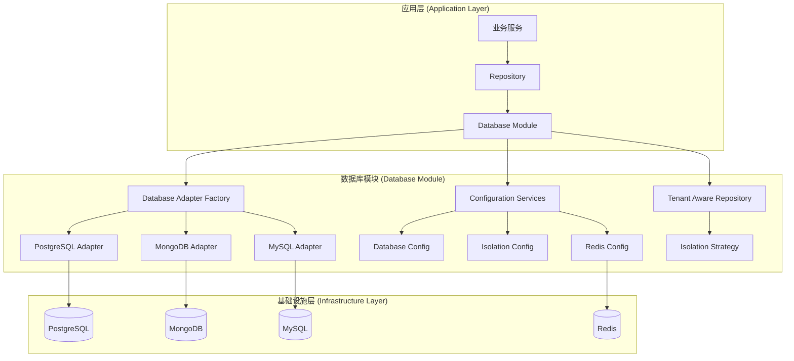
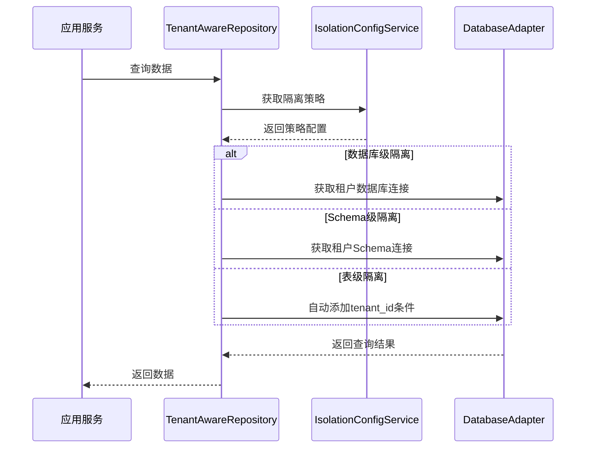
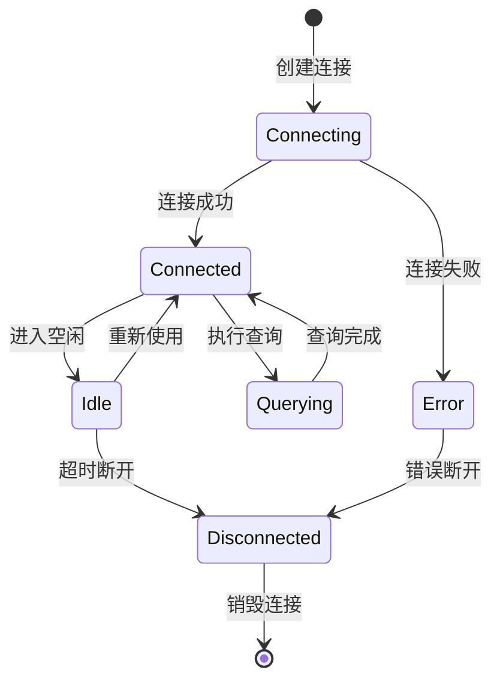
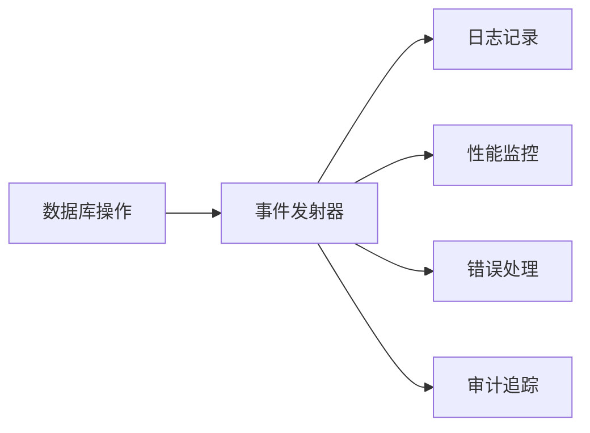

# 数据库模块技术设计方案

## 1. 模块概述

### 1.1 模块定位

`@aiofix/database` 是 Aiofix-AI-SaaS 平台的数据库基础设施库，提供统一的数据库抽象层和多租户数据隔离支持。该模块遵循 DDD（领域驱动设计）和 Clean Architecture 原则，为上层应用提供稳定、可扩展的数据库访问能力。

### 1.2 核心价值

- **统一抽象**：提供统一的数据库访问接口，屏蔽底层数据库差异
- **多租户支持**：支持数据库级、Schema级、表级三种数据隔离策略
- **高性能**：基于连接池和事件驱动的架构设计
- **可观测性**：完整的日志记录、统计信息和健康检查机制
- **可扩展性**：模块化设计，支持多种数据库类型和适配器

## 2. 架构设计

### 2.1 整体架构



### 2.2 核心组件

#### 2.2.1 数据库适配器 (Database Adapters)

- **PostgreSQLAdapter**：PostgreSQL 数据库适配器
- **DatabaseAdapterFactory**：数据库适配器工厂，负责创建和管理适配器实例

#### 2.2.2 配置服务 (Configuration Services)

- **DatabaseConfig**：数据库连接配置管理
- **IsolationConfigService**：多租户数据隔离配置
- **RedisConfig**：Redis 缓存和消息队列配置

#### 2.2.3 仓储层 (Repository Layer)

- **TenantAwareRepository**：租户感知的仓储基类

## 3. 核心功能设计

### 3.1 多租户数据隔离策略

#### 3.1.1 隔离策略类型

```typescript
export enum IsolationStrategy {
  /** 数据库级隔离：每个租户使用独立数据库 */
  DATABASE_LEVEL = 'database_level',
  /** Schema级隔离：每个租户使用独立Schema */
  SCHEMA_LEVEL = 'schema_level', 
  /** 表级隔离：使用tenant_id字段隔离（默认） */
  TABLE_LEVEL = 'table_level',
}
```

#### 3.1.2 隔离策略对比

| 策略 | 优点 | 缺点 | 适用场景 |
|------|------|------|----------|
| 数据库级 | 完全隔离、性能最优、安全性最高 | 资源消耗大、管理复杂 | 大型企业客户 |
| Schema级 | 平衡隔离性和资源消耗 | 需要数据库支持Schema | 中型企业客户 |
| 表级 | 资源消耗小、管理简单 | 隔离性相对较低 | 小型客户、共享资源 |

#### 3.1.3 隔离策略实现



### 3.2 数据库连接管理

#### 3.2.1 连接池设计

```typescript
interface PoolConfig {
  min: number;                    // 最小连接数
  max: number;                    // 最大连接数
  acquireTimeoutMillis: number;   // 获取连接超时时间
  createTimeoutMillis: number;    // 创建连接超时时间
  destroyTimeoutMillis: number;   // 销毁连接超时时间
  idleTimeoutMillis: number;      // 空闲连接超时时间
  reapIntervalMillis: number;     // 回收间隔
  createRetryIntervalMillis: number; // 创建重试间隔
}
```

#### 3.2.2 连接生命周期管理



### 3.3 事件驱动架构

#### 3.3.1 事件类型

```typescript
// 连接事件
interface ConnectionEvent {
  type: 'connection.created' | 'connection.closed' | 'connection.error';
  connectionId: string;
  timestamp: Date;
  metadata?: Record<string, unknown>;
}

// 查询事件
interface QueryEvent {
  type: 'query.started' | 'query.completed' | 'query.error';
  queryId: string;
  sql: string;
  duration?: number;
  timestamp: Date;
  metadata?: Record<string, unknown>;
}
```

#### 3.3.2 事件处理流程



## 4. 接口设计

### 4.1 核心接口定义

#### 4.1.1 数据库适配器接口

```typescript
interface IDatabaseAdapter {
  // 连接管理
  connect(): Promise<void>;
  disconnect(): Promise<void>;
  ping(): Promise<boolean>;
  
  // 查询操作
  query<T = any>(sql: string, params?: any[]): Promise<T[]>;
  execute(sql: string, params?: any[]): Promise<QueryResult>;
  
  // 事务管理
  transaction<T>(callback: (trx: Transaction) => Promise<T>): Promise<T>;
  
  // 健康检查
  healthCheck(): Promise<DatabaseHealth>;
  
  // 统计信息
  getStats(): DatabaseStats;
}
```

#### 4.1.2 数据库管理器接口

```typescript
interface IDatabaseManager {
  // 适配器管理
  getAdapter(type: DatabaseType): IDatabaseAdapter;
  createAdapter(config: DatabaseConfig): IDatabaseAdapter;
  
  // 连接管理
  getConnection(config: DatabaseConfig): Promise<DatabaseConnection>;
  releaseConnection(connection: DatabaseConnection): Promise<void>;
  
  // 健康检查
  healthCheck(): Promise<Record<string, DatabaseHealth>>;
}
```

### 4.2 配置接口设计

#### 4.2.1 数据库配置接口

```typescript
interface DatabaseConfig {
  type: 'postgresql' | 'mysql' | 'mongodb';
  host: string;
  port: number;
  username: string;
  password: string;
  database: string;
  schema?: string;
  ssl: boolean | SSLConfig;
  pool: PoolConfig;
  sync: SyncConfig;
  logging: LoggingConfig;
}
```

#### 4.2.2 隔离配置接口

```typescript
interface IsolationConfig {
  strategy: IsolationStrategy;
  defaultTenantId: string;
  databaseLevel: DatabaseLevelConfig;
  schemaLevel: SchemaLevelConfig;
  tableLevel: TableLevelConfig;
}
```

## 5. 实现细节

### 5.1 PostgreSQL 适配器实现

#### 5.1.1 连接管理

```typescript
class PostgreSQLAdapter implements IDatabaseAdapter {
  private pool: Pool;
  private stats: DatabaseStats;
  
  constructor(config: DatabaseConfig, eventEmitter: EventEmitter2) {
    this.pool = new Pool({
      host: config.host,
      port: config.port,
      user: config.username,
      password: config.password,
      database: config.database,
      ...config.pool
    });
    
    this.setupEventHandlers();
  }
  
  private setupEventHandlers(): void {
    this.pool.on('connect', (client) => {
      this.eventEmitter.emit('connection.created', {
        connectionId: client.processID,
        timestamp: new Date()
      });
    });
    
    this.pool.on('error', (err) => {
      this.eventEmitter.emit('connection.error', {
        error: err.message,
        timestamp: new Date()
      });
    });
  }
}
```

#### 5.1.2 查询执行

```typescript
async query<T = any>(sql: string, params?: any[]): Promise<T[]> {
  const queryId = uuidv4();
  const startTime = Date.now();
  
  try {
    this.eventEmitter.emit('query.started', {
      queryId,
      sql,
      timestamp: new Date()
    });
    
    const result = await this.pool.query(sql, params);
    
    const duration = Date.now() - startTime;
    this.updateStats('query', duration);
    
    this.eventEmitter.emit('query.completed', {
      queryId,
      sql,
      duration,
      timestamp: new Date()
    });
    
    return result.rows;
  } catch (error) {
    this.eventEmitter.emit('query.error', {
      queryId,
      sql,
      error: error.message,
      timestamp: new Date()
    });
    throw error;
  }
}
```

### 5.2 多租户仓储实现

#### 5.2.1 租户感知查询

```typescript
class TenantAwareRepository<T> {
  constructor(
    private adapter: IDatabaseAdapter,
    private isolationConfig: IsolationConfigService
  ) {}
  
  async findAll(tenantId?: string): Promise<T[]> {
    const strategy = this.isolationConfig.getStrategy();
    const sql = this.buildQuery('SELECT * FROM table_name', tenantId, strategy);
    
    return this.adapter.query<T>(sql);
  }
  
  private buildQuery(baseSql: string, tenantId?: string, strategy?: IsolationStrategy): string {
    if (!tenantId) {
      return baseSql;
    }
    
    switch (strategy) {
      case IsolationStrategy.DATABASE_LEVEL:
        // 使用租户特定的数据库连接
        return baseSql;
        
      case IsolationStrategy.SCHEMA_LEVEL:
        // 使用租户特定的Schema
        const schemaName = this.isolationConfig.getTenantSchemaName(tenantId);
        return baseSql.replace('table_name', `${schemaName}.table_name`);
        
      case IsolationStrategy.TABLE_LEVEL:
      default:
        // 添加tenant_id条件
        const tenantField = this.isolationConfig.getTenantIdField();
        const whereClause = baseSql.includes('WHERE') ? 'AND' : 'WHERE';
        return `${baseSql} ${whereClause} ${tenantField} = '${tenantId}'`;
    }
  }
}
```

### 5.3 配置管理实现

#### 5.3.1 数据库配置服务

```typescript
class DatabaseConfig {
  constructor(
    private configService: ConfigService,
    private logger: PinoLoggerService
  ) {}
  
  getPostgresConfig(): DatabaseConfig {
    const databaseConfig = this.configService.databaseConfig;
    
    return {
      type: 'postgresql',
      host: databaseConfig.postgresql?.host ?? 'localhost',
      port: databaseConfig.postgresql?.port ?? 5432,
      username: databaseConfig.postgresql?.username ?? 'aiofix_user',
      password: databaseConfig.postgresql?.password ?? 'aiofix_password',
      database: databaseConfig.postgresql?.database ?? 'aiofix_platform',
      schema: databaseConfig.postgresql?.schema ?? 'public',
      ssl: databaseConfig.postgresql?.ssl ?? false,
      pool: databaseConfig.pool ?? this.getDefaultPoolConfig(),
      sync: databaseConfig.sync ?? { synchronize: false },
      logging: databaseConfig.logging ?? { enabled: false }
    };
  }
  
  private getDefaultPoolConfig(): PoolConfig {
    return {
      min: 2,
      max: 10,
      acquireTimeoutMillis: 30000,
      createTimeoutMillis: 30000,
      destroyTimeoutMillis: 5000,
      idleTimeoutMillis: 30000,
      reapIntervalMillis: 1000,
      createRetryIntervalMillis: 200
    };
  }
}
```

## 6. 性能优化

### 6.1 连接池优化

#### 6.1.1 动态连接池调整

```typescript
class DynamicPoolManager {
  private adjustPoolSize(): void {
    const currentLoad = this.getCurrentLoad();
    const poolSize = this.pool.totalCount;
    
    if (currentLoad > 0.8 && poolSize < this.maxPoolSize) {
      // 增加连接数
      this.increasePoolSize();
    } else if (currentLoad < 0.3 && poolSize > this.minPoolSize) {
      // 减少连接数
      this.decreasePoolSize();
    }
  }
  
  private getCurrentLoad(): number {
    return this.pool.totalCount / this.pool.max;
  }
}
```

#### 6.1.2 连接预热

```typescript
class ConnectionPreWarmer {
  async warmupConnections(): Promise<void> {
    const connections = [];
    const minConnections = this.config.pool.min;
    
    for (let i = 0; i < minConnections; i++) {
      connections.push(this.createConnection());
    }
    
    await Promise.all(connections);
    this.logger.info(`Warmed up ${minConnections} connections`);
  }
}
```

### 6.2 查询优化

#### 6.2.1 查询缓存

```typescript
class QueryCache {
  private cache = new Map<string, CacheEntry>();
  
  async get<T>(sql: string, params: any[]): Promise<T[] | null> {
    const key = this.generateKey(sql, params);
    const entry = this.cache.get(key);
    
    if (entry && !this.isExpired(entry)) {
      return entry.data;
    }
    
    return null;
  }
  
  set<T>(sql: string, params: any[], data: T[], ttl: number): void {
    const key = this.generateKey(sql, params);
    this.cache.set(key, {
      data,
      expiresAt: Date.now() + ttl
    });
  }
}
```

#### 6.2.2 批量操作优化

```typescript
class BatchProcessor {
  async batchInsert<T>(tableName: string, records: T[]): Promise<void> {
    const batchSize = 1000;
    const batches = this.chunkArray(records, batchSize);
    
    for (const batch of batches) {
      await this.insertBatch(tableName, batch);
    }
  }
  
  private chunkArray<T>(array: T[], size: number): T[][] {
    const chunks = [];
    for (let i = 0; i < array.length; i += size) {
      chunks.push(array.slice(i, i + size));
    }
    return chunks;
  }
}
```

## 7. 监控与可观测性

### 7.1 健康检查

#### 7.1.1 健康检查接口

```typescript
interface DatabaseHealth {
  status: 'healthy' | 'unhealthy' | 'degraded';
  timestamp: Date;
  responseTime: number;
  activeConnections: number;
  totalConnections: number;
  error?: string;
}
```

#### 7.1.2 健康检查实现

```typescript
class HealthChecker {
  async checkHealth(): Promise<DatabaseHealth> {
    const startTime = Date.now();
    
    try {
      await this.adapter.ping();
      const responseTime = Date.now() - startTime;
      const stats = this.adapter.getStats();
      
      return {
        status: responseTime < 1000 ? 'healthy' : 'degraded',
        timestamp: new Date(),
        responseTime,
        activeConnections: stats.activeConnections,
        totalConnections: stats.totalConnections
      };
    } catch (error) {
      return {
        status: 'unhealthy',
        timestamp: new Date(),
        responseTime: Date.now() - startTime,
        activeConnections: 0,
        totalConnections: 0,
        error: error.message
      };
    }
  }
}
```

### 7.2 性能监控

#### 7.2.1 统计信息收集

```typescript
interface DatabaseStats {
  totalQueries: number;
  totalTransactions: number;
  averageQueryTime: number;
  activeConnections: number;
  totalConnections: number;
  errorCount: number;
  lastError?: string;
  lastErrorTime?: Date;
}
```

#### 7.2.2 指标导出

```typescript
class MetricsExporter {
  exportMetrics(): Record<string, number> {
    const stats = this.adapter.getStats();
    
    return {
      'database_queries_total': stats.totalQueries,
      'database_transactions_total': stats.totalTransactions,
      'database_query_duration_ms': stats.averageQueryTime,
      'database_connections_active': stats.activeConnections,
      'database_connections_total': stats.totalConnections,
      'database_errors_total': stats.errorCount
    };
  }
}
```

## 8. 错误处理与容错

### 8.1 错误分类

#### 8.1.1 错误类型定义

```typescript
enum DatabaseErrorType {
  CONNECTION_ERROR = 'CONNECTION_ERROR',
  QUERY_ERROR = 'QUERY_ERROR',
  TRANSACTION_ERROR = 'TRANSACTION_ERROR',
  TIMEOUT_ERROR = 'TIMEOUT_ERROR',
  PERMISSION_ERROR = 'PERMISSION_ERROR',
  CONFIGURATION_ERROR = 'CONFIGURATION_ERROR'
}
```

#### 8.1.2 错误处理策略

```typescript
class ErrorHandler {
  handleError(error: Error, context: ErrorContext): void {
    const errorType = this.classifyError(error);
    
    switch (errorType) {
      case DatabaseErrorType.CONNECTION_ERROR:
        this.handleConnectionError(error, context);
        break;
      case DatabaseErrorType.QUERY_ERROR:
        this.handleQueryError(error, context);
        break;
      case DatabaseErrorType.TIMEOUT_ERROR:
        this.handleTimeoutError(error, context);
        break;
      default:
        this.handleGenericError(error, context);
    }
  }
  
  private handleConnectionError(error: Error, context: ErrorContext): void {
    // 重连逻辑
    this.scheduleReconnect(context);
    
    // 记录错误
    this.logger.error('Database connection error', {
      error: error.message,
      context
    });
  }
}
```

### 8.2 重试机制

#### 8.2.1 指数退避重试

```typescript
class RetryManager {
  async executeWithRetry<T>(
    operation: () => Promise<T>,
    maxRetries: number = 3
  ): Promise<T> {
    let lastError: Error;
    
    for (let attempt = 1; attempt <= maxRetries; attempt++) {
      try {
        return await operation();
      } catch (error) {
        lastError = error;
        
        if (attempt === maxRetries || !this.isRetryableError(error)) {
          throw error;
        }
        
        const delay = this.calculateDelay(attempt);
        await this.sleep(delay);
      }
    }
    
    throw lastError;
  }
  
  private calculateDelay(attempt: number): number {
    // 指数退避：100ms, 200ms, 400ms, ...
    return Math.min(1000 * Math.pow(2, attempt - 1), 5000);
  }
}
```

## 9. 安全考虑

### 9.1 连接安全

#### 9.1.1 SSL/TLS 配置

```typescript
interface SSLConfig {
  rejectUnauthorized: boolean;
  ca?: string;
  cert?: string;
  key?: string;
  servername?: string;
}

class SecureConnectionManager {
  createSecureConnection(config: DatabaseConfig): PoolConfig {
    return {
      ...config,
      ssl: config.ssl ? {
        rejectUnauthorized: true,
        ...(typeof config.ssl === 'object' ? config.ssl : {})
      } : false
    };
  }
}
```

#### 9.1.2 凭据管理

```typescript
class CredentialManager {
  async getCredentials(tenantId: string): Promise<DatabaseCredentials> {
    // 从安全存储获取凭据
    const credentials = await this.secureStore.get(`db:${tenantId}`);
    
    if (!credentials) {
      throw new Error(`No credentials found for tenant: ${tenantId}`);
    }
    
    return this.decrypt(credentials);
  }
}
```

### 9.2 数据隔离安全

#### 9.2.1 租户隔离验证

```typescript
class TenantIsolationValidator {
  validateTenantAccess(tenantId: string, operation: DatabaseOperation): void {
    // 验证租户ID格式
    if (!this.isValidTenantId(tenantId)) {
      throw new Error('Invalid tenant ID format');
    }
    
    // 验证租户权限
    if (!this.hasTenantAccess(tenantId, operation)) {
      throw new Error('Insufficient tenant permissions');
    }
    
    // 验证数据隔离策略
    this.validateIsolationStrategy(tenantId, operation);
  }
  
  private isValidTenantId(tenantId: string): boolean {
    const uuidRegex = /^[0-9a-f]{8}-[0-9a-f]{4}-[0-9a-f]{4}-[0-9a-f]{4}-[0-9a-f]{12}$/i;
    return uuidRegex.test(tenantId);
  }
}
```

## 10. 测试策略

### 10.1 单元测试

#### 10.1.1 测试覆盖范围

```typescript
describe('PostgreSQLAdapter', () => {
  describe('连接管理', () => {
    it('应该能够成功连接数据库', async () => {
      const adapter = new PostgreSQLAdapter(mockConfig, mockEventEmitter);
      await adapter.connect();
      expect(adapter.isConnected()).toBe(true);
    });
    
    it('应该能够处理连接失败', async () => {
      const adapter = new PostgreSQLAdapter(invalidConfig, mockEventEmitter);
      await expect(adapter.connect()).rejects.toThrow();
    });
  });
  
  describe('查询执行', () => {
    it('应该能够执行简单查询', async () => {
      const result = await adapter.query('SELECT 1 as test');
      expect(result).toEqual([{ test: 1 }]);
    });
    
    it('应该能够处理查询错误', async () => {
      await expect(adapter.query('INVALID SQL')).rejects.toThrow();
    });
  });
});
```

### 10.2 集成测试

#### 10.2.1 多租户隔离测试

```typescript
describe('多租户数据隔离', () => {
  it('应该正确隔离不同租户的数据', async () => {
    const tenant1 = 'tenant-1';
    const tenant2 = 'tenant-2';
    
    // 创建租户1的数据
    await repository.create(tenant1, { name: 'Tenant 1 Data' });
    
    // 创建租户2的数据
    await repository.create(tenant2, { name: 'Tenant 2 Data' });
    
    // 验证租户1只能看到自己的数据
    const tenant1Data = await repository.findAll(tenant1);
    expect(tenant1Data).toHaveLength(1);
    expect(tenant1Data[0].name).toBe('Tenant 1 Data');
    
    // 验证租户2只能看到自己的数据
    const tenant2Data = await repository.findAll(tenant2);
    expect(tenant2Data).toHaveLength(1);
    expect(tenant2Data[0].name).toBe('Tenant 2 Data');
  });
});
```

### 10.3 性能测试

#### 10.3.1 负载测试

```typescript
describe('性能测试', () => {
  it('应该能够处理高并发查询', async () => {
    const concurrentQueries = 100;
    const promises = [];
    
    for (let i = 0; i < concurrentQueries; i++) {
      promises.push(adapter.query('SELECT 1'));
    }
    
    const startTime = Date.now();
    await Promise.all(promises);
    const duration = Date.now() - startTime;
    
    expect(duration).toBeLessThan(5000); // 5秒内完成
  });
});
```

## 11. 部署与运维

### 11.1 环境配置

#### 11.1.1 环境变量配置

```bash
# 数据库连接配置
DATABASE_HOST=localhost
DATABASE_PORT=5432
DATABASE_USERNAME=aiofix_user
DATABASE_PASSWORD=aiofix_password
DATABASE_NAME=aiofix_platform

# 连接池配置
DATABASE_POOL_MIN=2
DATABASE_POOL_MAX=10
DATABASE_POOL_ACQUIRE_TIMEOUT=30000

# 数据隔离配置
DATA_ISOLATION_STRATEGY=table_level
TENANT_ID_FIELD=tenant_id
ENABLE_RLS=true

# 日志配置
DATABASE_LOGGING_ENABLED=true
DATABASE_LOGGING_LEVEL=info
```

#### 11.1.2 Docker 配置

```dockerfile
FROM node:18-alpine

WORKDIR /app

COPY package*.json ./
RUN npm ci --only=production

COPY dist ./dist

EXPOSE 3000

CMD ["node", "dist/main.js"]
```

### 11.2 监控配置

#### 11.2.1 Prometheus 指标

```yaml
# prometheus.yml
global:
  scrape_interval: 15s

scrape_configs:
  - job_name: 'database-module'
    static_configs:
      - targets: ['localhost:9090']
    metrics_path: '/metrics'
```

#### 11.2.2 告警规则

```yaml
# alerts.yml
groups:
  - name: database
    rules:
      - alert: DatabaseConnectionHigh
        expr: database_connections_active / database_connections_total > 0.8
        for: 5m
        labels:
          severity: warning
        annotations:
          summary: "数据库连接数过高"
          
      - alert: DatabaseQuerySlow
        expr: database_query_duration_ms > 1000
        for: 2m
        labels:
          severity: warning
        annotations:
          summary: "数据库查询响应时间过长"
```

## 12. 未来扩展

### 12.1 支持更多数据库类型

#### 12.1.1 MySQL 适配器

```typescript
class MySQLAdapter implements IDatabaseAdapter {
  // MySQL 特定实现
}
```

#### 12.1.2 MongoDB 适配器

```typescript
class MongoDBAdapter implements IDatabaseAdapter {
  // MongoDB 特定实现
}
```

### 12.2 高级功能

#### 12.2.1 读写分离

```typescript
class ReadWriteSplitManager {
  getReadConnection(): IDatabaseAdapter {
    return this.readAdapters[this.getReadAdapterIndex()];
  }
  
  getWriteConnection(): IDatabaseAdapter {
    return this.writeAdapter;
  }
}
```

#### 12.2.2 分片支持

```typescript
class ShardingManager {
  getShard(tenantId: string): IDatabaseAdapter {
    const shardId = this.calculateShardId(tenantId);
    return this.shards[shardId];
  }
}
```

## 13. 总结

`@aiofix/database` 模块作为 Aiofix-AI-SaaS 平台的数据库基础设施，提供了：

1. **统一的数据访问抽象层**：屏蔽底层数据库差异，提供一致的 API
2. **灵活的多租户隔离策略**：支持数据库级、Schema级、表级三种隔离方式
3. **高性能的连接管理**：基于连接池的优化设计，支持动态调整
4. **完整的可观测性**：提供健康检查、性能监控、错误追踪等功能
5. **强大的容错能力**：包含重试机制、错误处理、故障恢复等特性
6. **安全的访问控制**：支持 SSL/TLS、凭据管理、租户隔离验证

该模块遵循 Clean Architecture 和 DDD 原则，具有良好的可扩展性和可维护性，能够满足多租户 SaaS 平台的复杂数据库需求。
