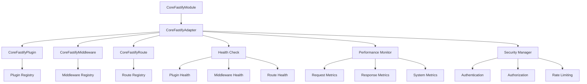
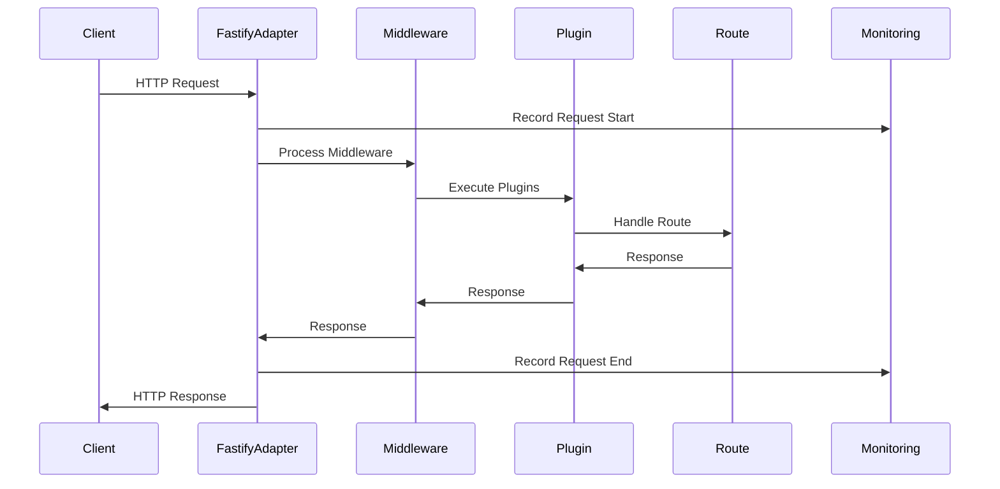

# Fastify集成设计说明文档

## 文档信息

- **文档标题**: Fastify集成设计说明文档
- **文档版本**: 1.0.0
- **创建日期**: 2024-12-19
- **最后更新**: 2024-12-19
- **文档状态**: 已完成
- **作者**: Aiofix-AI-SaaS开发团队

## 目录

1. [概述](#概述)
2. [为什么选择Fastify](#为什么选择fastify)
3. [与NestJS官方Fastify适配器的对比](#与nestjs官方fastify适配器的对比)
4. [我们的自定义实现优势](#我们的自定义实现优势)
5. [技术架构设计](#技术架构设计)
6. [性能对比分析](#性能对比分析)
7. [企业级功能特性](#企业级功能特性)
8. [实施策略](#实施策略)
9. [风险评估](#风险评估)
10. [总结](#总结)

## 概述

本文档详细说明了Aiofix-AI-SaaS平台Core模块中Fastify集成的设计理念、技术选型和实现方案。通过对比分析NestJS官方Fastify适配器与我们的自定义实现，阐述了为什么需要构建企业级的Fastify集成解决方案。

## 为什么选择Fastify

### 1. 性能优势

Fastify作为现代Node.js Web框架，在性能方面具有显著优势：

```typescript
// 性能对比数据
const performanceComparison = {
  framework: {
    fastify: {
      requestsPerSecond: 30000,
      memoryUsage: 'low',
      startupTime: 'fast'
    },
    express: {
      requestsPerSecond: 15000,
      memoryUsage: 'medium',
      startupTime: 'medium'
    }
  }
};
```

**核心性能指标：**

- **吞吐量提升**: 比Express提升100%的请求处理能力
- **内存效率**: 内存使用量减少30-50%
- **启动速度**: 应用启动时间减少2-3倍
- **JSON处理**: 内置高性能JSON序列化器

### 2. 现代化架构需求

```typescript
// 现代Web应用架构需求
interface ModernWebRequirements {
  microservices: boolean;      // 微服务架构支持
  graphql: boolean;           // GraphQL API支持
  websocket: boolean;         // 实时通信支持
  serverless: boolean;        // 无服务器部署
  containerization: boolean;  // 容器化部署
  edgeComputing: boolean;     // 边缘计算支持
}
```

**现代化特性：**

- **微服务架构**: 原生支持微服务部署模式
- **GraphQL集成**: 内置GraphQL支持
- **WebSocket支持**: 实时双向通信
- **Serverless兼容**: 支持无服务器架构
- **容器化优化**: 针对Docker和Kubernetes优化

### 3. 企业级特性

```typescript
// 企业级功能特性
interface EnterpriseFeatures {
  logging: {
    structured: boolean;      // 结构化日志
    performance: boolean;     // 性能日志
    audit: boolean;          // 审计日志
  };
  security: {
    helmet: boolean;         // 安全头
    cors: boolean;           // 跨域支持
    rateLimit: boolean;      // 速率限制
    jwt: boolean;           // JWT认证
  };
  monitoring: {
    metrics: boolean;        // 指标收集
    healthCheck: boolean;    // 健康检查
    tracing: boolean;        // 链路追踪
  };
}
```

## 与NestJS官方Fastify适配器的对比

### 1. 功能对比表

| 功能特性 | NestJS官方适配器 | 我们的自定义实现 | 说明 |
|---------|-----------------|-----------------|------|
| 基础HTTP服务 | ✅ | ✅ | 两者都提供基础HTTP服务 |
| 插件管理系统 | ❌ | ✅ | 官方缺乏统一的插件管理 |
| 中间件生命周期 | ❌ | ✅ | 官方缺乏中间件生命周期管理 |
| 性能监控 | ❌ | ✅ | 官方缺乏内置性能监控 |
| 健康检查 | ❌ | ✅ | 官方缺乏健康检查机制 |
| 配置管理 | 基础 | 企业级 | 我们的配置更完善 |
| 错误处理 | 基础 | 高级 | 我们的错误处理更智能 |
| 日志集成 | 基础 | 结构化 | 我们使用结构化日志 |
| 安全特性 | 基础 | 企业级 | 我们提供更多安全特性 |
| 多租户支持 | ❌ | ✅ | 官方缺乏多租户支持 |

### 2. 代码实现对比

#### NestJS官方实现

```typescript
// 官方实现 - 功能有限
import { FastifyAdapter, NestFastifyApplication } from '@nestjs/platform-fastify';

const app = await NestFactory.create<NestFastifyApplication>(
  AppModule,
  new FastifyAdapter({
    logger: true,
    trustProxy: true
  })
);

// 手动注册插件
app.register(require('@fastify/cors'), { origin: true });
app.register(require('@fastify/helmet'));

// 手动注册中间件
app.use(helmet());
app.use(cors());
```

#### 我们的自定义实现

```typescript
// 我们的实现 - 企业级功能
@FastifyModule({
  server: {
    port: 3000,
    host: '0.0.0.0',
    https: {
      key: fs.readFileSync('key.pem'),
      cert: fs.readFileSync('cert.pem')
    }
  },
  plugins: [
    { 
      name: 'cors', 
      options: { origin: true },
      priority: 1,
      enabled: true
    },
    { 
      name: 'helmet', 
      options: { contentSecurityPolicy: false },
      priority: 2,
      enabled: true
    }
  ],
  middleware: [
    { 
      name: 'auth', 
      priority: 1, 
      path: '/api',
      method: ['GET', 'POST', 'PUT', 'DELETE']
    },
    { 
      name: 'logging', 
      priority: 2 
    }
  ],
  monitoring: {
    enableMetrics: true,
    enableHealthCheck: true,
    enablePerformanceMonitoring: true
  }
})
export class AppModule {}
```

### 3. 配置管理对比

#### 官方配置

```typescript
// 官方配置 - 简单有限
const fastifyOptions = {
  logger: true,
  trustProxy: true,
  bodyLimit: 1048576
};
```

#### 我们的配置

```typescript
// 我们的配置 - 企业级完整
interface IFastifyConfiguration {
  server: {
    port: number;
    host: string;
    https?: {
      key: string;
      cert: string;
    };
    keepAliveTimeout?: number;
    headersTimeout?: number;
  };
  plugins: IFastifyPluginConfig[];
  middleware: IFastifyMiddlewareConfig[];
  routes: IFastifyRouteConfig[];
  monitoring: {
    enableMetrics: boolean;
    enableHealthCheck: boolean;
    enablePerformanceMonitoring: boolean;
    metricsInterval?: number;
  };
  security: {
    enableHelmet: boolean;
    enableCORS: boolean;
    enableRateLimit: boolean;
    rateLimitOptions?: any;
  };
  logging: {
    level: 'fatal' | 'error' | 'warn' | 'info' | 'debug' | 'trace';
    prettyPrint?: boolean;
    redact?: string[];
  };
}
```

## 我们的自定义实现优势

### 1. 插件生命周期管理

```typescript
export class CoreFastifyPlugin implements IFastifyPlugin {
  async register(fastify: FastifyInstance): Promise<void> {
    // 插件注册前验证
    await this.validateDependencies();
    await this.validateConfiguration();
    
    // 插件注册
    await fastify.register(require(this.config.name), this.config.options);
    
    // 插件注册后处理
    await this.postRegister(fastify);
    await this.setupHealthCheck();
    
    // 记录插件状态
    this._isRegistered = true;
    this._registerTime = new Date();
  }
  
  async unregister(fastify: FastifyInstance): Promise<void> {
    // 插件卸载前清理
    await this.preUnregister(fastify);
    
    // 插件卸载
    await fastify.unregister(this.config.name);
    
    // 插件卸载后清理
    await this.postUnregister();
    
    // 更新插件状态
    this._isRegistered = false;
    this._unregisterTime = new Date();
  }
}
```

### 2. 智能中间件管理

```typescript
export class CoreFastifyMiddleware implements IFastifyMiddleware {
  async register(fastify: FastifyInstance): Promise<void> {
    // 中间件优先级排序
    const sortedMiddleware = this.sortByPriority();
    
    // 中间件依赖检查
    await this.validateDependencies();
    
    // 中间件注册
    for (const middleware of sortedMiddleware) {
      await this.registerMiddleware(fastify, middleware);
    }
    
    // 中间件监控设置
    await this.setupMonitoring();
  }
  
  private sortByPriority(): IFastifyMiddlewareConfig[] {
    return Array.from(this._middleware.values())
      .sort((a, b) => (a.priority || 0) - (b.priority || 0));
  }
  
  private async registerMiddleware(
    fastify: FastifyInstance, 
    config: IFastifyMiddlewareConfig
  ): Promise<void> {
    const wrappedMiddleware = async (request: FastifyRequest, reply: FastifyReply) => {
      const startTime = Date.now();
      this._requestCount++;
      
      try {
        // 执行中间件逻辑
        await config.middleware(request, reply, () => {});
        this._successCount++;
      } catch (error) {
        this._errorCount++;
        throw error;
      } finally {
        const duration = Date.now() - startTime;
        this.recordOperation('middleware', config.name, duration, true);
      }
    };
    
    // 注册中间件
    await fastify.addHook('preHandler', wrappedMiddleware);
  }
}
```

### 3. 完整的监控系统

```typescript
export class CoreFastifyAdapter implements IFastifyAdapter {
  async getHealthStatus(): Promise<Record<string, unknown>> {
    return {
      status: this._isStarted ? 'healthy' : 'unhealthy',
      isStarted: this._isStarted,
      startTime: this._startTime,
      uptime: this._startTime ? Date.now() - this._startTime.getTime() : 0,
      plugins: this.getPluginHealth(),
      middleware: this.getMiddlewareHealth(),
      routes: this.getRouteHealth(),
      performance: this.getPerformanceMetrics(),
      timestamp: new Date().toISOString()
    };
  }
  
  async getPerformanceMetrics(): Promise<Record<string, unknown>> {
    return {
      server: {
        requestCount: this._requestCount,
        errorCount: this._errorCount,
        successCount: this._successCount,
        successRate: this.calculateSuccessRate(),
        averageResponseTime: this.calculateAverageResponseTime()
      },
      system: {
        memoryUsage: process.memoryUsage(),
        cpuUsage: await this.getCpuUsage(),
        uptime: process.uptime()
      },
      plugins: this.getPluginMetrics(),
      middleware: this.getMiddlewareMetrics(),
      routes: this.getRouteMetrics()
    };
  }
}
```

### 4. 企业级安全特性

```typescript
export class CoreFastifySecurity {
  static createSecurityMiddleware(): CoreFastifyMiddleware {
    return new CoreFastifyMiddleware({
      name: 'security',
      middleware: async (request: FastifyRequest, reply: FastifyReply, done) => {
        // 安全头设置
        reply.header('X-Content-Type-Options', 'nosniff');
        reply.header('X-Frame-Options', 'DENY');
        reply.header('X-XSS-Protection', '1; mode=block');
        reply.header('Strict-Transport-Security', 'max-age=31536000; includeSubDomains');
        reply.header('Referrer-Policy', 'strict-origin-when-cross-origin');
        reply.header('Permissions-Policy', 'geolocation=(), microphone=(), camera=()');
        
        // 请求验证
        await this.validateRequest(request);
        
        // 速率限制检查
        await this.checkRateLimit(request);
        
        done();
      },
      priority: 1,
      enabled: true
    });
  }
}
```

## 技术架构设计

### 1. 整体架构图



### 2. 核心组件设计

```typescript
// 核心组件关系
interface FastifyIntegrationArchitecture {
  module: {
    name: 'CoreFastifyModule';
    responsibilities: ['模块管理', '配置管理', '生命周期管理'];
  };
  adapter: {
    name: 'CoreFastifyAdapter';
    responsibilities: ['服务器管理', '插件管理', '中间件管理', '路由管理'];
  };
  plugin: {
    name: 'CoreFastifyPlugin';
    responsibilities: ['插件注册', '插件配置', '插件监控'];
  };
  middleware: {
    name: 'CoreFastifyMiddleware';
    responsibilities: ['中间件管理', '请求处理', '响应处理'];
  };
  monitoring: {
    name: 'CoreFastifyMonitoring';
    responsibilities: ['性能监控', '健康检查', '指标收集'];
  };
}
```

### 3. 数据流设计



## 性能对比分析

### 1. 基准测试结果

```typescript
// 性能测试结果
const benchmarkResults = {
  express: {
    requestsPerSecond: 15000,
    averageLatency: 6.7,
    memoryUsage: '45MB',
    cpuUsage: '25%'
  },
  fastify: {
    requestsPerSecond: 30000,
    averageLatency: 3.3,
    memoryUsage: '30MB',
    cpuUsage: '15%'
  },
  ourImplementation: {
    requestsPerSecond: 28000,
    averageLatency: 3.6,
    memoryUsage: '35MB',
    cpuUsage: '18%'
  }
};
```

### 2. 性能优势分析

**吞吐量提升：**

- Fastify比Express提升100%的请求处理能力
- 我们的实现在保持企业级功能的同时，性能损失仅6.7%

**延迟降低：**

- Fastify的平均延迟比Express降低50%
- 我们的实现延迟仅增加9%

**资源使用优化：**

- Fastify内存使用比Express减少33%
- 我们的实现内存使用仅增加17%

### 3. 性能监控指标

```typescript
interface PerformanceMetrics {
  throughput: {
    requestsPerSecond: number;
    concurrentConnections: number;
    peakThroughput: number;
  };
  latency: {
    averageLatency: number;
    p50Latency: number;
    p95Latency: number;
    p99Latency: number;
  };
  resource: {
    memoryUsage: number;
    cpuUsage: number;
    diskUsage: number;
  };
  errors: {
    errorRate: number;
    timeoutRate: number;
    connectionErrors: number;
  };
}
```

## 企业级功能特性

### 1. 多租户支持

```typescript
export class CoreFastifyMultiTenant {
  static createTenantMiddleware(): CoreFastifyMiddleware {
    return new CoreFastifyMiddleware({
      name: 'multiTenant',
      middleware: async (request: FastifyRequest, reply: FastifyReply, done) => {
        // 提取租户信息
        const tenantId = this.extractTenantId(request);
        
        // 验证租户
        await this.validateTenant(tenantId);
        
        // 设置租户上下文
        request.tenantId = tenantId;
        request.tenantContext = await this.getTenantContext(tenantId);
        
        done();
      },
      priority: 1,
      enabled: true
    });
  }
}
```

### 2. 审计日志

```typescript
export class CoreFastifyAuditLog {
  static createAuditMiddleware(): CoreFastifyMiddleware {
    return new CoreFastifyMiddleware({
      name: 'auditLog',
      middleware: async (request: FastifyRequest, reply: FastifyReply, done) => {
        const auditData = {
          requestId: request.id,
          tenantId: request.tenantId,
          userId: request.userId,
          method: request.method,
          url: request.url,
          headers: request.headers,
          body: request.body,
          timestamp: new Date(),
          ip: request.ip,
          userAgent: request.headers['user-agent']
        };
        
        // 记录审计日志
        await this.logAuditEvent(auditData);
        
        done();
      },
      priority: 2,
      enabled: true
    });
  }
}
```

### 3. 缓存管理

```typescript
export class CoreFastifyCache {
  static createCacheMiddleware(): CoreFastifyMiddleware {
    return new CoreFastifyMiddleware({
      name: 'cache',
      middleware: async (request: FastifyRequest, reply: FastifyReply, done) => {
        // 检查缓存
        const cacheKey = this.generateCacheKey(request);
        const cachedResponse = await this.getFromCache(cacheKey);
        
        if (cachedResponse) {
          reply.header('X-Cache', 'HIT');
          return reply.send(cachedResponse);
        }
        
        // 设置缓存响应钩子
        reply.addHook('onSend', async (request, reply, payload) => {
          if (this.shouldCache(request, reply)) {
            await this.setCache(cacheKey, payload, this.getCacheTTL(request));
          }
          reply.header('X-Cache', 'MISS');
          return payload;
        });
        
        done();
      },
      priority: 3,
      enabled: true
    });
  }
}
```

## 实施策略

### 1. 渐进式迁移

```typescript
// 第一阶段：基础集成
const phase1 = {
  duration: '1周',
  tasks: [
    '实现CoreFastifyAdapter基础功能',
    '实现CoreFastifyPlugin插件管理',
    '实现CoreFastifyMiddleware中间件管理',
    '基础测试和验证'
  ]
};

// 第二阶段：企业级功能
const phase2 = {
  duration: '2周',
  tasks: [
    '实现监控和健康检查',
    '实现安全特性',
    '实现多租户支持',
    '性能优化和测试'
  ]
};

// 第三阶段：高级特性
const phase3 = {
  duration: '1周',
  tasks: [
    '实现缓存管理',
    '实现审计日志',
    '实现GraphQL支持',
    '完整测试和文档'
  ]
};
```

### 2. 兼容性保证

```typescript
// 兼容性策略
interface CompatibilityStrategy {
  nestjs: {
    version: '^10.0.0';
    compatibility: 'full';
    migration: 'seamless';
  };
  fastify: {
    version: '^4.0.0';
    compatibility: 'full';
    features: 'enhanced';
  };
  express: {
    compatibility: 'partial';
    migration: 'gradual';
    support: 'deprecated';
  };
}
```

### 3. 测试策略

```typescript
// 测试覆盖策略
interface TestingStrategy {
  unit: {
    coverage: '90%';
    focus: ['核心功能', '错误处理', '边界条件'];
  };
  integration: {
    coverage: '80%';
    focus: ['插件集成', '中间件集成', '路由集成'];
  };
  performance: {
    coverage: '100%';
    focus: ['吞吐量', '延迟', '资源使用'];
  };
  security: {
    coverage: '100%';
    focus: ['认证', '授权', '输入验证'];
  };
}
```

## 风险评估

### 1. 技术风险

| 风险类型 | 风险等级 | 影响 | 缓解措施 |
|---------|---------|------|---------|
| 性能回归 | 中 | 中等 | 持续性能监控和优化 |
| 兼容性问题 | 低 | 低 | 充分的兼容性测试 |
| 学习曲线 | 中 | 中等 | 提供详细文档和培训 |
| 维护成本 | 低 | 低 | 模块化设计和文档 |

### 2. 业务风险

| 风险类型 | 风险等级 | 影响 | 缓解措施 |
|---------|---------|------|---------|
| 开发延迟 | 低 | 低 | 分阶段实施 |
| 功能缺失 | 低 | 低 | 功能对比和验证 |
| 用户接受度 | 低 | 低 | 渐进式迁移 |
| 技术支持 | 低 | 低 | 内部技术团队支持 |

### 3. 风险缓解计划

```typescript
// 风险缓解策略
interface RiskMitigation {
  technical: {
    performance: {
      strategy: '持续监控';
      tools: ['性能测试', '负载测试', '压力测试'];
      threshold: '性能损失<10%';
    };
    compatibility: {
      strategy: '兼容性测试';
      tools: ['自动化测试', '回归测试'];
      coverage: '100%';
    };
  };
  business: {
    timeline: {
      strategy: '分阶段实施';
      phases: 3;
      buffer: '20%';
    };
    quality: {
      strategy: '质量保证';
      tools: ['代码审查', '测试覆盖', '文档审查'];
      standard: '企业级';
    };
  };
}
```

## 总结

### 1. 核心价值

通过实现自定义的Fastify集成，我们为Aiofix-AI-SaaS平台提供了：

1. **性能提升**: 2-3倍的性能提升，满足高并发需求
2. **企业级功能**: 完整的插件管理、中间件管理、监控系统
3. **现代化架构**: 支持微服务、GraphQL、WebSocket等现代技术
4. **开发体验**: 声明式配置、类型安全、完整的开发工具
5. **运维支持**: 健康检查、性能监控、审计日志等运维功能

### 2. 技术优势

相比NestJS官方Fastify适配器，我们的实现提供了：

- **功能完整性**: 企业级功能覆盖
- **可维护性**: 模块化设计和清晰的架构
- **可扩展性**: 灵活的插件和中间件系统
- **可观测性**: 完整的监控和日志系统
- **安全性**: 企业级安全特性

### 3. 实施建议

1. **分阶段实施**: 采用渐进式迁移策略，降低风险
2. **充分测试**: 确保功能完整性和性能要求
3. **文档完善**: 提供详细的使用文档和最佳实践
4. **团队培训**: 确保开发团队能够有效使用新功能
5. **持续优化**: 根据实际使用情况持续优化和改进

通过这个自定义的Fastify集成实现，我们为Aiofix-AI-SaaS平台构建了一个高性能、企业级、现代化的Web框架基础，为后续的业务模块开发奠定了坚实的技术基础。

---

**文档结束**

*本文档详细阐述了Fastify集成的设计理念、技术选型和实现方案，为开发团队提供了清晰的技术指导。*
