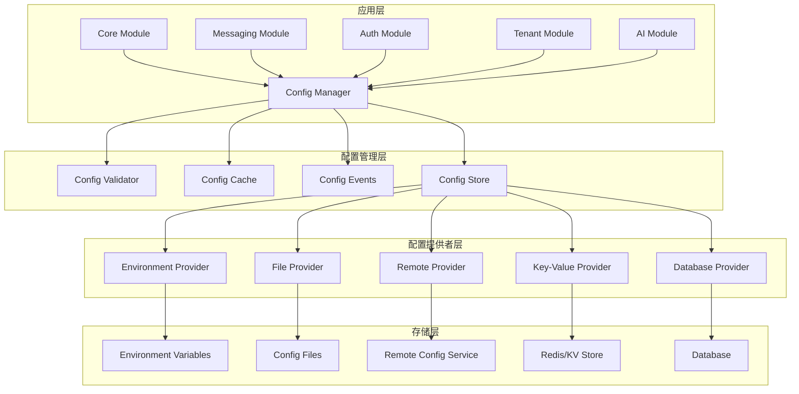

# 统一配置管理系统技术设计方案

## 📋 文档信息

- **文档标题**: 统一配置管理系统技术设计方案
- **文档版本**: v1.0.0
- **创建日期**: 2024-12-19
- **作者**: AIOFix Team
- **文档类型**: 技术设计方案

## 🎯 项目概述

### 设计目标

设计并实现一个**企业级统一配置管理平台**，为整个 AIOFix SAAS 系统提供：

- 🏗️ **统一配置中心**：所有模块的配置统一管理
- 🔄 **动态配置更新**：支持运行时配置热更新
- 🌍 **多环境支持**：开发、测试、预发布、生产环境配置管理
- 🔒 **类型安全**：完整的 TypeScript 类型支持
- 📊 **配置验证**：严格的配置验证和错误检测
- 🎛️ **可视化管理**：配置的可视化编辑和监控

### 核心价值

1. **🎯 统一性**：一个配置系统管理所有模块配置
2. **🚀 高性能**：配置缓存和懒加载机制
3. **🔐 安全性**：配置加密和权限控制
4. **📈 可扩展性**：支持新模块的快速接入
5. **🛠️ 易用性**：简单直观的 API 和工具

## 🏗️ 系统架构设计

### 整体架构图



### 核心组件设计

#### 1. 配置管理器 (ConfigManager)

```typescript
/**
 * 统一配置管理器
 * 
 * @description 系统配置管理的核心组件，负责配置的加载、缓存、更新和分发
 */
export class UnifiedConfigManager {
  // 配置存储
  private readonly configStore: IConfigStore;
  // 配置缓存
  private readonly configCache: IConfigCache;
  // 配置验证器
  private readonly configValidator: IConfigValidator;
  // 事件系统
  private readonly eventEmitter: IConfigEventEmitter;
  // 配置提供者
  private readonly providers: Map<string, IConfigProvider>;
}
```

#### 2. 配置存储 (ConfigStore)

```typescript
/**
 * 配置存储抽象层
 * 
 * @description 提供统一的配置存储接口，支持多种存储后端
 */
export interface IConfigStore {
  // 获取配置
  get<T>(path: string, defaultValue?: T): Promise<T>;
  // 设置配置
  set<T>(path: string, value: T): Promise<void>;
  // 删除配置
  delete(path: string): Promise<void>;
  // 批量操作
  batch(operations: ConfigOperation[]): Promise<void>;
  // 监听变化
  watch(path: string, callback: ConfigChangeCallback): void;
}
```

#### 3. 配置验证器 (ConfigValidator)

```typescript
/**
 * 配置验证器
 * 
 * @description 提供配置的类型验证、业务规则验证和一致性检查
 */
export interface IConfigValidator {
  // 验证配置
  validate<T>(schema: ConfigSchema<T>, config: unknown): ValidationResult<T>;
  // 注册验证规则
  registerRule(name: string, rule: ValidationRule): void;
  // 验证配置更新
  validateUpdate(path: string, oldValue: unknown, newValue: unknown): ValidationResult;
}
```

## 📊 配置模型设计

### 统一配置结构

```typescript
/**
 * 统一配置根接口
 * 
 * @description 系统所有配置的根结构，采用模块化设计
 */
export interface UnifiedConfig {
  /** 系统元信息 */
  system: SystemConfig;
  /** 核心模块配置 */
  core: CoreModuleConfig;
  /** 消息传递模块配置 */
  messaging: MessagingModuleConfig;
  /** 认证模块配置 */
  auth: AuthModuleConfig;
  /** 租户模块配置 */
  tenant: TenantModuleConfig;
  /** AI模块配置 */
  ai: AIModuleConfig;
  /** 日志模块配置 */
  logging: LoggingModuleConfig;
  /** 缓存模块配置 */
  cache: CacheModuleConfig;
  /** 数据库模块配置 */
  database: DatabaseModuleConfig;
}

/**
 * 系统配置
 */
export interface SystemConfig {
  /** 系统名称 */
  name: string;
  /** 系统版本 */
  version: string;
  /** 运行环境 */
  environment: Environment;
  /** 系统描述 */
  description?: string;
  /** 启动时间 */
  startTime: Date;
  /** 配置版本 */
  configVersion: string;
  /** 功能开关 */
  features: Record<string, boolean>;
}

/**
 * 消息传递模块配置
 */
export interface MessagingModuleConfig {
  /** 是否启用 */
  enabled: boolean;
  /** 全局配置 */
  global: {
    defaultTimeout: number;
    maxRetries: number;
    retryDelay: number;
    enableMetrics: boolean;
    enableVerboseLogging: boolean;
    enableTenantIsolation: boolean;
    serializationFormat: 'json' | 'msgpack' | 'protobuf';
    enableCompression: boolean;
    enableEncryption: boolean;
  };
  /** Redis配置 */
  redis: {
    host: string;
    port: number;
    password?: string;
    db: number;
    cluster?: {
      enabled: boolean;
      nodes: Array<{ host: string; port: number }>;
    };
  };
  /** 队列配置 */
  queues: Record<string, QueueConfig>;
  /** 处理器配置 */
  handlers: Record<string, HandlerConfig>;
  /** 监控配置 */
  monitoring: {
    enabled: boolean;
    metricsInterval: number;
    enableTracing: boolean;
  };
}
```

### 配置模式 (Schema) 系统

```typescript
/**
 * 配置模式定义
 * 
 * @description 使用 JSON Schema 定义配置结构和验证规则
 */
export interface ConfigSchema<T = unknown> {
  /** 模式 ID */
  $id: string;
  /** 模式版本 */
  version: string;
  /** 类型定义 */
  type: string;
  /** 属性定义 */
  properties: Record<string, PropertySchema>;
  /** 必需属性 */
  required?: string[];
  /** 附加属性 */
  additionalProperties?: boolean;
  /** 自定义验证规则 */
  customRules?: ValidationRule[];
}

/**
 * 属性模式
 */
export interface PropertySchema {
  type: 'string' | 'number' | 'boolean' | 'object' | 'array';
  description?: string;
  default?: unknown;
  enum?: unknown[];
  minimum?: number;
  maximum?: number;
  pattern?: string;
  format?: string;
  items?: PropertySchema;
  properties?: Record<string, PropertySchema>;
}
```

## 🔧 核心功能实现

### 1. 配置加载策略

```typescript
/**
 * 配置加载策略
 * 
 * @description 定义配置的加载顺序和优先级
 */
export enum ConfigLoadStrategy {
  /** 环境变量优先 */
  ENV_FIRST = 'env-first',
  /** 文件优先 */
  FILE_FIRST = 'file-first',
  /** 远程优先 */
  REMOTE_FIRST = 'remote-first',
  /** 合并策略 */
  MERGE = 'merge',
}

/**
 * 配置加载器
 */
export class ConfigLoader {
  async load(strategy: ConfigLoadStrategy): Promise<UnifiedConfig> {
    switch (strategy) {
      case ConfigLoadStrategy.ENV_FIRST:
        return this.loadWithEnvFirst();
      case ConfigLoadStrategy.FILE_FIRST:
        return this.loadWithFileFirst();
      case ConfigLoadStrategy.REMOTE_FIRST:
        return this.loadWithRemoteFirst();
      case ConfigLoadStrategy.MERGE:
        return this.loadWithMerge();
      default:
        throw new Error(`Unsupported load strategy: ${strategy}`);
    }
  }

  private async loadWithMerge(): Promise<UnifiedConfig> {
    const configs = await Promise.all([
      this.loadFromEnvironment(),
      this.loadFromFiles(),
      this.loadFromRemote(),
      this.loadFromDatabase(),
    ]);

    return this.mergeConfigs(configs);
  }
}
```

### 2. 配置缓存机制

```typescript
/**
 * 配置缓存
 * 
 * @description 提供多级缓存机制，提高配置访问性能
 */
export class ConfigCache implements IConfigCache {
  private readonly l1Cache: Map<string, CacheEntry> = new Map();
  private readonly l2Cache: IExternalCache; // Redis 等外部缓存

  async get<T>(key: string): Promise<T | undefined> {
    // L1 缓存查询
    const l1Entry = this.l1Cache.get(key);
    if (l1Entry && !this.isExpired(l1Entry)) {
      return l1Entry.value as T;
    }

    // L2 缓存查询
    const l2Value = await this.l2Cache.get(key);
    if (l2Value) {
      this.l1Cache.set(key, {
        value: l2Value,
        timestamp: Date.now(),
        ttl: this.getDefaultTTL(),
      });
      return l2Value as T;
    }

    return undefined;
  }

  async set<T>(key: string, value: T, ttl?: number): Promise<void> {
    const entry: CacheEntry = {
      value,
      timestamp: Date.now(),
      ttl: ttl || this.getDefaultTTL(),
    };

    // 更新 L1 缓存
    this.l1Cache.set(key, entry);

    // 更新 L2 缓存
    await this.l2Cache.set(key, value, ttl);
  }
}
```

### 3. 配置热更新机制

```typescript
/**
 * 配置热更新管理器
 * 
 * @description 支持运行时配置的动态更新
 */
export class ConfigHotReloader {
  private readonly watchers: Map<string, ConfigWatcher> = new Map();
  private readonly subscribers: Map<string, Set<ConfigChangeCallback>> = new Map();

  /**
   * 监听配置变化
   */
  watch(path: string, callback: ConfigChangeCallback): void {
    if (!this.subscribers.has(path)) {
      this.subscribers.set(path, new Set());
    }
    this.subscribers.get(path)!.add(callback);

    // 启动文件监听器
    if (!this.watchers.has(path)) {
      this.startWatcher(path);
    }
  }

  /**
   * 应用配置更新
   */
  async applyUpdate(path: string, newValue: unknown): Promise<void> {
    // 验证新配置
    const validationResult = await this.validateUpdate(path, newValue);
    if (!validationResult.valid) {
      throw new ConfigValidationError(validationResult.errors);
    }

    // 更新配置
    await this.configStore.set(path, newValue);

    // 清除缓存
    await this.configCache.delete(path);

    // 通知订阅者
    this.notifySubscribers(path, newValue);
  }

  private notifySubscribers(path: string, newValue: unknown): void {
    const callbacks = this.subscribers.get(path);
    if (callbacks) {
      callbacks.forEach(callback => {
        try {
          callback({
            path,
            newValue,
            oldValue: undefined, // 可以从缓存中获取
            timestamp: new Date(),
          });
        } catch (error) {
          console.error('Config change callback error:', error);
        }
      });
    }
  }
}
```

## 🎛️ API 设计

### 1. 基础 API

```typescript
/**
 * 统一配置管理器 API
 */
export class UnifiedConfigManager {
  /**
   * 获取配置
   * 
   * @param path 配置路径，支持点分隔符
   * @param defaultValue 默认值
   * @returns 配置值
   */
  async get<T>(path: string, defaultValue?: T): Promise<T> {
    return this.configStore.get(path, defaultValue);
  }

  /**
   * 设置配置
   * 
   * @param path 配置路径
   * @param value 配置值
   */
  async set<T>(path: string, value: T): Promise<void> {
    await this.configStore.set(path, value);
  }

  /**
   * 获取模块配置
   * 
   * @param module 模块名称
   * @returns 模块配置
   */
  async getModuleConfig<T>(module: string): Promise<T> {
    return this.get<T>(module);
  }

  /**
   * 监听配置变化
   * 
   * @param path 配置路径
   * @param callback 变化回调
   */
  onChange(path: string, callback: ConfigChangeCallback): void {
    this.hotReloader.watch(path, callback);
  }

  /**
   * 验证配置
   * 
   * @param config 配置对象
   * @returns 验证结果
   */
  async validate<T>(config: T): Promise<ValidationResult<T>> {
    return this.configValidator.validate(this.getSchema<T>(), config);
  }
}
```

### 2. 模块专用 API

```typescript
/**
 * 消息传递模块配置 API
 */
export class MessagingConfigAPI {
  constructor(private readonly configManager: UnifiedConfigManager) {}

  /**
   * 获取消息传递配置
   */
  async getConfig(): Promise<MessagingModuleConfig> {
    return this.configManager.getModuleConfig<MessagingModuleConfig>('messaging');
  }

  /**
   * 获取队列配置
   */
  async getQueueConfig(queueName: string): Promise<QueueConfig> {
    return this.configManager.get<QueueConfig>(`messaging.queues.${queueName}`);
  }

  /**
   * 更新全局配置
   */
  async updateGlobalConfig(config: Partial<MessagingModuleConfig['global']>): Promise<void> {
    const currentConfig = await this.getConfig();
    const newGlobalConfig = { ...currentConfig.global, ...config };
    await this.configManager.set('messaging.global', newGlobalConfig);
  }

  /**
   * 监听消息传递配置变化
   */
  onConfigChange(callback: (config: MessagingModuleConfig) => void): void {
    this.configManager.onChange('messaging', (event) => {
      callback(event.newValue as MessagingModuleConfig);
    });
  }
}
```

## 🔒 安全性设计

### 1. 配置加密

```typescript
/**
 * 配置加密服务
 * 
 * @description 对敏感配置进行加密存储和传输
 */
export class ConfigEncryption {
  private readonly algorithm = 'aes-256-gcm';
  private readonly keyDerivation = 'pbkdf2';

  /**
   * 加密配置值
   */
  encrypt(value: string, key: string): EncryptedValue {
    const salt = crypto.randomBytes(16);
    const iv = crypto.randomBytes(12);
    const derivedKey = crypto.pbkdf2Sync(key, salt, 100000, 32, 'sha256');
    
    const cipher = crypto.createCipherGCM(this.algorithm, derivedKey, iv);
    let encrypted = cipher.update(value, 'utf8', 'hex');
    encrypted += cipher.final('hex');
    
    const authTag = cipher.getAuthTag();

    return {
      encrypted,
      salt: salt.toString('hex'),
      iv: iv.toString('hex'),
      authTag: authTag.toString('hex'),
      algorithm: this.algorithm,
    };
  }

  /**
   * 解密配置值
   */
  decrypt(encryptedValue: EncryptedValue, key: string): string {
    const salt = Buffer.from(encryptedValue.salt, 'hex');
    const iv = Buffer.from(encryptedValue.iv, 'hex');
    const authTag = Buffer.from(encryptedValue.authTag, 'hex');
    const derivedKey = crypto.pbkdf2Sync(key, salt, 100000, 32, 'sha256');

    const decipher = crypto.createDecipherGCM(this.algorithm, derivedKey, iv);
    decipher.setAuthTag(authTag);
    
    let decrypted = decipher.update(encryptedValue.encrypted, 'hex', 'utf8');
    decrypted += decipher.final('utf8');
    
    return decrypted;
  }
}
```

### 2. 权限控制

```typescript
/**
 * 配置权限管理
 * 
 * @description 控制配置的访问和修改权限
 */
export class ConfigPermissionManager {
  private readonly permissions: Map<string, ConfigPermission> = new Map();

  /**
   * 检查读取权限
   */
  checkReadPermission(path: string, context: SecurityContext): boolean {
    const permission = this.permissions.get(path);
    if (!permission) {
      return true; // 默认允许读取
    }

    return this.evaluatePermission(permission.read, context);
  }

  /**
   * 检查写入权限
   */
  checkWritePermission(path: string, context: SecurityContext): boolean {
    const permission = this.permissions.get(path);
    if (!permission) {
      return false; // 默认禁止写入
    }

    return this.evaluatePermission(permission.write, context);
  }

  private evaluatePermission(rule: PermissionRule, context: SecurityContext): boolean {
    switch (rule.type) {
      case 'role':
        return context.roles.includes(rule.value);
      case 'user':
        return context.userId === rule.value;
      case 'environment':
        return context.environment === rule.value;
      default:
        return false;
    }
  }
}
```

## 📊 监控和诊断

### 1. 配置监控

```typescript
/**
 * 配置监控服务
 * 
 * @description 监控配置的使用情况和性能指标
 */
export class ConfigMonitoring {
  private readonly metrics: ConfigMetrics = new ConfigMetrics();

  /**
   * 记录配置访问
   */
  recordAccess(path: string, operation: 'read' | 'write', duration: number): void {
    this.metrics.increment(`config.access.${operation}`, {
      path,
      duration,
    });
  }

  /**
   * 记录配置错误
   */
  recordError(path: string, error: Error): void {
    this.metrics.increment('config.error', {
      path,
      errorType: error.constructor.name,
      message: error.message,
    });
  }

  /**
   * 获取配置统计信息
   */
  getStatistics(): ConfigStatistics {
    return {
      totalAccess: this.metrics.getCounter('config.access.read') + 
                   this.metrics.getCounter('config.access.write'),
      readAccess: this.metrics.getCounter('config.access.read'),
      writeAccess: this.metrics.getCounter('config.access.write'),
      errors: this.metrics.getCounter('config.error'),
      averageResponseTime: this.metrics.getAverage('config.access.duration'),
      cacheHitRate: this.calculateCacheHitRate(),
    };
  }
}
```

### 2. 配置诊断工具

```typescript
/**
 * 配置诊断工具
 * 
 * @description 提供配置问题的诊断和调试功能
 */
export class ConfigDiagnostics {
  /**
   * 诊断配置健康状态
   */
  async diagnose(): Promise<DiagnosticReport> {
    const report: DiagnosticReport = {
      timestamp: new Date(),
      overall: 'healthy',
      issues: [],
      recommendations: [],
    };

    // 检查配置完整性
    await this.checkConfigIntegrity(report);

    // 检查性能问题
    await this.checkPerformanceIssues(report);

    // 检查安全问题
    await this.checkSecurityIssues(report);

    return report;
  }

  /**
   * 验证配置一致性
   */
  async validateConsistency(): Promise<ConsistencyReport> {
    // 检查跨模块配置的一致性
    // 例如：消息传递模块的Redis配置是否与缓存模块一致
    return {
      consistent: true,
      conflicts: [],
      suggestions: [],
    };
  }
}
```

## 🚀 部署和集成

### 1. NestJS 模块集成

```typescript
/**
 * 统一配置模块
 * 
 * @description NestJS 模块集成
 */
@Module({
  imports: [],
  providers: [
    {
      provide: 'CONFIG_OPTIONS',
      useValue: {
        loadStrategy: ConfigLoadStrategy.MERGE,
        enableHotReload: true,
        enableEncryption: true,
        enableMonitoring: true,
      },
    },
    UnifiedConfigManager,
    ConfigLoader,
    ConfigCache,
    ConfigValidator,
    ConfigHotReloader,
    ConfigEncryption,
    ConfigPermissionManager,
    ConfigMonitoring,
    ConfigDiagnostics,
    MessagingConfigAPI,
    // ... 其他模块配置 API
  ],
  exports: [
    UnifiedConfigManager,
    MessagingConfigAPI,
    // ... 其他模块配置 API
  ],
})
export class UnifiedConfigModule {
  static forRoot(options: ConfigModuleOptions): DynamicModule {
    return {
      module: UnifiedConfigModule,
      providers: [
        {
          provide: 'CONFIG_OPTIONS',
          useValue: options,
        },
      ],
      global: true,
    };
  }
}
```

### 2. 使用示例

```typescript
// 在应用启动时
@Module({
  imports: [
    UnifiedConfigModule.forRoot({
      loadStrategy: ConfigLoadStrategy.MERGE,
      enableHotReload: process.env.NODE_ENV !== 'production',
      enableEncryption: true,
      enableMonitoring: true,
      providers: [
        new EnvironmentConfigProvider(),
        new FileConfigProvider('./config'),
        new RemoteConfigProvider(process.env.CONFIG_SERVICE_URL),
      ],
    }),
    // 其他模块
  ],
})
export class AppModule {}

// 在消息传递模块中使用
@Injectable()
export class MessagingService {
  constructor(
    private readonly messagingConfig: MessagingConfigAPI,
  ) {}

  async initialize(): Promise<void> {
    const config = await this.messagingConfig.getConfig();
    
    // 监听配置变化
    this.messagingConfig.onConfigChange((newConfig) => {
      this.handleConfigChange(newConfig);
    });
  }
}
```

## 📈 性能优化

### 1. 配置预加载

```typescript
/**
 * 配置预加载器
 * 
 * @description 在应用启动时预加载常用配置
 */
export class ConfigPreloader {
  private readonly criticalPaths = [
    'system',
    'core.database',
    'core.redis',
    'messaging.global',
    'auth.jwt',
  ];

  async preload(): Promise<void> {
    const promises = this.criticalPaths.map(path => 
      this.configManager.get(path)
    );

    await Promise.all(promises);
  }
}
```

### 2. 配置压缩

```typescript
/**
 * 配置压缩服务
 * 
 * @description 压缩大型配置对象以节省内存和传输带宽
 */
export class ConfigCompression {
  compress(config: unknown): CompressedConfig {
    const serialized = JSON.stringify(config);
    const compressed = zlib.gzipSync(serialized);
    
    return {
      data: compressed.toString('base64'),
      originalSize: serialized.length,
      compressedSize: compressed.length,
      algorithm: 'gzip',
    };
  }

  decompress(compressed: CompressedConfig): unknown {
    const buffer = Buffer.from(compressed.data, 'base64');
    const decompressed = zlib.gunzipSync(buffer);
    return JSON.parse(decompressed.toString());
  }
}
```

## 🧪 测试策略

### 1. 单元测试

```typescript
describe('UnifiedConfigManager', () => {
  let configManager: UnifiedConfigManager;
  let mockStore: jest.Mocked<IConfigStore>;

  beforeEach(() => {
    mockStore = createMockConfigStore();
    configManager = new UnifiedConfigManager(mockStore);
  });

  describe('get', () => {
    it('should return config value from store', async () => {
      mockStore.get.mockResolvedValue('test-value');
      
      const result = await configManager.get('test.path');
      
      expect(result).toBe('test-value');
      expect(mockStore.get).toHaveBeenCalledWith('test.path', undefined);
    });
  });

  describe('set', () => {
    it('should validate and store config value', async () => {
      const mockValidator = jest.mocked(configManager['configValidator']);
      mockValidator.validate.mockResolvedValue({ valid: true, errors: [] });
      
      await configManager.set('test.path', 'new-value');
      
      expect(mockStore.set).toHaveBeenCalledWith('test.path', 'new-value');
    });
  });
});
```

### 2. 集成测试

```typescript
describe('Config Integration', () => {
  let app: INestApplication;
  let configManager: UnifiedConfigManager;

  beforeAll(async () => {
    const module = await Test.createTestingModule({
      imports: [
        UnifiedConfigModule.forRoot({
          loadStrategy: ConfigLoadStrategy.FILE_FIRST,
          providers: [new FileConfigProvider('./test-config')],
        }),
      ],
    }).compile();

    app = module.createNestApplication();
    configManager = module.get<UnifiedConfigManager>(UnifiedConfigManager);
    await app.init();
  });

  it('should load config from file provider', async () => {
    const systemConfig = await configManager.get<SystemConfig>('system');
    
    expect(systemConfig).toBeDefined();
    expect(systemConfig.name).toBe('test-system');
  });

  it('should support hot reload', async () => {
    const changePromise = new Promise(resolve => {
      configManager.onChange('test.value', resolve);
    });

    await configManager.set('test.value', 'updated');
    
    await expect(changePromise).resolves.toBeDefined();
  });
});
```

## 📚 文档和工具

### 1. CLI 工具

```bash
# 配置管理 CLI 工具
aiofix-config --help

# 查看配置
aiofix-config get messaging.global.defaultTimeout

# 设置配置
aiofix-config set messaging.global.defaultTimeout 60000

# 验证配置
aiofix-config validate ./config.json

# 导出配置
aiofix-config export --format json --output ./config-backup.json

# 导入配置
aiofix-config import ./config-backup.json

# 配置诊断
aiofix-config diagnose

# 监控配置使用情况
aiofix-config monitor --duration 1h
```

### 2. 配置管理界面

```typescript
/**
 * 配置管理 Web 界面
 * 
 * @description 提供可视化的配置管理界面
 */
@Controller('admin/config')
export class ConfigAdminController {
  constructor(
    private readonly configManager: UnifiedConfigManager,
    private readonly configDiagnostics: ConfigDiagnostics,
  ) {}

  @Get('/')
  async getConfigTree(): Promise<ConfigTreeNode[]> {
    return this.buildConfigTree();
  }

  @Get('/:path')
  async getConfig(@Param('path') path: string): Promise<unknown> {
    return this.configManager.get(path);
  }

  @Put('/:path')
  async updateConfig(
    @Param('path') path: string,
    @Body() value: unknown,
  ): Promise<void> {
    await this.configManager.set(path, value);
  }

  @Get('/diagnostics/health')
  async getDiagnostics(): Promise<DiagnosticReport> {
    return this.configDiagnostics.diagnose();
  }
}
```

## 🎯 实施路线图

### 阶段 1：核心基础设施 (2-3 周)

- [x] 配置接口和类型定义
- [ ] 配置管理器核心实现
- [ ] 基础配置提供者 (环境变量、文件)
- [ ] 配置验证器
- [ ] 基础缓存机制

### 阶段 2：高级功能 (3-4 周)

- [ ] 配置热更新机制
- [ ] 配置加密和安全
- [ ] 远程配置提供者
- [ ] 配置监控和诊断
- [ ] NestJS 模块集成

### 阶段 3：工具和界面 (2-3 周)

- [ ] CLI 工具开发
- [ ] 配置管理界面
- [ ] 配置迁移工具
- [ ] 性能优化
- [ ] 完整测试覆盖

### 阶段 4：模块集成 (2-3 周)

- [ ] 消息传递模块集成
- [ ] 认证模块集成
- [ ] 其他模块逐步迁移
- [ ] 生产环境部署
- [ ] 监控和运维工具

## 📊 成功指标

### 技术指标

- **性能**: 配置访问响应时间 < 10ms
- **可用性**: 系统可用性 > 99.9%
- **缓存命中率**: > 95%
- **配置更新延迟**: < 5 秒

### 业务指标

- **开发效率**: 新模块配置集成时间 < 1 天
- **运维效率**: 配置变更部署时间 < 5 分钟
- **错误率**: 配置相关错误 < 0.1%
- **用户满意度**: 开发者满意度 > 90%

---

## 📝 总结

这个统一配置管理系统设计方案提供了：

1. **🏗️ 现代化架构**：基于最佳实践的可扩展架构
2. **🚀 企业级功能**：热更新、加密、权限控制、监控
3. **🎯 开发友好**：类型安全、简单易用的 API
4. **📊 运维友好**：可视化管理、诊断工具、监控系统
5. **🔒 安全可靠**：配置加密、权限控制、审计日志

通过这个统一配置系统，我们可以实现真正的配置统一管理，为整个 AIOFix SAAS 平台提供强大、灵活、安全的配置服务。
