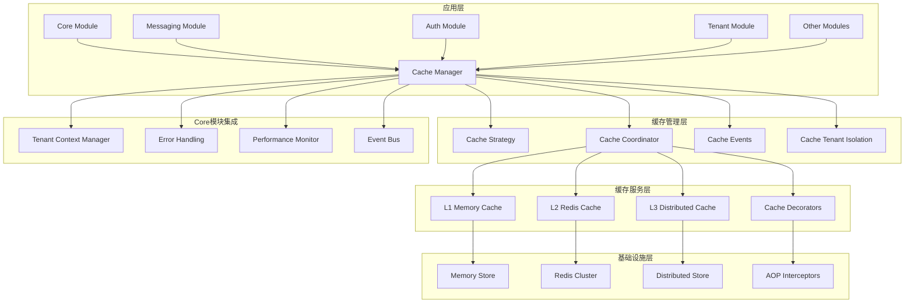

# 统一缓存管理系统技术设计方案

## 📋 文档信息

- **文档标题**: 统一缓存管理系统技术设计方案
- **文档版本**: v1.0.0
- **创建日期**: 2024-12-19
- **作者**: AIOFix Team
- **文档类型**: 技术设计方案

## 🎯 项目概述

### 设计目标

设计并实现一个**企业级统一缓存管理平台**，为整个 AIOFix SAAS 系统提供：

- 🏗️ **多级缓存架构**：内存缓存 + Redis缓存 + 分布式缓存
- 🔄 **智能缓存策略**：LRU、LFU、TTL、自适应策略
- 🌍 **多租户缓存隔离**：基于Core模块的租户上下文
- 🔒 **类型安全**：完整的 TypeScript 类型支持
- 📊 **缓存监控**：实时性能监控和统计分析
- 🎛️ **声明式缓存**：装饰器和AOP支持

### 核心价值

1. **🎯 统一性**：一个缓存系统服务所有模块
2. **🚀 高性能**：多级缓存和智能策略
3. **🔐 安全性**：多租户隔离和数据安全
4. **📈 可扩展性**：支持水平扩展和集群
5. **🛠️ 易用性**：声明式API和装饰器支持

## 🏗️ 系统架构设计

### 整体架构图



### 核心组件设计

#### 1. 统一缓存管理器 (UnifiedCacheManager)

```typescript
/**
 * 统一缓存管理器
 * 
 * @description 集成Core模块功能的企业级缓存管理器
 * 支持多租户、错误处理、性能监控和事件驱动
 */
export class UnifiedCacheManager {
  // Core模块集成
  private readonly tenantContextManager: TenantContextManager;
  private readonly performanceMonitor: CorePerformanceMonitor;
  private readonly eventBus: CoreEventBus;
  private readonly errorHandler: CoreErrorHandler;
  
  // 缓存层管理
  private readonly cacheCoordinator: ICacheCoordinator;
  private readonly cacheStrategy: ICacheStrategy;
  
  // 配置管理
  private readonly configManager: IConfigManager;
  private cacheConfig: ICacheModuleConfig;

  /**
   * 获取缓存值（支持多租户隔离）
   */
  async get<T>(key: string, options?: CacheGetOptions): Promise<T | null> {
    const startTime = performance.now();
    
    try {
      // 获取租户上下文
      const tenantContext = await this.tenantContextManager.getCurrentContext();
      
      // 构建租户隔离的缓存键
      const tenantAwareKey = this.buildTenantAwareKey(key, tenantContext);
      
      // 执行缓存获取
      const result = await this.cacheCoordinator.get<T>(tenantAwareKey, options);
      
      // 记录性能指标
      this.performanceMonitor.recordCacheOperation('get', performance.now() - startTime);
      
      // 发布缓存事件
      this.eventBus.publish(new CacheAccessedEvent(tenantAwareKey, result !== null));
      
      return result;
    } catch (error) {
      // 统一错误处理
      throw this.errorHandler.handleCacheError(error, 'cache_get', { key });
    }
  }
}
```

#### 2. 多租户缓存隔离 (TenantAwareCacheService)

```typescript
/**
 * 多租户感知缓存服务
 * 
 * @description 基于Core模块的租户上下文实现缓存隔离
 */
export class TenantAwareCacheService implements ICacheService {
  constructor(
    private readonly tenantContextManager: TenantContextManager,
    private readonly baseCacheService: ICacheService,
    private readonly isolationStrategy: CacheIsolationStrategy,
  ) {}

  async get<T>(key: string): Promise<T | null> {
    const tenantContext = await this.tenantContextManager.getCurrentContext();
    const isolatedKey = this.isolationStrategy.isolateKey(key, tenantContext);
    return this.baseCacheService.get<T>(isolatedKey);
  }

  async set<T>(key: string, value: T, ttl?: number): Promise<boolean> {
    const tenantContext = await this.tenantContextManager.getCurrentContext();
    const isolatedKey = this.isolationStrategy.isolateKey(key, tenantContext);
    return this.baseCacheService.set(isolatedKey, value, ttl);
  }
}
```

#### 3. 缓存隔离策略 (CacheIsolationStrategy)

```typescript
/**
 * 缓存隔离策略
 * 
 * @description 定义不同级别的缓存隔离策略
 */
export enum CacheIsolationLevel {
  /** 无隔离 */
  NONE = 'none',
  /** 租户级隔离 */
  TENANT = 'tenant',
  /** 组织级隔离 */
  ORGANIZATION = 'organization',
  /** 用户级隔离 */
  USER = 'user',
  /** 完全隔离 */
  FULL = 'full',
}

export interface ICacheIsolationStrategy {
  /**
   * 生成隔离的缓存键
   */
  isolateKey(key: string, context: TenantContext): string;
  
  /**
   * 验证缓存访问权限
   */
  validateAccess(key: string, context: TenantContext): Promise<boolean>;
  
  /**
   * 清理租户相关缓存
   */
  cleanupTenantCache(tenantId: string): Promise<void>;
}
```

## 📊 配置模型设计

### 统一配置集成

```typescript
/**
 * 缓存模块配置（集成到统一配置系统）
 */
export interface ICacheModuleConfig {
  /** 是否启用缓存 */
  enabled: boolean;
  
  /** 全局配置 */
  global: {
    defaultTTL: number;
    maxSize: number;
    enableCompression: boolean;
    enableEncryption: boolean;
    enableStats: boolean;
    enableEvents: boolean;
    isolationLevel: CacheIsolationLevel;
  };
  
  /** Redis配置 */
  redis: {
    host: string;
    port: number;
    password?: string;
    db: number;
    cluster?: {
      enabled: boolean;
      nodes: Array<{ host: string; port: number }>;
    };
    sentinel?: {
      enabled: boolean;
      sentinels: Array<{ host: string; port: number }>;
      name: string;
    };
  };
  
  /** 内存缓存配置 */
  memory: {
    maxSize: number;
    strategy: 'lru' | 'lfu' | 'fifo';
    cleanupInterval: number;
  };
  
  /** 缓存层配置 */
  layers: Record<string, CacheLayerConfig>;
  
  /** 监控配置 */
  monitoring: {
    enabled: boolean;
    metricsInterval: number;
    enableTracing: boolean;
    enableAlerts: boolean;
  };
  
  /** 预热配置 */
  warmup: {
    enabled: boolean;
    strategies: string[];
    schedule: string;
  };
}
```

## 🔧 核心功能实现

### 1. 事件驱动缓存系统

```typescript
/**
 * 缓存事件系统
 * 
 * @description 基于Core模块的事件总线实现缓存事件
 */
export class CacheEventSystem {
  constructor(private readonly eventBus: CoreEventBus) {}

  // 缓存命中事件
  async onCacheHit(key: string, layer: string, value: unknown): Promise<void> {
    await this.eventBus.publish(new CacheHitEvent(key, layer, value));
  }

  // 缓存未命中事件
  async onCacheMiss(key: string, layer: string): Promise<void> {
    await this.eventBus.publish(new CacheMissEvent(key, layer));
  }

  // 缓存失效事件
  async onCacheEvicted(key: string, reason: string): Promise<void> {
    await this.eventBus.publish(new CacheEvictedEvent(key, reason));
  }

  // 缓存错误事件
  async onCacheError(key: string, error: Error, operation: string): Promise<void> {
    await this.eventBus.publish(new CacheErrorEvent(key, error, operation));
  }
}

// 缓存领域事件
export class CacheHitEvent extends BaseDomainEvent {
  constructor(
    public readonly key: string,
    public readonly layer: string,
    public readonly value: unknown,
  ) {
    super('cache.hit', { key, layer, hasValue: value !== null });
  }
}

export class CacheMissEvent extends BaseDomainEvent {
  constructor(
    public readonly key: string,
    public readonly layer: string,
  ) {
    super('cache.miss', { key, layer });
  }
}
```

### 2. 统一错误处理

```typescript
/**
 * 缓存错误处理系统
 * 
 * @description 基于Core模块的统一错误处理
 */
export class CacheErrorHandler {
  constructor(private readonly coreErrorBus: CoreErrorBus) {}

  handleCacheError(error: unknown, operation: string, context: CacheContext): CacheError {
    if (error instanceof CacheError) {
      return error;
    }

    // 根据错误类型创建特定的缓存错误
    if (error instanceof Error) {
      switch (error.name) {
        case 'ConnectionError':
          return new CacheConnectionError(error.message, context);
        case 'TimeoutError':
          return new CacheTimeoutError(error.message, context);
        case 'SerializationError':
          return new CacheSerializationError(error.message, context);
        default:
          return new CacheOperationError(error.message, operation, context);
      }
    }

    return new CacheUnknownError(String(error), context);
  }
}

// 缓存特定错误类型
export class CacheError extends BaseError {
  constructor(
    message: string,
    public readonly operation: string,
    public readonly context: CacheContext,
  ) {
    super(message, 'CACHE_ERROR');
  }
}

export class CacheConnectionError extends CacheError {
  constructor(message: string, context: CacheContext) {
    super(message, 'connection', context);
  }
}

export class CacheTimeoutError extends CacheError {
  constructor(message: string, context: CacheContext) {
    super(message, 'timeout', context);
  }
}
```

### 3. 性能监控集成

```typescript
/**
 * 缓存性能监控
 * 
 * @description 集成Core模块的性能监控系统
 */
export class CachePerformanceMonitor {
  constructor(private readonly coreMonitor: CorePerformanceMonitor) {}

  recordCacheOperation(
    operation: 'get' | 'set' | 'delete' | 'clear',
    duration: number,
    success: boolean,
    metadata: CacheOperationMetadata,
  ): void {
    this.coreMonitor.recordOperation('cache', operation, duration, success, {
      ...metadata,
      layer: metadata.layer,
      tenantId: metadata.tenantId,
      keyPattern: this.extractKeyPattern(metadata.key),
    });
  }

  recordCacheHit(key: string, layer: string, tenantId?: string): void {
    this.coreMonitor.recordEvent('cache_hit', {
      key,
      layer,
      tenantId,
      timestamp: new Date(),
    });
  }

  recordCacheMiss(key: string, layer: string, tenantId?: string): void {
    this.coreMonitor.recordEvent('cache_miss', {
      key,
      layer,
      tenantId,
      timestamp: new Date(),
    });
  }

  getCacheMetrics(): CacheMetrics {
    const coreMetrics = this.coreMonitor.getMetrics('cache');
    
    return {
      operations: coreMetrics.operations,
      hitRate: this.calculateHitRate(coreMetrics.events),
      averageResponseTime: coreMetrics.averageResponseTime,
      errorRate: coreMetrics.errorRate,
      throughput: coreMetrics.throughput,
      tenantMetrics: this.aggregateTenantMetrics(coreMetrics.events),
    };
  }
}
```

## 🎨 声明式缓存API

### 1. 现代化装饰器系统

```typescript
/**
 * 现代化缓存装饰器
 * 
 * @description 基于最新装饰器标准的缓存AOP系统
 */

// 基础缓存装饰器
export function Cacheable(
  keyPattern: string,
  options?: CacheableOptions,
): MethodDecorator {
  return function (
    target: any,
    propertyKey: string | symbol,
    descriptor: PropertyDescriptor,
  ) {
    const originalMethod = descriptor.value;
    
    descriptor.value = async function (...args: any[]) {
      const cacheManager = this.cacheManager || getCacheManager();
      const tenantContext = await getTenantContext();
      
      // 生成缓存键
      const cacheKey = buildCacheKey(keyPattern, args, tenantContext);
      
      // 尝试从缓存获取
      const cached = await cacheManager.get(cacheKey);
      if (cached !== null) {
        return cached;
      }
      
      // 执行原方法
      const result = await originalMethod.apply(this, args);
      
      // 存储到缓存
      await cacheManager.set(cacheKey, result, options?.ttl);
      
      return result;
    };
    
    return descriptor;
  };
}

// 缓存失效装饰器
export function CacheEvict(
  keyPattern: string | string[],
  options?: CacheEvictOptions,
): MethodDecorator {
  return function (
    target: any,
    propertyKey: string | symbol,
    descriptor: PropertyDescriptor,
  ) {
    const originalMethod = descriptor.value;
    
    descriptor.value = async function (...args: any[]) {
      const result = await originalMethod.apply(this, args);
      
      const cacheManager = this.cacheManager || getCacheManager();
      const tenantContext = await getTenantContext();
      
      // 失效相关缓存
      const patterns = Array.isArray(keyPattern) ? keyPattern : [keyPattern];
      for (const pattern of patterns) {
        const keys = buildCacheKeys(pattern, args, tenantContext);
        await cacheManager.evict(keys, options);
      }
      
      return result;
    };
    
    return descriptor;
  };
}

// 条件缓存装饰器
export function CacheWhen(
  condition: (args: any[], result?: any) => boolean,
): MethodDecorator {
  return function (
    target: any,
    propertyKey: string | symbol,
    descriptor: PropertyDescriptor,
  ) {
    const originalMethod = descriptor.value;
    
    descriptor.value = async function (...args: any[]) {
      if (!condition(args)) {
        return originalMethod.apply(this, args);
      }
      
      // 应用缓存逻辑
      return applyCacheLogic(originalMethod, this, args);
    };
    
    return descriptor;
  };
}
```

### 2. 智能缓存策略

```typescript
/**
 * 智能缓存策略系统
 * 
 * @description 基于使用模式的自适应缓存策略
 */
export class IntelligentCacheStrategy implements ICacheStrategy {
  constructor(
    private readonly performanceMonitor: CorePerformanceMonitor,
    private readonly configManager: IConfigManager,
  ) {}

  async selectOptimalStrategy(
    key: string,
    context: CacheContext,
  ): Promise<CacheStrategyDecision> {
    // 分析访问模式
    const accessPattern = await this.analyzeAccessPattern(key);
    
    // 基于模式选择策略
    switch (accessPattern.type) {
      case 'frequent_read':
        return {
          strategy: 'memory_first',
          ttl: accessPattern.avgInterval * 2,
          layers: ['memory', 'redis'],
        };
        
      case 'infrequent_read':
        return {
          strategy: 'redis_only',
          ttl: this.getDefaultTTL(),
          layers: ['redis'],
        };
        
      case 'write_heavy':
        return {
          strategy: 'write_through',
          ttl: accessPattern.avgInterval,
          layers: ['memory', 'redis'],
        };
        
      default:
        return this.getDefaultStrategy();
    }
  }

  private async analyzeAccessPattern(key: string): Promise<AccessPattern> {
    const metrics = await this.performanceMonitor.getKeyMetrics(key);
    
    return {
      type: this.classifyPattern(metrics),
      frequency: metrics.accessCount / metrics.timeWindow,
      avgInterval: metrics.avgTimeBetweenAccess,
      readWriteRatio: metrics.reads / (metrics.writes || 1),
    };
  }
}
```

## 🔒 多租户缓存架构

### 1. 租户隔离实现

```typescript
/**
 * 租户缓存隔离管理器
 * 
 * @description 基于Core模块的多租户架构实现缓存隔离
 */
export class TenantCacheIsolationManager {
  constructor(
    private readonly tenantContextManager: TenantContextManager,
    private readonly isolationConfig: TenantIsolationConfig,
  ) {}

  /**
   * 构建租户感知的缓存键
   */
  buildTenantAwareKey(
    baseKey: string,
    tenantContext: TenantContext,
  ): string {
    const { isolationLevel, keyStrategy } = this.isolationConfig;
    
    switch (isolationLevel) {
      case CacheIsolationLevel.TENANT:
        return `tenant:${tenantContext.tenantId}:${baseKey}`;
        
      case CacheIsolationLevel.ORGANIZATION:
        return `org:${tenantContext.organizationId}:${baseKey}`;
        
      case CacheIsolationLevel.USER:
        return `user:${tenantContext.userId}:${baseKey}`;
        
      case CacheIsolationLevel.FULL:
        return `tenant:${tenantContext.tenantId}:org:${tenantContext.organizationId}:user:${tenantContext.userId}:${baseKey}`;
        
      default:
        return baseKey;
    }
  }

  /**
   * 验证缓存访问权限
   */
  async validateCacheAccess(
    key: string,
    operation: 'read' | 'write' | 'delete',
    tenantContext: TenantContext,
  ): Promise<boolean> {
    // 基于租户上下文验证访问权限
    const keyTenantId = this.extractTenantFromKey(key);
    
    if (keyTenantId && keyTenantId !== tenantContext.tenantId) {
      return false; // 跨租户访问被拒绝
    }
    
    // 检查操作权限
    return this.checkOperationPermission(operation, tenantContext);
  }

  /**
   * 批量清理租户缓存
   */
  async cleanupTenantCache(tenantId: string): Promise<CleanupResult> {
    const pattern = `tenant:${tenantId}:*`;
    const keys = await this.findKeysByPattern(pattern);
    
    const results = await Promise.allSettled(
      keys.map(key => this.deleteCacheKey(key))
    );
    
    return {
      totalKeys: keys.length,
      deletedKeys: results.filter(r => r.status === 'fulfilled').length,
      failedKeys: results.filter(r => r.status === 'rejected').length,
    };
  }
}
```

### 2. 缓存安全策略

```typescript
/**
 * 缓存安全管理器
 * 
 * @description 实现缓存的安全策略和数据保护
 */
export class CacheSecurityManager {
  constructor(
    private readonly tenantContextManager: TenantContextManager,
    private readonly encryptionService: CacheEncryptionService,
  ) {}

  /**
   * 安全的缓存设置
   */
  async secureSet<T>(
    key: string,
    value: T,
    options: SecureCacheOptions,
  ): Promise<boolean> {
    const tenantContext = await this.tenantContextManager.getCurrentContext();
    
    // 数据敏感性检查
    if (options.sensitivity === DataSensitivity.HIGH) {
      value = await this.encryptionService.encrypt(value, tenantContext);
    }
    
    // 构建安全的缓存键
    const secureKey = this.buildSecureKey(key, tenantContext, options);
    
    // 设置访问控制元数据
    const metadata = {
      tenantId: tenantContext.tenantId,
      sensitivity: options.sensitivity,
      accessControl: options.accessControl,
      createdAt: new Date(),
    };
    
    return this.setCacheWithMetadata(secureKey, value, metadata, options);
  }

  /**
   * 安全的缓存获取
   */
  async secureGet<T>(
    key: string,
    options: SecureCacheOptions,
  ): Promise<T | null> {
    const tenantContext = await this.tenantContextManager.getCurrentContext();
    const secureKey = this.buildSecureKey(key, tenantContext, options);
    
    // 验证访问权限
    const hasAccess = await this.validateAccess(secureKey, tenantContext);
    if (!hasAccess) {
      throw new CacheAccessDeniedError(`Access denied for key: ${key}`);
    }
    
    const result = await this.getCacheWithMetadata<T>(secureKey);
    
    // 解密敏感数据
    if (result && options.sensitivity === DataSensitivity.HIGH) {
      result.value = await this.encryptionService.decrypt(result.value, tenantContext);
    }
    
    return result?.value || null;
  }
}
```

## 📊 监控和诊断系统

### 1. 缓存监控仪表板

```typescript
/**
 * 缓存监控仪表板
 * 
 * @description 基于Core模块的监控系统实现缓存监控
 */
export class CacheMonitoringDashboard {
  constructor(
    private readonly performanceMonitor: CorePerformanceMonitor,
    private readonly cacheManager: UnifiedCacheManager,
  ) {}

  /**
   * 获取实时缓存指标
   */
  async getRealTimeMetrics(): Promise<CacheRealTimeMetrics> {
    const metrics = await this.performanceMonitor.getMetrics('cache');
    
    return {
      hitRate: this.calculateHitRate(metrics),
      missRate: this.calculateMissRate(metrics),
      averageResponseTime: metrics.averageResponseTime,
      operationsPerSecond: metrics.operationsPerSecond,
      errorRate: metrics.errorRate,
      memoryUsage: await this.getMemoryUsage(),
      connectionStatus: await this.getConnectionStatus(),
      tenantMetrics: await this.getTenantMetrics(),
    };
  }

  /**
   * 获取缓存健康状态
   */
  async getHealthStatus(): Promise<CacheHealthStatus> {
    const layers = await this.cacheManager.getAllLayers();
    const layerHealth = await Promise.all(
      layers.map(layer => this.checkLayerHealth(layer))
    );
    
    const overallHealth = layerHealth.every(h => h.status === 'healthy')
      ? 'healthy'
      : layerHealth.some(h => h.status === 'degraded')
      ? 'degraded'
      : 'unhealthy';
    
    return {
      overall: overallHealth,
      layers: layerHealth,
      recommendations: this.generateRecommendations(layerHealth),
      lastChecked: new Date(),
    };
  }

  /**
   * 生成性能报告
   */
  async generatePerformanceReport(
    timeRange: TimeRange,
  ): Promise<CachePerformanceReport> {
    const metrics = await this.performanceMonitor.getHistoricalMetrics('cache', timeRange);
    
    return {
      summary: {
        totalOperations: metrics.totalOperations,
        averageHitRate: metrics.averageHitRate,
        peakThroughput: metrics.peakThroughput,
        averageResponseTime: metrics.averageResponseTime,
      },
      trends: this.analyzeTrends(metrics),
      bottlenecks: this.identifyBottlenecks(metrics),
      recommendations: this.generateOptimizationRecommendations(metrics),
      tenantAnalysis: this.analyzeTenantUsage(metrics),
    };
  }
}
```

### 2. 缓存诊断工具

```typescript
/**
 * 缓存诊断工具
 * 
 * @description 提供缓存问题的诊断和调试功能
 */
export class CacheDiagnostics {
  constructor(
    private readonly cacheManager: UnifiedCacheManager,
    private readonly performanceMonitor: CorePerformanceMonitor,
  ) {}

  /**
   * 诊断缓存问题
   */
  async diagnose(): Promise<CacheDiagnosticReport> {
    const report: CacheDiagnosticReport = {
      timestamp: new Date(),
      overall: 'healthy',
      issues: [],
      recommendations: [],
    };

    // 检查连接状态
    await this.checkConnections(report);
    
    // 检查性能问题
    await this.checkPerformanceIssues(report);
    
    // 检查内存使用
    await this.checkMemoryUsage(report);
    
    // 检查租户隔离
    await this.checkTenantIsolation(report);
    
    // 检查配置问题
    await this.checkConfiguration(report);
    
    return report;
  }

  /**
   * 缓存键分析
   */
  async analyzeKey(key: string): Promise<CacheKeyAnalysis> {
    const tenantContext = await getTenantContext();
    const fullKey = this.cacheManager.buildFullKey(key, tenantContext);
    
    return {
      originalKey: key,
      fullKey,
      tenantId: tenantContext?.tenantId,
      exists: await this.cacheManager.exists(fullKey),
      size: await this.cacheManager.getSize(fullKey),
      ttl: await this.cacheManager.getTTL(fullKey),
      accessHistory: await this.getAccessHistory(fullKey),
      relatedKeys: await this.findRelatedKeys(fullKey),
    };
  }
}
```

## 🚀 NestJS模块集成

### 1. 统一缓存模块

```typescript
/**
 * 统一缓存模块
 * 
 * @description 完整的NestJS模块集成，支持依赖注入和生命周期管理
 */
@Global()
@Module({})
export class UnifiedCacheModule implements OnModuleInit, OnModuleDestroy {
  static forRoot(options: ICacheModuleOptions = {}): DynamicModule {
    return {
      module: UnifiedCacheModule,
      imports: [
        // 集成统一配置管理
        UnifiedConfigModule.forFeature(['cache']),
        // 集成Core模块
        CoreModule.forFeature(['tenant', 'monitoring', 'events']),
      ],
      providers: [
        // 配置提供者
        {
          provide: 'CACHE_CONFIG',
          useFactory: async (configManager: IConfigManager) => {
            return configManager.getModuleConfig<ICacheModuleConfig>('cache');
          },
          inject: [IConfigManager],
        },
        
        // 核心服务
        UnifiedCacheManager,
        TenantAwareCacheService,
        CachePerformanceMonitor,
        CacheEventSystem,
        CacheErrorHandler,
        CacheSecurityManager,
        
        // 缓存层服务
        MemoryCacheService,
        RedisCacheService,
        DistributedCacheService,
        
        // 工具服务
        CacheKeyFactory,
        CacheWarmupService,
        CacheInvalidationService,
        CacheDiagnostics,
        
        // 拦截器
        CacheInterceptor,
        CacheEvictInterceptor,
      ],
      exports: [
        UnifiedCacheManager,
        TenantAwareCacheService,
        CachePerformanceMonitor,
        CacheDiagnostics,
      ],
      global: options.global !== false,
    };
  }

  static forFeature(features: CacheFeatureConfig): DynamicModule {
    return {
      module: UnifiedCacheModule,
      providers: this.createFeatureProviders(features),
      exports: this.createFeatureExports(features),
    };
  }

  async onModuleInit(): Promise<void> {
    // 初始化缓存系统
    await this.initializeCacheSystem();
    
    // 启动监控
    await this.startMonitoring();
    
    // 执行预热
    await this.performWarmup();
  }

  async onModuleDestroy(): Promise<void> {
    // 优雅关闭缓存连接
    await this.gracefulShutdown();
  }
}

// 依赖注入装饰器
export const InjectCacheManager = (): ParameterDecorator => 
  Inject(UnifiedCacheManager);

export const InjectTenantCache = (): ParameterDecorator => 
  Inject(TenantAwareCacheService);
```

## 🎛️ 使用示例

### 1. 基础使用

```typescript
// 在应用模块中集成
@Module({
  imports: [
    UnifiedCacheModule.forRoot({
      enableTenantIsolation: true,
      enableMonitoring: true,
      enableEncryption: true,
    }),
  ],
})
export class AppModule {}

// 在服务中使用
@Injectable()
export class UserService {
  constructor(
    @InjectTenantCache()
    private readonly cache: TenantAwareCacheService,
  ) {}

  @Cacheable('user:profile:{{userId}}', { ttl: 3600000 })
  async getUserProfile(userId: string): Promise<UserProfile> {
    return this.userRepository.findById(userId);
  }

  @CacheEvict(['user:profile:{{userId}}', 'user:permissions:{{userId}}'])
  async updateUserProfile(userId: string, data: UpdateUserData): Promise<void> {
    await this.userRepository.update(userId, data);
  }
}
```

### 2. 高级使用

```typescript
// 消息传递模块集成
@Injectable()
export class MessagingCacheService {
  constructor(
    @InjectCacheManager()
    private readonly cacheManager: UnifiedCacheManager,
  ) {}

  @Cacheable('message:template:{{templateId}}', { 
    ttl: 86400000, // 24小时
    layers: ['memory', 'redis'],
    compression: true,
  })
  async getMessageTemplate(templateId: string): Promise<MessageTemplate> {
    return this.templateRepository.findById(templateId);
  }

  @CacheWhen((args) => args[0].priority === MessagePriority.LOW)
  @Cacheable('message:queue:status:{{queueName}}')
  async getQueueStatus(queueName: string): Promise<QueueStatus> {
    return this.queueService.getStatus(queueName);
  }
}
```

## 📈 性能优化策略

### 1. 智能预热系统

```typescript
/**
 * 智能缓存预热系统
 * 
 * @description 基于使用模式的智能预热策略
 */
export class IntelligentCacheWarmup {
  constructor(
    private readonly cacheManager: UnifiedCacheManager,
    private readonly performanceMonitor: CorePerformanceMonitor,
  ) {}

  async performIntelligentWarmup(): Promise<WarmupResult> {
    // 分析历史访问模式
    const accessPatterns = await this.analyzeHistoricalPatterns();
    
    // 生成预热策略
    const warmupStrategy = this.generateWarmupStrategy(accessPatterns);
    
    // 执行预热
    const results = await Promise.allSettled(
      warmupStrategy.items.map(item => this.warmupItem(item))
    );
    
    return this.aggregateWarmupResults(results);
  }

  private async analyzeHistoricalPatterns(): Promise<AccessPattern[]> {
    const timeRange = { start: new Date(Date.now() - 7 * 24 * 60 * 60 * 1000), end: new Date() };
    const metrics = await this.performanceMonitor.getHistoricalMetrics('cache', timeRange);
    
    return this.extractPatterns(metrics);
  }
}
```

### 2. 自适应缓存大小

```typescript
/**
 * 自适应缓存大小管理
 * 
 * @description 基于内存使用和性能指标动态调整缓存大小
 */
export class AdaptiveCacheSizing {
  async adjustCacheSize(): Promise<SizingAdjustment> {
    const memoryMetrics = await this.getMemoryMetrics();
    const performanceMetrics = await this.getPerformanceMetrics();
    
    const recommendation = this.calculateOptimalSize(memoryMetrics, performanceMetrics);
    
    if (recommendation.shouldAdjust) {
      await this.applySizeAdjustment(recommendation);
    }
    
    return recommendation;
  }
}
```

## 🧪 测试策略

### 1. 多租户测试

```typescript
describe('多租户缓存隔离', () => {
  let cacheService: TenantAwareCacheService;
  let tenantContextManager: TenantContextManager;

  beforeEach(async () => {
    const module = await Test.createTestingModule({
      imports: [UnifiedCacheModule.forRoot({ enableTenantIsolation: true })],
    }).compile();

    cacheService = module.get<TenantAwareCacheService>(TenantAwareCacheService);
    tenantContextManager = module.get<TenantContextManager>(TenantContextManager);
  });

  it('应该正确隔离不同租户的缓存', async () => {
    // 设置租户A的上下文
    await tenantContextManager.setContext({ tenantId: 'tenant-a' });
    await cacheService.set('user:123', { name: 'User A' });

    // 设置租户B的上下文
    await tenantContextManager.setContext({ tenantId: 'tenant-b' });
    await cacheService.set('user:123', { name: 'User B' });

    // 验证隔离
    await tenantContextManager.setContext({ tenantId: 'tenant-a' });
    const userA = await cacheService.get('user:123');
    expect(userA.name).toBe('User A');

    await tenantContextManager.setContext({ tenantId: 'tenant-b' });
    const userB = await cacheService.get('user:123');
    expect(userB.name).toBe('User B');
  });
});
```

### 2. 性能测试

```typescript
describe('缓存性能测试', () => {
  it('应该在高并发下保持性能', async () => {
    const operations = Array.from({ length: 1000 }, (_, i) => 
      cacheService.set(`key:${i}`, `value:${i}`)
    );

    const startTime = performance.now();
    await Promise.all(operations);
    const duration = performance.now() - startTime;

    expect(duration).toBeLessThan(5000); // 5秒内完成1000次操作
  });
});
```

## 🎯 实施路线图

### 阶段 1：核心重构 (3-5 天)

- [x] 创建技术设计方案
- [ ] 重构配置系统集成
- [ ] 集成Core模块依赖
- [ ] 实现多租户缓存隔离
- [ ] 统一错误处理系统

### 阶段 2：高级功能 (5-7 天)

- [ ] 实现智能缓存策略
- [ ] 集成性能监控系统
- [ ] 实现事件驱动架构
- [ ] 完善安全和加密功能
- [ ] NestJS模块完整集成

### 阶段 3：优化和工具 (3-5 天)

- [ ] 智能预热系统
- [ ] 监控仪表板
- [ ] 诊断工具
- [ ] 性能优化
- [ ] 完整测试覆盖

### 阶段 4：生产就绪 (2-3 天)

- [ ] 与Messaging模块集成测试
- [ ] 性能基准测试
- [ ] 文档完善
- [ ] 生产环境验证

## 📊 成功指标

### 技术指标

- **性能**: 缓存访问响应时间 < 5ms (内存) / < 20ms (Redis)
- **可用性**: 缓存系统可用性 > 99.9%
- **命中率**: 缓存命中率 > 85%
- **并发**: 支持 10,000+ 并发操作

### 业务指标

- **多租户隔离**: 100% 数据隔离保证
- **开发效率**: 缓存集成时间 < 1 小时
- **运维效率**: 问题诊断时间 < 5 分钟
- **错误率**: 缓存相关错误 < 0.01%

---

## 📝 总结

这个统一缓存管理系统设计方案提供了：

1. **🏗️ 现代化架构**：基于Core模块的统一架构模式
2. **🚀 企业级功能**：多租户、监控、安全、性能优化
3. **🎯 开发友好**：声明式API、装饰器、类型安全
4. **📊 运维友好**：监控仪表板、诊断工具、自动化管理
5. **🔒 安全可靠**：数据隔离、加密、权限控制

通过这个统一缓存系统，我们可以为整个 AIOFix SAAS 平台提供强大、安全、高性能的缓存服务，同时保持与Core模块和其他模块的完美集成。

## 🚀 立即开始

建议立即开始阶段1的核心重构工作，首先修复配置系统集成问题，然后逐步实现Core模块的集成功能。这将为整个平台提供统一、强大的缓存基础设施。
