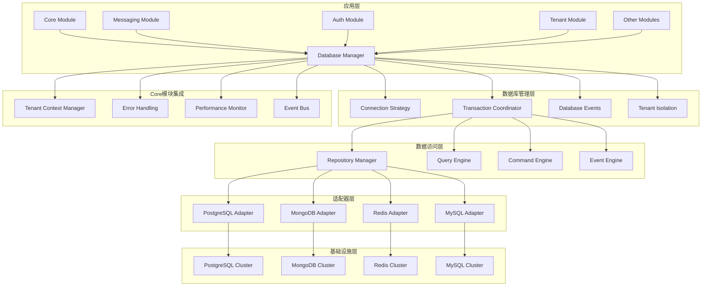

# 统一数据库管理系统技术设计方案

## 📋 文档信息

- **文档标题**: 统一数据库管理系统技术设计方案
- **文档版本**: v1.0.0
- **创建日期**: 2024-12-19
- **作者**: AIOFix Team
- **文档类型**: 技术设计方案

## 🎯 项目概述

### 设计目标

设计并实现一个**企业级统一数据库管理平台**，为整个 AIOFix SAAS 系统提供：

- 🏗️ **多数据库支持**：PostgreSQL + MongoDB + Redis + MySQL
- 🔄 **CQRS架构支持**：读写分离、事件溯源、领域事件持久化
- 🌍 **多租户数据隔离**：基于Core模块的租户上下文
- 🔒 **事务管理**：ACID事务、分布式事务、Saga模式
- 📊 **性能监控**：实时监控、慢查询分析、连接池优化
- 🎛️ **声明式数据访问**：装饰器和Repository模式

### 核心价值

1. **🎯 统一性**：一个数据库系统服务所有模块
2. **🚀 高性能**：连接池优化、查询缓存、读写分离
3. **🔐 安全性**：多租户隔离、数据加密、审计日志
4. **📈 可扩展性**：支持水平扩展和分库分表
5. **🛠️ 易用性**：声明式API、Repository模式、装饰器支持

## 🏗️ 系统架构设计

### 整体架构图



### 核心组件设计

#### 1. 统一数据库管理器 (UnifiedDatabaseManager)

```typescript
/**
 * 统一数据库管理器
 * 
 * @description 集成Core模块功能的企业级数据库管理器
 * 支持多租户、CQRS、事务管理、性能监控
 */
export class UnifiedDatabaseManager {
  // Core模块集成
  private readonly tenantContextManager: TenantContextManager;
  private readonly performanceMonitor: CorePerformanceMonitor;
  private readonly eventBus: CoreEventBus;
  private readonly errorHandler: CoreErrorHandler;
  
  // 数据库适配器管理
  private readonly connectionManager: IConnectionManager;
  private readonly transactionManager: ITransactionManager;
  
  // 配置管理
  private readonly configManager: IConfigManager;
  private databaseConfig: IDatabaseModuleConfig;

  /**
   * 获取租户感知的数据库连接
   */
  async getConnection<T = any>(
    connectionName?: string,
    options?: DatabaseConnectionOptions,
  ): Promise<IDatabaseConnection<T>> {
    const startTime = performance.now();
    
    try {
      // 获取租户上下文
      const tenantContext = await this.tenantContextManager.getCurrentContext();
      
      // 构建租户感知的连接配置
      const connectionConfig = await this.buildTenantAwareConnection(
        connectionName || this.databaseConfig.default,
        tenantContext,
        options,
      );
      
      // 获取数据库连接
      const connection = await this.connectionManager.getConnection(connectionConfig);
      
      // 记录性能指标
      this.performanceMonitor.recordDatabaseOperation(
        'connection',
        performance.now() - startTime,
        true,
        {
          connectionName: connectionConfig.name,
          tenantId: tenantContext?.tenantId,
          database: connectionConfig.database,
        },
      );
      
      // 发布数据库事件
      this.eventBus.publish(new DatabaseConnectionAcquiredEvent(
        connectionConfig.name,
        tenantContext?.tenantId,
      ));
      
      return connection;
    } catch (error) {
      // 统一错误处理
      throw this.errorHandler.handleDatabaseError(error, 'connection', {
        connectionName,
        tenantContext: await this.tenantContextManager.getCurrentContext(),
      });
    }
  }

  /**
   * 执行租户感知的事务
   */
  async executeTransaction<T>(
    operation: (trx: ITransaction) => Promise<T>,
    options?: TransactionOptions,
  ): Promise<T> {
    const startTime = performance.now();
    const tenantContext = await this.tenantContextManager.getCurrentContext();
    
    try {
      // 获取租户感知的连接
      const connection = await this.getConnection(options?.connectionName);
      
      // 开始事务
      const transaction = await this.transactionManager.begin(connection, {
        ...options,
        tenantContext,
        isolationLevel: options?.isolationLevel || this.databaseConfig.transaction.isolationLevel,
        timeout: options?.timeout || this.databaseConfig.transaction.timeout,
      });
      
      let result: T;
      try {
        // 执行事务操作
        result = await operation(transaction);
        
        // 提交事务
        await this.transactionManager.commit(transaction);
        
        // 记录成功指标
        this.performanceMonitor.recordDatabaseOperation(
          'transaction',
          performance.now() - startTime,
          true,
          {
            tenantId: tenantContext?.tenantId,
            operationType: 'commit',
          },
        );
        
        return result;
      } catch (error) {
        // 回滚事务
        await this.transactionManager.rollback(transaction);
        throw error;
      }
    } catch (error) {
      // 统一错误处理
      throw this.errorHandler.handleDatabaseError(error, 'transaction', {
        tenantContext,
        operation: 'execute',
      });
    }
  }
}
```

#### 2. 多租户数据库隔离 (TenantAwareDatabaseService)

```typescript
/**
 * 多租户感知数据库服务
 * 
 * @description 基于Core模块的租户上下文实现数据库隔离
 */
export class TenantAwareDatabaseService implements IDatabaseService {
  constructor(
    private readonly tenantContextManager: TenantContextManager,
    private readonly baseDatabaseService: IDatabaseService,
    private readonly isolationStrategy: DatabaseIsolationStrategy,
  ) {}

  async query<T>(
    sql: string,
    params?: any[],
    options?: QueryOptions,
  ): Promise<T[]> {
    const tenantContext = await this.tenantContextManager.getCurrentContext();
    
    // 应用租户隔离
    const isolatedQuery = this.isolationStrategy.isolateQuery(sql, tenantContext);
    const isolatedParams = this.isolationStrategy.isolateParams(params, tenantContext);
    
    return this.baseDatabaseService.query<T>(isolatedQuery, isolatedParams, options);
  }

  async execute(
    sql: string,
    params?: any[],
    options?: ExecuteOptions,
  ): Promise<IExecuteResult> {
    const tenantContext = await this.tenantContextManager.getCurrentContext();
    
    // 验证租户权限
    await this.validateTenantAccess(sql, tenantContext);
    
    // 应用租户隔离
    const isolatedQuery = this.isolationStrategy.isolateQuery(sql, tenantContext);
    const isolatedParams = this.isolationStrategy.isolateParams(params, tenantContext);
    
    return this.baseDatabaseService.execute(isolatedQuery, isolatedParams, options);
  }

  async getRepository<T>(
    entityClass: new () => T,
    options?: RepositoryOptions,
  ): Promise<ITenantAwareRepository<T>> {
    const tenantContext = await this.tenantContextManager.getCurrentContext();
    
    // 创建租户感知的仓储
    const baseRepository = await this.baseDatabaseService.getRepository(entityClass, options);
    
    return new TenantAwareRepository<T>(
      baseRepository,
      tenantContext,
      this.isolationStrategy,
    );
  }
}
```

#### 3. 数据库隔离策略 (DatabaseIsolationStrategy)

```typescript
/**
 * 数据库隔离策略
 * 
 * @description 定义不同级别的数据库隔离策略
 */
export enum DatabaseIsolationLevel {
  /** 无隔离 */
  NONE = 'none',
  /** 行级隔离 */
  ROW = 'row',
  /** 模式隔离 */
  SCHEMA = 'schema',
  /** 数据库隔离 */
  DATABASE = 'database',
}

export interface IDatabaseIsolationStrategy {
  /**
   * 隔离SQL查询
   */
  isolateQuery(sql: string, context: TenantContext): string;
  
  /**
   * 隔离查询参数
   */
  isolateParams(params: any[], context: TenantContext): any[];
  
  /**
   * 获取租户数据库连接配置
   */
  getTenantConnectionConfig(
    baseConfig: IDatabaseConnection,
    context: TenantContext,
  ): IDatabaseConnection;
  
  /**
   * 验证租户数据访问权限
   */
  validateTenantAccess(sql: string, context: TenantContext): Promise<boolean>;
  
  /**
   * 清理租户数据
   */
  cleanupTenantData(tenantId: string): Promise<ICleanupResult>;
}
```

## 📊 配置模型设计

### 统一配置集成

```typescript
/**
 * 数据库模块配置（集成到统一配置系统）
 */
export interface IDatabaseModuleConfig {
  /** 是否启用数据库模块 */
  enabled: boolean;
  
  /** 默认数据库连接 */
  default: string;
  
  /** 数据库连接配置 */
  connections: Record<string, IDatabaseConnectionConfig>;
  
  /** 多租户配置 */
  multiTenant: {
    enabled: boolean;
    strategy: DatabaseIsolationLevel;
    tenantDatabasePrefix: string;
    tenantSchemaPrefix: string;
    enableAutoMigration: boolean;
    enableTenantDiscovery: boolean;
  };
  
  /** CQRS配置 */
  cqrs: {
    enabled: boolean;
    readConnection: string;
    writeConnection: string;
    eventStore: {
      enabled: boolean;
      connection: string;
      tableName: string;
      snapshotThreshold: number;
    };
  };
  
  /** 事务配置 */
  transaction: {
    enabled: boolean;
    isolationLevel: TransactionIsolationLevel;
    timeout: number;
    enableDistributed: boolean;
    sagaConfig: {
      enabled: boolean;
      timeoutMs: number;
      maxRetries: number;
    };
  };
  
  /** 性能配置 */
  performance: {
    enableQueryCache: boolean;
    queryCacheTTL: number;
    enableConnectionPooling: boolean;
    connectionPool: {
      min: number;
      max: number;
      acquireTimeoutMs: number;
      idleTimeoutMs: number;
    };
    enableQueryOptimization: boolean;
  };
  
  /** 监控配置 */
  monitoring: {
    enabled: boolean;
    interval: number;
    enableSlowQueryLog: boolean;
    slowQueryThreshold: number;
    enableConnectionPoolMonitoring: boolean;
    enableQueryAnalytics: boolean;
  };
  
  /** 迁移和种子数据配置 */
  migrations: {
    enabled: boolean;
    directory: string;
    tableName: string;
    autoRun: boolean;
    enableTenantMigrations: boolean;
  };
  
  /** 备份和恢复配置 */
  backup?: {
    enabled: boolean;
    schedule: string;
    retention: number;
    compression: boolean;
    encryption: boolean;
  };
}
```

## 🔧 核心功能实现

### 1. CQRS模式数据库支持

```typescript
/**
 * CQRS数据库管理器
 * 
 * @description 基于CQRS模式的数据库读写分离
 */
export class CQRSDatabaseManager {
  constructor(
    private readonly readConnectionManager: IConnectionManager,
    private readonly writeConnectionManager: IConnectionManager,
    private readonly eventStore: IEventStore,
    private readonly tenantContextManager: TenantContextManager,
  ) {}

  /**
   * 执行命令（写操作）
   */
  async executeCommand<T>(
    command: IDatabaseCommand<T>,
    options?: CommandExecutionOptions,
  ): Promise<ICommandResult<T>> {
    const tenantContext = await this.tenantContextManager.getCurrentContext();
    
    // 获取写连接
    const writeConnection = await this.writeConnectionManager.getConnection(
      this.getWriteConnectionName(tenantContext),
    );
    
    // 开始事务
    const transaction = await writeConnection.beginTransaction();
    
    try {
      // 执行命令
      const result = await command.execute(transaction);
      
      // 存储领域事件
      if (command.events && command.events.length > 0) {
        await this.eventStore.saveEvents(command.events, transaction);
      }
      
      // 提交事务
      await transaction.commit();
      
      // 异步发布事件
      this.publishDomainEvents(command.events);
      
      return {
        success: true,
        data: result,
        eventCount: command.events?.length || 0,
      };
    } catch (error) {
      await transaction.rollback();
      throw error;
    }
  }

  /**
   * 执行查询（读操作）
   */
  async executeQuery<T>(
    query: IDatabaseQuery<T>,
    options?: QueryExecutionOptions,
  ): Promise<IQueryResult<T>> {
    const tenantContext = await this.tenantContextManager.getCurrentContext();
    
    // 获取读连接（可能是只读副本）
    const readConnection = await this.readConnectionManager.getConnection(
      this.getReadConnectionName(tenantContext),
    );
    
    // 应用租户隔离
    const isolatedQuery = this.applyTenantIsolation(query, tenantContext);
    
    // 执行查询
    const result = await isolatedQuery.execute(readConnection);
    
    return {
      success: true,
      data: result,
      totalCount: result.length,
      executionTime: performance.now(),
    };
  }

  /**
   * 重建聚合根状态
   */
  async rebuildAggregateState<T>(
    aggregateId: string,
    aggregateType: string,
    upToVersion?: number,
  ): Promise<T | null> {
    const events = await this.eventStore.getEvents(
      aggregateId,
      aggregateType,
      0,
      upToVersion,
    );
    
    if (events.length === 0) {
      return null;
    }
    
    // 重放事件重建状态
    return this.replayEvents<T>(events);
  }
}
```

### 2. 事件溯源数据库支持

```typescript
/**
 * 事件存储实现
 * 
 * @description 基于MongoDB的事件溯源存储
 */
export class MongoEventStore implements IEventStore {
  constructor(
    private readonly mongoConnection: IMongoConnection,
    private readonly tenantContextManager: TenantContextManager,
    private readonly performanceMonitor: CorePerformanceMonitor,
  ) {}

  async saveEvents(
    events: IDomainEvent[],
    transaction?: ITransaction,
  ): Promise<void> {
    const tenantContext = await this.tenantContextManager.getCurrentContext();
    
    // 构建事件文档
    const eventDocuments = events.map(event => ({
      eventId: event.eventId,
      aggregateId: event.aggregateId,
      aggregateType: event.aggregateType,
      eventType: event.eventType,
      eventVersion: event.eventVersion,
      eventData: event.eventData,
      metadata: {
        ...event.metadata,
        tenantId: tenantContext?.tenantId,
        timestamp: new Date(),
        correlationId: event.correlationId,
      },
      createdAt: new Date(),
    }));
    
    // 租户隔离的集合名称
    const collectionName = this.getTenantEventCollection(tenantContext);
    
    // 保存事件
    await this.mongoConnection
      .collection(collectionName)
      .insertMany(eventDocuments, { session: transaction?.mongoSession });
    
    // 记录性能指标
    this.performanceMonitor.recordDatabaseOperation(
      'event_save',
      performance.now(),
      true,
      {
        eventCount: events.length,
        tenantId: tenantContext?.tenantId,
        aggregateType: events[0]?.aggregateType,
      },
    );
  }

  async getEvents(
    aggregateId: string,
    aggregateType: string,
    fromVersion: number = 0,
    toVersion?: number,
  ): Promise<IDomainEvent[]> {
    const tenantContext = await this.tenantContextManager.getCurrentContext();
    const collectionName = this.getTenantEventCollection(tenantContext);
    
    // 构建查询条件
    const query: any = {
      aggregateId,
      aggregateType,
      eventVersion: { $gte: fromVersion },
    };
    
    if (toVersion !== undefined) {
      query.eventVersion.$lte = toVersion;
    }
    
    // 租户隔离
    if (tenantContext?.tenantId) {
      query['metadata.tenantId'] = tenantContext.tenantId;
    }
    
    // 执行查询
    const eventDocuments = await this.mongoConnection
      .collection(collectionName)
      .find(query)
      .sort({ eventVersion: 1 })
      .toArray();
    
    // 转换为领域事件
    return eventDocuments.map(doc => this.toDomainEvent(doc));
  }

  async saveSnapshot(
    aggregateId: string,
    aggregateType: string,
    version: number,
    snapshot: any,
  ): Promise<void> {
    const tenantContext = await this.tenantContextManager.getCurrentContext();
    const collectionName = this.getTenantSnapshotCollection(tenantContext);
    
    const snapshotDocument = {
      aggregateId,
      aggregateType,
      version,
      snapshot,
      metadata: {
        tenantId: tenantContext?.tenantId,
        createdAt: new Date(),
      },
    };
    
    await this.mongoConnection
      .collection(collectionName)
      .replaceOne(
        { aggregateId, aggregateType },
        snapshotDocument,
        { upsert: true },
      );
  }
}
```

### 3. 租户感知仓储模式

```typescript
/**
 * 租户感知仓储基类
 * 
 * @description 基于Core模块的多租户仓储实现
 */
export abstract class TenantAwareRepository<T extends BaseEntity> implements IRepository<T> {
  constructor(
    protected readonly connection: IDatabaseConnection,
    protected readonly tenantContextManager: TenantContextManager,
    protected readonly isolationStrategy: DatabaseIsolationStrategy,
    protected readonly entityClass: new () => T,
  ) {}

  async findById(id: EntityId): Promise<T | null> {
    const tenantContext = await this.tenantContextManager.getCurrentContext();
    
    // 构建租户隔离的查询
    const query = this.buildTenantAwareQuery(
      `SELECT * FROM ${this.getTableName()} WHERE id = ?`,
      [id.value],
      tenantContext,
    );
    
    const result = await this.connection.query(query.sql, query.params);
    
    if (result.length === 0) {
      return null;
    }
    
    return this.mapToEntity(result[0]);
  }

  async save(entity: T): Promise<void> {
    const tenantContext = await this.tenantContextManager.getCurrentContext();
    
    // 验证租户权限
    await this.validateTenantOwnership(entity, tenantContext);
    
    // 构建租户隔离的保存操作
    const saveOperation = this.buildTenantAwareSave(entity, tenantContext);
    
    await this.connection.execute(saveOperation.sql, saveOperation.params);
    
    // 发布领域事件
    if (entity.getUncommittedEvents().length > 0) {
      await this.publishDomainEvents(entity.getUncommittedEvents());
      entity.markEventsAsCommitted();
    }
  }

  async findByTenant(
    criteria: QueryCriteria,
    options?: QueryOptions,
  ): Promise<T[]> {
    const tenantContext = await this.tenantContextManager.getCurrentContext();
    
    if (!tenantContext?.tenantId) {
      throw new Error('租户上下文缺失，无法执行租户查询');
    }
    
    // 自动添加租户过滤条件
    const tenantAwareCriteria = {
      ...criteria,
      tenantId: tenantContext.tenantId,
    };
    
    const query = this.buildQuery(tenantAwareCriteria, options);
    const results = await this.connection.query(query.sql, query.params);
    
    return results.map(row => this.mapToEntity(row));
  }

  protected abstract getTableName(): string;
  protected abstract mapToEntity(row: any): T;
  protected abstract buildQuery(criteria: QueryCriteria, options?: QueryOptions): IQuery;
}
```

## 🔒 多租户数据库架构

### 1. 数据库隔离实现

```typescript
/**
 * 数据库租户隔离管理器
 * 
 * @description 基于Core模块的多租户架构实现数据库隔离
 */
export class TenantDatabaseIsolationManager {
  constructor(
    private readonly tenantContextManager: TenantContextManager,
    private readonly isolationConfig: DatabaseIsolationConfig,
  ) {}

  /**
   * 获取租户数据库连接配置
   */
  async getTenantConnectionConfig(
    baseConfig: IDatabaseConnectionConfig,
    tenantContext: TenantContext,
  ): Promise<IDatabaseConnectionConfig> {
    const { strategy } = this.isolationConfig;
    
    switch (strategy) {
      case DatabaseIsolationLevel.DATABASE:
        return {
          ...baseConfig,
          database: `${this.isolationConfig.tenantDatabasePrefix}${tenantContext.tenantId}`,
        };
        
      case DatabaseIsolationLevel.SCHEMA:
        return {
          ...baseConfig,
          schema: `${this.isolationConfig.tenantSchemaPrefix}${tenantContext.tenantId}`,
        };
        
      case DatabaseIsolationLevel.ROW:
      default:
        return baseConfig;
    }
  }

  /**
   * 应用租户隔离到SQL查询
   */
  applyTenantIsolation(
    sql: string,
    params: any[],
    tenantContext: TenantContext,
  ): { sql: string; params: any[] } {
    const { strategy } = this.isolationConfig;
    
    switch (strategy) {
      case DatabaseIsolationLevel.ROW:
        return this.applyRowLevelIsolation(sql, params, tenantContext);
        
      case DatabaseIsolationLevel.SCHEMA:
        return this.applySchemaIsolation(sql, params, tenantContext);
        
      case DatabaseIsolationLevel.DATABASE:
        // 数据库级隔离在连接层处理
        return { sql, params };
        
      default:
        return { sql, params };
    }
  }

  /**
   * 行级隔离实现
   */
  private applyRowLevelIsolation(
    sql: string,
    params: any[],
    tenantContext: TenantContext,
  ): { sql: string; params: any[] } {
    // 自动添加租户ID过滤条件
    const tenantFilter = ` AND tenant_id = ?`;
    const modifiedSql = this.injectTenantFilter(sql, tenantFilter);
    const modifiedParams = [...params, tenantContext.tenantId];
    
    return {
      sql: modifiedSql,
      params: modifiedParams,
    };
  }

  /**
   * 模式级隔离实现
   */
  private applySchemaIsolation(
    sql: string,
    params: any[],
    tenantContext: TenantContext,
  ): { sql: string; params: any[] } {
    // 替换表名为租户模式表名
    const tenantSchema = `${this.isolationConfig.tenantSchemaPrefix}${tenantContext.tenantId}`;
    const modifiedSql = this.replaceTableNames(sql, tenantSchema);
    
    return {
      sql: modifiedSql,
      params,
    };
  }

  /**
   * 批量清理租户数据
   */
  async cleanupTenantData(tenantId: string): Promise<ICleanupResult> {
    const { strategy } = this.isolationConfig;
    
    switch (strategy) {
      case DatabaseIsolationLevel.DATABASE:
        return this.cleanupTenantDatabase(tenantId);
        
      case DatabaseIsolationLevel.SCHEMA:
        return this.cleanupTenantSchema(tenantId);
        
      case DatabaseIsolationLevel.ROW:
        return this.cleanupTenantRows(tenantId);
        
      default:
        throw new Error(`不支持的隔离策略: ${strategy}`);
    }
  }
}
```

### 2. 分布式事务管理

```typescript
/**
 * 分布式事务管理器
 * 
 * @description 实现跨数据库的分布式事务管理
 */
export class DistributedTransactionManager {
  constructor(
    private readonly connectionManager: IConnectionManager,
    private readonly sagaManager: ISagaManager,
    private readonly eventBus: CoreEventBus,
  ) {}

  /**
   * 执行分布式事务
   */
  async executeDistributedTransaction<T>(
    operations: IDistributedOperation[],
    options?: DistributedTransactionOptions,
  ): Promise<IDistributedTransactionResult<T>> {
    const transactionId = this.generateTransactionId();
    const startTime = performance.now();
    
    // 开始所有数据库的事务
    const transactions = await this.beginAllTransactions(operations);
    
    try {
      const results: any[] = [];
      
      // 按顺序执行所有操作
      for (const operation of operations) {
        const transaction = transactions[operation.connectionName];
        const result = await operation.execute(transaction);
        results.push(result);
      }
      
      // 两阶段提交：准备阶段
      await this.prepareAllTransactions(transactions);
      
      // 两阶段提交：提交阶段
      await this.commitAllTransactions(transactions);
      
      // 记录成功指标
      this.recordTransactionMetrics(transactionId, 'commit', performance.now() - startTime);
      
      return {
        success: true,
        transactionId,
        results,
        duration: performance.now() - startTime,
      };
    } catch (error) {
      // 回滚所有事务
      await this.rollbackAllTransactions(transactions);
      
      // 记录失败指标
      this.recordTransactionMetrics(transactionId, 'rollback', performance.now() - startTime);
      
      throw new DistributedTransactionError(
        `分布式事务失败: ${error.message}`,
        transactionId,
        error,
      );
    }
  }

  /**
   * Saga模式事务管理
   */
  async executeSaga<T>(
    sagaDefinition: ISagaDefinition<T>,
    options?: SagaExecutionOptions,
  ): Promise<ISagaResult<T>> {
    const sagaId = this.generateSagaId();
    
    try {
      // 创建Saga实例
      const saga = await this.sagaManager.createSaga(sagaDefinition, {
        ...options,
        sagaId,
      });
      
      // 执行Saga步骤
      const result = await saga.execute();
      
      return {
        success: true,
        sagaId,
        result,
        completedSteps: saga.getCompletedSteps(),
      };
    } catch (error) {
      // 执行补偿操作
      await this.executeCompensation(sagaId, error);
      
      throw new SagaExecutionError(
        `Saga执行失败: ${error.message}`,
        sagaId,
        error,
      );
    }
  }
}
```

## 📊 监控和诊断系统

### 1. 数据库性能监控

```typescript
/**
 * 数据库性能监控器
 * 
 * @description 基于Core模块的监控系统实现数据库监控
 */
export class DatabasePerformanceMonitor {
  constructor(
    private readonly performanceMonitor: CorePerformanceMonitor,
    private readonly databaseManager: UnifiedDatabaseManager,
  ) {}

  /**
   * 记录数据库操作性能
   */
  recordDatabaseOperation(
    operation: 'query' | 'execute' | 'transaction' | 'connection',
    duration: number,
    success: boolean,
    metadata: DatabaseOperationMetadata,
  ): void {
    this.performanceMonitor.recordOperation('database', operation, duration, success, {
      ...metadata,
      connectionName: metadata.connectionName,
      tenantId: metadata.tenantId,
      queryType: this.extractQueryType(metadata.sql),
      tableNames: this.extractTableNames(metadata.sql),
    });
  }

  /**
   * 获取数据库性能指标
   */
  async getDatabaseMetrics(): Promise<DatabaseMetrics> {
    const coreMetrics = this.performanceMonitor.getMetrics('database');
    
    return {
      operations: coreMetrics.operations,
      averageResponseTime: coreMetrics.averageResponseTime,
      errorRate: coreMetrics.errorRate,
      throughput: coreMetrics.throughput,
      connectionPool: await this.getConnectionPoolMetrics(),
      slowQueries: await this.getSlowQueryMetrics(),
      tenantMetrics: this.aggregateTenantMetrics(coreMetrics.events),
    };
  }

  /**
   * 慢查询分析
   */
  async analyzeSlowQueries(
    timeRange: TimeRange,
  ): Promise<SlowQueryAnalysis> {
    const slowQueries = await this.getSlowQueries(timeRange);
    
    return {
      totalSlowQueries: slowQueries.length,
      averageExecutionTime: this.calculateAverageTime(slowQueries),
      topSlowQueries: this.getTopSlowQueries(slowQueries, 10),
      queryPatterns: this.analyzeQueryPatterns(slowQueries),
      recommendations: this.generateOptimizationRecommendations(slowQueries),
    };
  }

  /**
   * 连接池健康检查
   */
  async checkConnectionPoolHealth(): Promise<ConnectionPoolHealth> {
    const pools = await this.databaseManager.getAllConnectionPools();
    
    const poolHealthChecks = await Promise.all(
      pools.map(pool => this.checkSinglePoolHealth(pool))
    );
    
    const overallHealth = poolHealthChecks.every(h => h.status === 'healthy')
      ? 'healthy'
      : poolHealthChecks.some(h => h.status === 'degraded')
      ? 'degraded'
      : 'unhealthy';
    
    return {
      overall: overallHealth,
      pools: poolHealthChecks,
      recommendations: this.generatePoolRecommendations(poolHealthChecks),
      lastChecked: new Date(),
    };
  }
}
```

## 🚀 NestJS模块集成

### 1. 统一数据库模块

```typescript
/**
 * 统一数据库模块
 * 
 * @description 完整的NestJS模块集成，支持依赖注入和生命周期管理
 */
@Global()
@Module({})
export class UnifiedDatabaseModule implements OnModuleInit, OnModuleDestroy {
  static forRoot(options: IDatabaseModuleOptions = {}): DynamicModule {
    return {
      module: UnifiedDatabaseModule,
      imports: [
        // 集成统一配置管理
        UnifiedConfigModule.forFeature(['database']),
        // 集成Core模块
        CoreModule.forFeature(['tenant', 'monitoring', 'events', 'errors']),
      ],
      providers: [
        // 配置提供者
        {
          provide: 'DATABASE_CONFIG',
          useFactory: async (configManager: IConfigManager) => {
            return configManager.getModuleConfig<IDatabaseModuleConfig>('database');
          },
          inject: [IConfigManager],
        },
        
        // 核心服务
        UnifiedDatabaseManager,
        TenantAwareDatabaseService,
        DatabasePerformanceMonitor,
        DistributedTransactionManager,
        
        // 连接管理
        ConnectionManager,
        ConnectionPoolManager,
        
        // 事务管理
        TransactionManager,
        SagaManager,
        
        // 事件存储
        MongoEventStore,
        PostgreSQLEventStore,
        
        // 仓储工厂
        RepositoryFactory,
        TenantAwareRepositoryFactory,
        
        // 迁移和种子数据
        MigrationService,
        SeedDataService,
        
        // 监控和诊断
        DatabaseHealthChecker,
        QueryAnalyzer,
        PerformanceOptimizer,
      ],
      exports: [
        UnifiedDatabaseManager,
        TenantAwareDatabaseService,
        DatabasePerformanceMonitor,
        RepositoryFactory,
      ],
      global: options.global !== false,
    };
  }

  static forFeature(features: DatabaseFeatureConfig): DynamicModule {
    return {
      module: UnifiedDatabaseModule,
      providers: this.createFeatureProviders(features),
      exports: this.createFeatureExports(features),
    };
  }

  async onModuleInit(): Promise<void> {
    // 初始化数据库连接
    await this.initializeDatabaseConnections();
    
    // 运行迁移
    await this.runMigrations();
    
    // 启动监控
    await this.startMonitoring();
    
    // 预热连接池
    await this.warmupConnectionPools();
  }

  async onModuleDestroy(): Promise<void> {
    // 优雅关闭数据库连接
    await this.gracefulShutdown();
  }
}

// 依赖注入装饰器
export const InjectDatabaseManager = (): ParameterDecorator => 
  Inject(UnifiedDatabaseManager);

export const InjectTenantDatabase = (): ParameterDecorator => 
  Inject(TenantAwareDatabaseService);

export const InjectRepository = <T>(entityClass: new () => T): ParameterDecorator =>
  Inject(`REPOSITORY_${entityClass.name}`);
```

## 🎛️ 使用示例

### 1. 基础使用

```typescript
// 在应用模块中集成
@Module({
  imports: [
    UnifiedDatabaseModule.forRoot({
      enableMultiTenant: true,
      enableCQRS: true,
      enableEventSourcing: true,
      enableMonitoring: true,
    }),
  ],
})
export class AppModule {}

// 在服务中使用
@Injectable()
export class UserService {
  constructor(
    @InjectTenantDatabase()
    private readonly database: TenantAwareDatabaseService,
    @InjectRepository(User)
    private readonly userRepository: ITenantAwareRepository<User>,
  ) {}

  @Transactional()
  async createUser(userData: CreateUserData): Promise<User> {
    // 自动应用租户隔离
    const user = new User(userData);
    await this.userRepository.save(user);
    return user;
  }

  @QueryCache({ ttl: 300000 }) // 5分钟缓存
  async findUsersByTenant(): Promise<User[]> {
    // 自动基于当前租户上下文查询
    return this.userRepository.findByTenant({});
  }
}
```

### 2. CQRS模式使用

```typescript
// 命令处理器
@Injectable()
export class CreateUserCommandHandler {
  constructor(
    @InjectDatabaseManager()
    private readonly databaseManager: UnifiedDatabaseManager,
  ) {}

  async handle(command: CreateUserCommand): Promise<void> {
    const dbCommand = new DatabaseCommand(
      'INSERT INTO users (id, name, email, tenant_id) VALUES (?, ?, ?, ?)',
      [command.userId, command.name, command.email, command.tenantId],
      [new UserCreatedEvent(command.userId, command.name)],
    );

    await this.databaseManager.executeCommand(dbCommand);
  }
}

// 查询处理器
@Injectable()
export class GetUserQueryHandler {
  constructor(
    @InjectDatabaseManager()
    private readonly databaseManager: UnifiedDatabaseManager,
  ) {}

  async handle(query: GetUserQuery): Promise<User | null> {
    const dbQuery = new DatabaseQuery(
      'SELECT * FROM users WHERE id = ? AND tenant_id = ?',
      [query.userId, query.tenantId],
    );

    const result = await this.databaseManager.executeQuery<User>(dbQuery);
    return result.data[0] || null;
  }
}
```

### 3. 事件溯源使用

```typescript
// 聚合根仓储
@Injectable()
export class OrderAggregateRepository {
  constructor(
    @InjectDatabaseManager()
    private readonly databaseManager: UnifiedDatabaseManager,
    private readonly eventStore: IEventStore,
  ) {}

  async save(order: OrderAggregate): Promise<void> {
    const events = order.getUncommittedEvents();
    
    // 保存事件到事件存储
    await this.eventStore.saveEvents(events);
    
    // 保存快照（如果需要）
    if (order.getVersion() % 10 === 0) {
      await this.eventStore.saveSnapshot(
        order.getId().value,
        'Order',
        order.getVersion(),
        order.toSnapshot(),
      );
    }
    
    order.markEventsAsCommitted();
  }

  async findById(orderId: EntityId): Promise<OrderAggregate | null> {
    // 尝试从快照恢复
    const snapshot = await this.eventStore.getLatestSnapshot(
      orderId.value,
      'Order',
    );
    
    let order: OrderAggregate | null = null;
    let fromVersion = 0;
    
    if (snapshot) {
      order = OrderAggregate.fromSnapshot(snapshot);
      fromVersion = snapshot.version + 1;
    }
    
    // 获取后续事件
    const events = await this.eventStore.getEvents(
      orderId.value,
      'Order',
      fromVersion,
    );
    
    if (events.length === 0 && !order) {
      return null;
    }
    
    // 重放事件
    if (!order) {
      order = new OrderAggregate(orderId);
    }
    
    order.replayEvents(events);
    
    return order;
  }
}
```

## 📈 性能优化策略

### 1. 连接池优化

```typescript
/**
 * 智能连接池管理器
 * 
 * @description 基于使用模式的智能连接池管理
 */
export class IntelligentConnectionPoolManager {
  constructor(
    private readonly performanceMonitor: CorePerformanceMonitor,
    private readonly configManager: IConfigManager,
  ) {}

  async optimizeConnectionPool(
    connectionName: string,
  ): Promise<PoolOptimizationResult> {
    // 分析连接使用模式
    const usagePattern = await this.analyzeConnectionUsage(connectionName);
    
    // 生成优化建议
    const optimization = this.generatePoolOptimization(usagePattern);
    
    if (optimization.shouldOptimize) {
      await this.applyPoolOptimization(connectionName, optimization);
    }
    
    return optimization;
  }

  private async analyzeConnectionUsage(
    connectionName: string,
  ): Promise<ConnectionUsagePattern> {
    const timeRange = { start: new Date(Date.now() - 24 * 60 * 60 * 1000), end: new Date() };
    const metrics = await this.performanceMonitor.getHistoricalMetrics('database', timeRange);
    
    return {
      averageActiveConnections: this.calculateAverageActive(metrics),
      peakConnections: this.calculatePeakConnections(metrics),
      connectionAcquisitionTime: this.calculateAcquisitionTime(metrics),
      idleConnectionRatio: this.calculateIdleRatio(metrics),
    };
  }
}
```

### 2. 查询优化

```typescript
/**
 * 智能查询优化器
 * 
 * @description 基于执行计划和性能指标的查询优化
 */
export class IntelligentQueryOptimizer {
  async optimizeQuery(
    sql: string,
    params: any[],
    connectionName: string,
  ): Promise<QueryOptimizationResult> {
    // 分析查询执行计划
    const executionPlan = await this.analyzeExecutionPlan(sql, params, connectionName);
    
    // 生成优化建议
    const optimizations = this.generateOptimizations(executionPlan);
    
    // 应用安全的优化
    const optimizedSql = this.applyOptimizations(sql, optimizations);
    
    return {
      originalSql: sql,
      optimizedSql,
      optimizations,
      estimatedImprovement: this.calculateImprovement(executionPlan, optimizations),
    };
  }

  async suggestIndexes(
    tableName: string,
    queryPatterns: QueryPattern[],
  ): Promise<IndexSuggestion[]> {
    // 分析查询模式
    const analysis = this.analyzeQueryPatterns(queryPatterns);
    
    // 生成索引建议
    return this.generateIndexSuggestions(tableName, analysis);
  }
}
```

## 🧪 测试策略

### 1. 多租户测试

```typescript
describe('多租户数据库隔离', () => {
  let databaseService: TenantAwareDatabaseService;
  let tenantContextManager: TenantContextManager;

  beforeEach(async () => {
    const module = await Test.createTestingModule({
      imports: [UnifiedDatabaseModule.forRoot({ enableMultiTenant: true })],
    }).compile();

    databaseService = module.get<TenantAwareDatabaseService>(TenantAwareDatabaseService);
    tenantContextManager = module.get<TenantContextManager>(TenantContextManager);
  });

  it('应该正确隔离不同租户的数据', async () => {
    // 设置租户A的上下文
    await tenantContextManager.setContext({ tenantId: 'tenant-a' });
    await databaseService.execute('INSERT INTO users (name) VALUES (?)', ['User A']);

    // 设置租户B的上下文
    await tenantContextManager.setContext({ tenantId: 'tenant-b' });
    await databaseService.execute('INSERT INTO users (name) VALUES (?)', ['User B']);

    // 验证隔离
    await tenantContextManager.setContext({ tenantId: 'tenant-a' });
    const usersA = await databaseService.query('SELECT * FROM users');
    expect(usersA).toHaveLength(1);
    expect(usersA[0].name).toBe('User A');

    await tenantContextManager.setContext({ tenantId: 'tenant-b' });
    const usersB = await databaseService.query('SELECT * FROM users');
    expect(usersB).toHaveLength(1);
    expect(usersB[0].name).toBe('User B');
  });
});
```

### 2. 事务测试

```typescript
describe('分布式事务管理', () => {
  it('应该正确处理分布式事务', async () => {
    const operations = [
      new DatabaseOperation('postgres', 'INSERT INTO orders ...'),
      new DatabaseOperation('mongodb', 'db.events.insertOne(...)'),
      new DatabaseOperation('redis', 'SET order:123 ...'),
    ];

    const result = await distributedTransactionManager.executeDistributedTransaction(operations);
    
    expect(result.success).toBe(true);
    expect(result.results).toHaveLength(3);
  });

  it('应该正确回滚失败的分布式事务', async () => {
    const operations = [
      new DatabaseOperation('postgres', 'INSERT INTO orders ...'),
      new DatabaseOperation('mongodb', 'INVALID OPERATION'), // 故意失败
    ];

    await expect(
      distributedTransactionManager.executeDistributedTransaction(operations)
    ).rejects.toThrow(DistributedTransactionError);
    
    // 验证回滚
    const orderExists = await checkOrderExists('123');
    expect(orderExists).toBe(false);
  });
});
```

## 🎯 实施路线图

### 阶段 1：核心重构 (5-7 天)

- [x] 创建技术设计方案
- [ ] 重构配置系统集成
- [ ] 集成Core模块依赖
- [ ] 实现多租户数据库隔离
- [ ] 统一错误处理系统
- [ ] 基础连接管理

### 阶段 2：CQRS和事务 (7-10 天)

- [ ] 实现CQRS数据库支持
- [ ] 集成事件溯源存储
- [ ] 实现分布式事务管理
- [ ] Saga模式事务支持
- [ ] 租户感知仓储模式

### 阶段 3：高级功能 (5-7 天)

- [ ] 智能连接池管理
- [ ] 查询性能优化
- [ ] 实时监控系统
- [ ] 慢查询分析
- [ ] 数据库健康检查

### 阶段 4：生产就绪 (3-5 天)

- [ ] 与其他模块集成测试
- [ ] 性能基准测试
- [ ] 数据迁移工具
- [ ] 监控仪表板
- [ ] 生产环境验证

## 📊 成功指标

### 技术指标

- **性能**: 查询响应时间 < 100ms (简单查询) / < 500ms (复杂查询)
- **可用性**: 数据库系统可用性 > 99.9%
- **并发**: 支持 1,000+ 并发数据库连接
- **事务**: 分布式事务成功率 > 99%

### 业务指标

- **多租户隔离**: 100% 数据隔离保证
- **开发效率**: 新仓储实现时间 < 2 小时
- **运维效率**: 数据库问题诊断时间 < 10 分钟
- **错误率**: 数据库相关错误 < 0.001%

---

## 📝 总结

这个统一数据库管理系统设计方案提供了：

1. **🏗️ 现代化架构**：基于Core模块的统一架构模式
2. **🚀 企业级功能**：多租户、CQRS、事务管理、性能监控
3. **🎯 开发友好**：Repository模式、装饰器、类型安全
4. **📊 运维友好**：监控仪表板、诊断工具、自动化管理
5. **🔒 安全可靠**：数据隔离、事务保证、错误恢复

通过这个统一数据库系统，我们可以为整个 AIOFix SAAS 平台提供强大、安全、高性能的数据库服务，同时保持与Core模块和其他模块的完美集成。

## 🚀 立即开始

建议立即开始阶段1的核心重构工作，首先修复配置系统集成问题，然后逐步实现Core模块的集成功能。这将为整个平台提供统一、强大的数据库基础设施。

## 🔄 与现有模块的关系

### 重构原因

1. **配置系统冲突**
   - 现有Database模块使用旧的`ConfigService`
   - 新的统一配置管理系统使用`IConfigManager`
   - 接口完全不兼容，需要重构

2. **架构不一致**
   - 缺少Core模块的多租户基础设施集成
   - 未使用Core模块的错误处理和监控系统
   - 多租户实现与Core模块的TenantContextManager不一致

3. **功能缺失**
   - 缺少CQRS模式的数据库支持
   - 缺少事件溯源的数据库实现
   - 缺少分布式事务管理
   - 缺少现代化的性能监控

### 重构策略

**采用与Cache模块相同的重构策略**：

1. **完全重构**：清空旧代码，基于新架构重新实现
2. **保持API兼容性**：保留现有的公共API，内部实现完全更新
3. **分阶段实施**：核心功能 → 高级功能 → 优化工具 → 生产就绪

这将确保Database模块与整个平台的架构完全一致，提供企业级的数据库管理能力。
