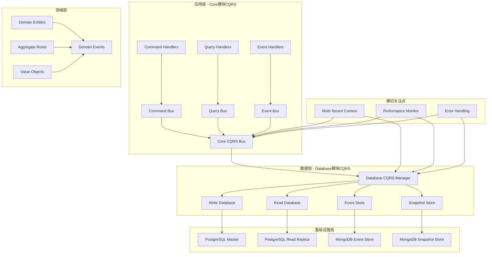
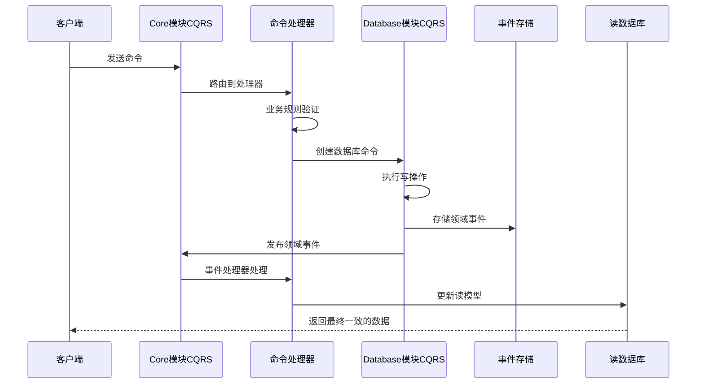

# Database模块CQRS vs Core模块CQRS - 架构分析

## 📋 文档信息

- **文档标题**: Database模块CQRS与Core模块CQRS的区别和联系分析
- **文档版本**: v1.0.0
- **创建日期**: 2024-12-19
- **作者**: AIOFix Team
- **文档类型**: 架构分析文档

## 🎯 概述

在AIOFix SAAS平台的架构中，CQRS（命令查询职责分离）模式在两个不同的层面发挥作用：

1. **Core模块的CQRS**：应用层的业务逻辑分离
2. **Database模块的CQRS**：数据层的存储和访问分离

这两个CQRS系统相互协作，共同构建了完整的企业级CQRS架构。

## 🏗️ 架构层次关系



## 🔍 详细对比分析

### 1. **Core模块CQRS** - 应用层业务逻辑分离

#### 🎯 **职责范围**

- **业务逻辑处理**：处理业务命令、查询和事件
- **领域模型管理**：管理聚合根、实体和值对象
- **业务规则验证**：验证业务规则和约束
- **工作流协调**：协调复杂的业务流程

#### 🏗️ **核心组件**

```typescript
// Core模块CQRS的核心组件
export interface CoreCQRSComponents {
  // 命令系统
  commandBus: ICommandBus;           // 命令总线
  commandHandlers: ICommandHandler[]; // 命令处理器
  
  // 查询系统
  queryBus: IQueryBus;               // 查询总线
  queryHandlers: IQueryHandler[];     // 查询处理器
  
  // 事件系统
  eventBus: IEventBus;               // 事件总线
  eventHandlers: IEventHandler[];     // 事件处理器
  
  // 协调器
  cqrsBus: ICQRSBus;                 // 统一CQRS总线
}
```

#### 📋 **使用场景**

```typescript
// 业务命令处理
@CommandHandler(CreateUserCommand)
export class CreateUserCommandHandler {
  async handle(command: CreateUserCommand): Promise<void> {
    // 1. 业务规则验证
    // 2. 创建领域实体
    // 3. 调用Database模块持久化
    // 4. 发布领域事件
  }
}

// 业务查询处理
@QueryHandler(GetUserQuery)
export class GetUserQueryHandler {
  async handle(query: GetUserQuery): Promise<UserDto> {
    // 1. 参数验证
    // 2. 调用Database模块查询
    // 3. 数据转换和映射
    // 4. 返回DTO
  }
}
```

### 2. **Database模块CQRS** - 数据层存储访问分离

#### 🎯 **职责范围**

- **数据存储分离**：读写数据库分离
- **事件持久化**：事件溯源的数据库实现
- **查询优化**：读操作的性能优化
- **数据一致性**：最终一致性保证

#### 🏗️ **核心组件**

```typescript
// Database模块CQRS的核心组件
export interface DatabaseCQRSComponents {
  // 数据库管理器
  cqrsDatabaseManager: CQRSDatabaseManager;
  
  // 读写分离
  writeConnectionManager: IConnectionManager;  // 写数据库连接管理
  readConnectionManager: IConnectionManager;   // 读数据库连接管理
  
  // 事件存储
  eventStore: IEventStore;                     // 事件存储
  snapshotStore: ISnapshotStore;               // 快照存储
  
  // 查询引擎
  queryEngine: IQueryEngine;                   // 查询引擎
  commandEngine: ICommandEngine;               // 命令引擎
}
```

#### 📋 **使用场景**

```typescript
// 数据库命令执行
export class DatabaseCommand<T> {
  constructor(
    public readonly sql: string,
    public readonly params: any[],
    public readonly events: IDomainEvent[],
  ) {}

  async execute(transaction: ITransaction): Promise<T> {
    // 1. 执行写操作
    // 2. 存储领域事件
    // 3. 返回结果
  }
}

// 数据库查询执行
export class DatabaseQuery<T> {
  constructor(
    public readonly sql: string,
    public readonly params: any[],
  ) {}

  async execute(connection: IDatabaseConnection): Promise<T[]> {
    // 1. 执行读操作
    // 2. 应用租户隔离
    // 3. 返回数据
  }
}
```

## 🔗 协作关系分析

### 1. **分层协作**

```typescript
/**
 * 完整的CQRS流程示例
 * 展示Core模块CQRS与Database模块CQRS的协作
 */

// 第一层：业务层（Core模块CQRS）
@CommandHandler(CreateOrderCommand)
export class CreateOrderCommandHandler {
  constructor(
    @InjectDatabaseManager()
    private readonly databaseManager: UnifiedDatabaseManager, // Database模块
  ) {}

  async handle(command: CreateOrderCommand): Promise<void> {
    // 1. 业务验证（Core模块职责）
    this.validateBusinessRules(command);
    
    // 2. 创建领域事件（Core模块职责）
    const events = [
      new OrderCreatedEvent(command.orderId, command.customerId),
      new InventoryReservedEvent(command.productId, command.quantity),
    ];
    
    // 3. 构建数据库命令（Database模块CQRS）
    const dbCommand = new DatabaseCommand(
      'INSERT INTO orders (id, customer_id, amount, status) VALUES (?, ?, ?, ?)',
      [command.orderId, command.customerId, command.amount, 'pending'],
      events, // 领域事件传递给Database模块
    );
    
    // 4. 执行数据库命令（Database模块CQRS）
    await this.databaseManager.executeCommand(dbCommand);
  }
}

// 第二层：数据层（Database模块CQRS）
export class CQRSDatabaseManager {
  async executeCommand<T>(
    command: IDatabaseCommand<T>,
    options?: CommandExecutionOptions,
  ): Promise<ICommandResult<T>> {
    // 1. 获取写数据库连接
    const writeConnection = await this.writeConnectionManager.getConnection();
    
    // 2. 开始事务
    const transaction = await writeConnection.beginTransaction();
    
    try {
      // 3. 执行SQL命令
      const result = await command.execute(transaction);
      
      // 4. 存储领域事件到事件存储
      if (command.events && command.events.length > 0) {
        await this.eventStore.saveEvents(command.events, transaction);
      }
      
      // 5. 提交事务
      await transaction.commit();
      
      // 6. 异步发布事件（回到Core模块）
      this.publishDomainEvents(command.events);
      
      return { success: true, data: result };
    } catch (error) {
      await transaction.rollback();
      throw error;
    }
  }
}
```

### 2. **事件流转机制**



## 🔍 关键区别分析

### 1. **抽象层次**

| 维度 | Core模块CQRS | Database模块CQRS |
|------|-------------|------------------|
| **抽象层次** | 高层业务抽象 | 低层数据抽象 |
| **关注点** | 业务逻辑分离 | 数据存储分离 |
| **处理对象** | 业务命令/查询/事件 | SQL命令/查询/事件持久化 |
| **依赖方向** | 依赖Database模块 | 被Core模块依赖 |

### 2. **功能职责**

#### **Core模块CQRS职责**

```typescript
// 业务命令
export class CreateUserCommand extends BaseCommand {
  constructor(
    public readonly email: string,
    public readonly name: string,
    public readonly role: UserRole,
    tenantId: string,
    userId: string,
  ) {
    super(tenantId, userId);
  }
  
  get commandType(): string {
    return 'CreateUser';
  }
}

// 业务查询
export class GetActiveUsersQuery extends BaseQuery {
  constructor(
    public readonly filters: UserFilters,
    public readonly pagination: PaginationOptions,
    tenantId: string,
  ) {
    super(tenantId);
  }
  
  get queryType(): string {
    return 'GetActiveUsers';
  }
}

// 领域事件
export class UserCreatedEvent extends BaseDomainEvent {
  constructor(
    public readonly userId: string,
    public readonly email: string,
    public readonly name: string,
  ) {
    super();
  }
  
  get eventType(): string {
    return 'UserCreated';
  }
}
```

#### **Database模块CQRS职责**

```typescript
// 数据库命令
export class DatabaseCommand<T> {
  constructor(
    public readonly sql: string,
    public readonly params: any[],
    public readonly events: IDomainEvent[], // 来自Core模块的领域事件
  ) {}

  async execute(transaction: ITransaction): Promise<T> {
    // 执行原始SQL命令
    return transaction.execute(this.sql, this.params);
  }
}

// 数据库查询
export class DatabaseQuery<T> {
  constructor(
    public readonly sql: string,
    public readonly params: any[],
    public readonly cacheable: boolean = false,
  ) {}

  async execute(connection: IDatabaseConnection): Promise<T[]> {
    // 执行原始SQL查询
    return connection.query(this.sql, this.params);
  }
}

// 事件持久化
export interface IEventStore {
  saveEvents(events: IDomainEvent[], transaction?: ITransaction): Promise<void>;
  getEvents(aggregateId: string, fromVersion: number): Promise<IDomainEvent[]>;
  saveSnapshot(aggregateId: string, version: number, snapshot: any): Promise<void>;
}
```

## 🔗 协作模式

### 1. **命令流程协作**

```typescript
/**
 * 完整的命令处理流程
 * 展示两个CQRS系统如何协作
 */

// 步骤1：Core模块接收业务命令
@CommandHandler(CreateOrderCommand)
export class CreateOrderCommandHandler {
  constructor(
    @InjectDatabaseManager()
    private readonly databaseManager: CQRSDatabaseManager,
  ) {}

  async handle(command: CreateOrderCommand): Promise<void> {
    // 步骤2：Core模块进行业务验证
    await this.validateBusinessRules(command);
    
    // 步骤3：Core模块创建领域事件
    const domainEvents = [
      new OrderCreatedEvent(command.orderId, command.customerId),
      new PaymentInitiatedEvent(command.orderId, command.amount),
    ];
    
    // 步骤4：Core模块构建数据库命令
    const databaseCommand = new DatabaseCommand(
      `INSERT INTO orders (id, customer_id, amount, status, tenant_id) 
       VALUES (?, ?, ?, ?, ?)`,
      [
        command.orderId,
        command.customerId, 
        command.amount,
        'pending',
        command.tenantId
      ],
      domainEvents, // 传递领域事件
    );
    
    // 步骤5：Database模块执行CQRS命令
    const result = await this.databaseManager.executeCommand(databaseCommand);
    
    // 步骤6：Database模块自动处理事件持久化和发布
    // - 保存事件到事件存储
    // - 发布事件给Core模块的事件处理器
    // - 更新读模型
  }
}
```

### 2. **查询流程协作**

```typescript
/**
 * 完整的查询处理流程
 */

// 步骤1：Core模块接收业务查询
@QueryHandler(GetOrderHistoryQuery)
export class GetOrderHistoryQueryHandler {
  constructor(
    @InjectDatabaseManager()
    private readonly databaseManager: CQRSDatabaseManager,
  ) {}

  async handle(query: GetOrderHistoryQuery): Promise<OrderHistoryDto[]> {
    // 步骤2：Core模块进行参数验证
    this.validateQueryParameters(query);
    
    // 步骤3：Core模块构建数据库查询
    const databaseQuery = new DatabaseQuery<OrderHistoryRow>(
      `SELECT o.*, c.name as customer_name 
       FROM orders o 
       JOIN customers c ON o.customer_id = c.id 
       WHERE o.tenant_id = ? AND o.created_at >= ?
       ORDER BY o.created_at DESC
       LIMIT ? OFFSET ?`,
      [
        query.tenantId,
        query.fromDate,
        query.pageSize,
        query.offset
      ],
      true, // 启用缓存
    );
    
    // 步骤4：Database模块执行CQRS查询
    const result = await this.databaseManager.executeQuery(databaseQuery);
    
    // 步骤5：Core模块进行数据转换
    return result.data.map(row => this.mapToDto(row));
  }
}
```

### 3. **事件流程协作**

```typescript
/**
 * 事件处理的协作流程
 */

// Core模块的事件处理器
@EventHandler(OrderCreatedEvent)
export class OrderCreatedEventHandler {
  constructor(
    @InjectDatabaseManager()
    private readonly databaseManager: CQRSDatabaseManager,
  ) {}

  async handle(event: OrderCreatedEvent): Promise<void> {
    // 步骤1：Core模块处理业务逻辑
    await this.updateCustomerStatistics(event.customerId);
    
    // 步骤2：构建读模型更新命令
    const updateReadModelCommand = new DatabaseCommand(
      `INSERT INTO order_summary (customer_id, order_count, last_order_date)
       VALUES (?, 1, ?) 
       ON CONFLICT (customer_id) 
       DO UPDATE SET 
         order_count = order_summary.order_count + 1,
         last_order_date = ?`,
      [event.customerId, event.createdAt, event.createdAt],
      [], // 读模型更新不产生新的领域事件
    );
    
    // 步骤3：Database模块执行读模型更新
    await this.databaseManager.executeCommand(updateReadModelCommand);
  }
}

// Database模块的事件存储
export class MongoEventStore implements IEventStore {
  async saveEvents(
    events: IDomainEvent[], // 来自Core模块的领域事件
    transaction?: ITransaction,
  ): Promise<void> {
    // 步骤1：转换为事件存储格式
    const eventDocuments = events.map(event => ({
      eventId: event.eventId,
      aggregateId: event.aggregateId,
      eventType: event.eventType,
      eventData: event.eventData,
      metadata: event.metadata,
      createdAt: new Date(),
    }));
    
    // 步骤2：持久化到MongoDB
    await this.mongoConnection
      .collection('domain_events')
      .insertMany(eventDocuments);
    
    // 步骤3：异步发布事件（回到Core模块）
    this.publishEventsToCoreBus(events);
  }
}
```

## 🎯 设计原则和最佳实践

### 1. **职责分离原则**

```typescript
// ✅ 正确的职责分离
@CommandHandler(CreateUserCommand)
export class CreateUserCommandHandler {
  async handle(command: CreateUserCommand): Promise<void> {
    // Core模块职责：业务逻辑
    const user = new User(command.email, command.name);
    user.validateBusinessRules();
    
    // Database模块职责：数据持久化
    const dbCommand = new DatabaseCommand(
      'INSERT INTO users ...',
      [...],
      user.getUncommittedEvents(),
    );
    
    await this.databaseManager.executeCommand(dbCommand);
  }
}

// ❌ 错误的职责混合
@CommandHandler(CreateUserCommand)
export class BadCreateUserCommandHandler {
  async handle(command: CreateUserCommand): Promise<void> {
    // 错误：在Core模块直接写SQL
    await this.database.execute(
      'INSERT INTO users (email, name) VALUES (?, ?)',
      [command.email, command.name]
    );
  }
}
```

### 2. **依赖方向原则**

```typescript
// ✅ 正确的依赖方向：Core → Database
export class UserService {
  constructor(
    @InjectDatabaseManager()
    private readonly databaseManager: CQRSDatabaseManager, // 依赖Database模块
  ) {}
}

// ❌ 错误的依赖方向：Database → Core
export class DatabaseService {
  constructor(
    private readonly coreCommandBus: CoreCommandBus, // 错误：Database不应依赖Core的业务逻辑
  ) {}
}
```

### 3. **事件传递原则**

```typescript
// 事件的正确传递路径
export class EventFlowExample {
  /**
   * 事件流转路径：
   * 
   * 1. Core模块创建领域事件
   * 2. Database模块持久化事件
   * 3. Database模块发布事件回Core模块
   * 4. Core模块的事件处理器处理事件
   * 5. 更新读模型（通过Database模块）
   */
  
  // 步骤1：Core模块创建事件
  createDomainEvent(): OrderCreatedEvent {
    return new OrderCreatedEvent(orderId, customerId);
  }
  
  // 步骤2-3：Database模块处理事件
  async persistAndPublishEvent(event: OrderCreatedEvent): Promise<void> {
    // 持久化到事件存储
    await this.eventStore.saveEvents([event]);
    
    // 发布回Core模块
    await this.coreCQRSBus.publishEvent(event);
  }
  
  // 步骤4-5：Core模块处理事件并更新读模型
  @EventHandler(OrderCreatedEvent)
  async handleOrderCreated(event: OrderCreatedEvent): Promise<void> {
    // 更新读模型（通过Database模块）
    const updateCommand = new DatabaseCommand(
      'UPDATE customer_stats SET order_count = order_count + 1 WHERE id = ?',
      [event.customerId],
      [],
    );
    
    await this.databaseManager.executeCommand(updateCommand);
  }
}
```

## 🚀 集成策略

### 1. **配置集成**

```typescript
// 统一配置中的CQRS配置
export interface IUnifiedConfig {
  core: {
    cqrs: {
      enabled: boolean;
      commandBus: { timeout: number; maxRetries: number };
      queryBus: { enableCache: boolean; cacheTTL: number };
      eventBus: { enableAsync: boolean; maxConcurrency: number };
    };
  };
  
  database: {
    cqrs: {
      enabled: boolean;
      readConnection: string;   // 读数据库连接
      writeConnection: string;  // 写数据库连接
      eventStore: {
        enabled: boolean;
        connection: string;
        tableName: string;
        snapshotThreshold: number;
      };
    };
  };
}
```

### 2. **依赖注入集成**

```typescript
// Core模块的CQRS配置
@Module({
  imports: [
    // 依赖Database模块的CQRS功能
    UnifiedDatabaseModule.forFeature(['cqrs', 'eventStore']),
  ],
  providers: [
    CoreCommandBus,
    CoreQueryBus,
    CoreEventBus,
    CoreCQRSBus,
  ],
})
export class CoreCQRSModule {}

// Database模块的CQRS配置
@Module({
  providers: [
    CQRSDatabaseManager,
    MongoEventStore,
    PostgreSQLEventStore,
    DistributedTransactionManager,
  ],
  exports: [
    CQRSDatabaseManager, // 提供给Core模块使用
  ],
})
export class DatabaseCQRSModule {}
```

## 📊 性能和扩展性

### 1. **读写分离优化**

```typescript
// Database模块的读写分离实现
export class CQRSDatabaseManager {
  constructor(
    private readonly writeConnectionManager: IConnectionManager, // 写库连接池
    private readonly readConnectionManager: IConnectionManager,  // 读库连接池
  ) {}

  // 写操作：使用主数据库
  async executeCommand<T>(command: IDatabaseCommand<T>): Promise<ICommandResult<T>> {
    const writeConnection = await this.writeConnectionManager.getConnection();
    // 执行写操作...
  }

  // 读操作：使用只读副本
  async executeQuery<T>(query: IDatabaseQuery<T>): Promise<IQueryResult<T>> {
    const readConnection = await this.readConnectionManager.getConnection();
    // 执行读操作...
  }
}
```

### 2. **事件存储优化**

```typescript
// Database模块的事件存储优化
export class OptimizedEventStore {
  async saveEvents(events: IDomainEvent[]): Promise<void> {
    // 批量插入优化
    await this.batchInsertEvents(events);
    
    // 异步快照创建
    this.scheduleSnapshotCreation(events);
    
    // 读模型更新
    this.scheduleReadModelUpdate(events);
  }
  
  async getEvents(aggregateId: string): Promise<IDomainEvent[]> {
    // 尝试从快照恢复
    const snapshot = await this.getLatestSnapshot(aggregateId);
    
    // 获取快照后的事件
    const events = await this.getEventsAfterSnapshot(aggregateId, snapshot?.version);
    
    return this.mergeSnapshotAndEvents(snapshot, events);
  }
}
```

## 📝 总结

### 🎯 **核心区别**

1. **Core模块CQRS**：
   - **业务层抽象**：处理业务命令、查询和事件
   - **领域驱动**：基于领域模型的CQRS实现
   - **业务规则**：专注于业务逻辑和规则验证
   - **高层协调**：协调业务流程和工作流

2. **Database模块CQRS**：
   - **数据层实现**：处理数据存储的读写分离
   - **存储驱动**：基于数据库特性的CQRS实现
   - **性能优化**：专注于数据访问性能和一致性
   - **底层支撑**：为Core模块提供数据持久化支持

### 🔗 **核心联系**

1. **分层协作**：Core模块CQRS依赖Database模块CQRS
2. **事件传递**：领域事件在两个系统间流转
3. **配置统一**：通过统一配置系统协调两者
4. **监控集成**：共享性能监控和错误处理

### 🚀 **设计优势**

1. **清晰的职责分离**：业务逻辑与数据访问完全分离
2. **高度的可扩展性**：每层都可以独立扩展和优化
3. **强大的一致性保证**：事件溯源确保数据一致性
4. **优秀的性能表现**：读写分离和缓存优化

这种双层CQRS设计为AIOFix SAAS平台提供了**企业级的可扩展性、性能和可维护性**，是现代微服务架构的最佳实践。
